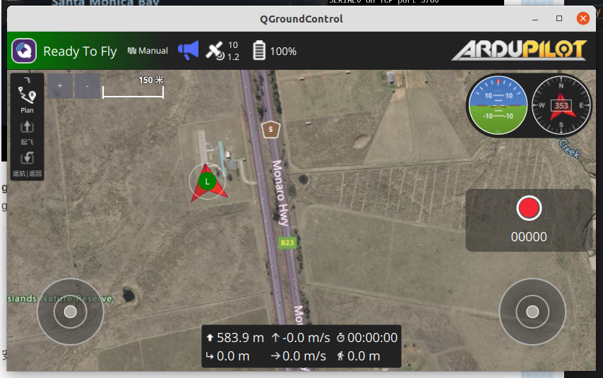
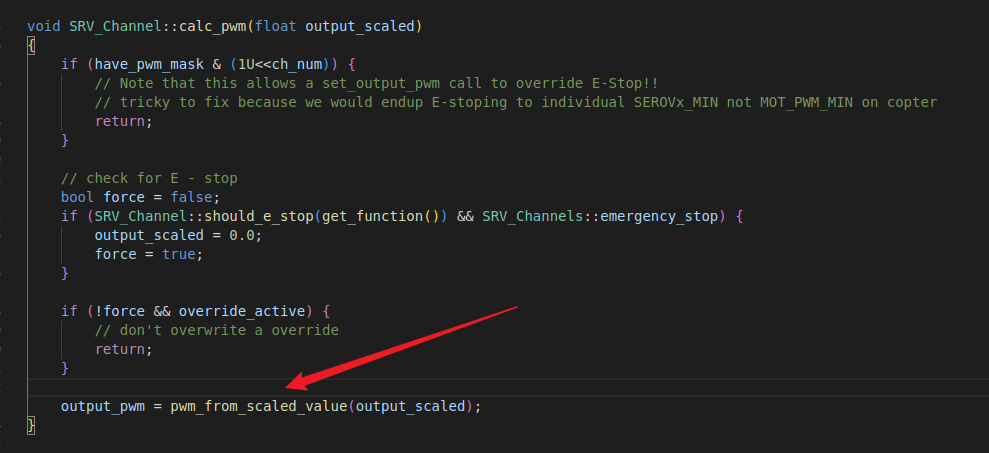
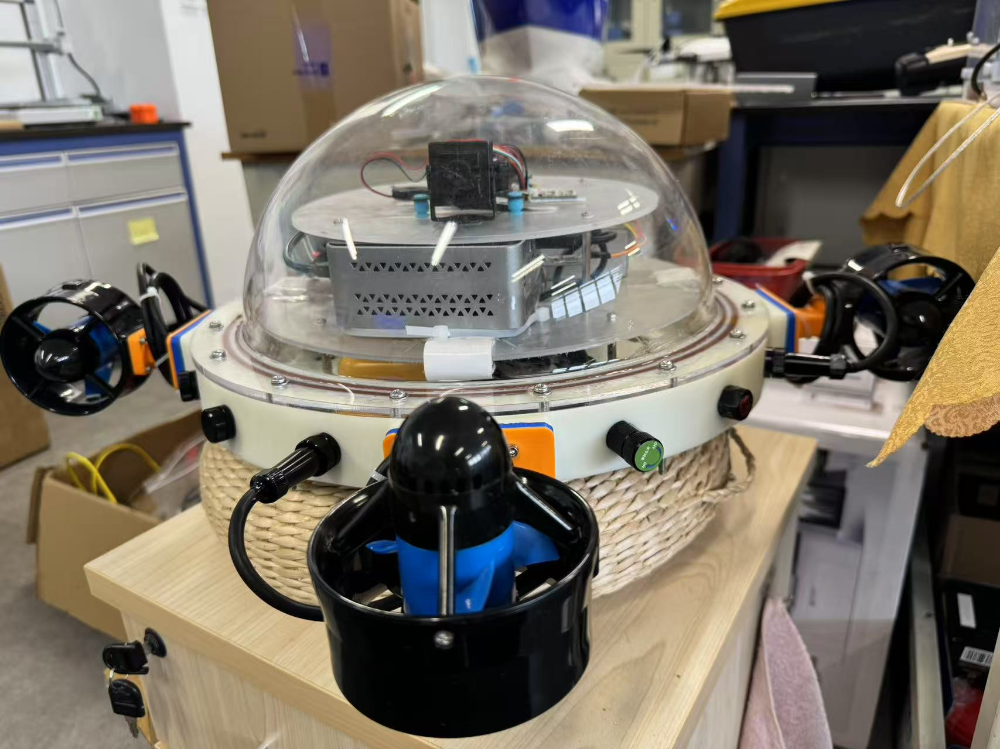

## Ubuntu搭建APM固件编译环境
### 下载源码
1. `git clone https://github.com/ArduPilot/ardupilot.git`，这句命令可以下载APM的源码，但是我发现这句命令有的时候不管用，硬是得从github官网上复制HTTP链接再 `git clone`才行，具体为什么还不知道，但最好手动复制一下，这样不会出错。
2. 下载完之后

        + cd ardupilot
        + git submodule init
        + git submodule update
    + 在执行git submodule update时若出现报错没有更新完毕子模块，则继续执行该命令，直至更新完毕。如果一次不成功就多次，如果下载慢的话就反复切换`proxy`和`unproxy`
### 配置编译环境
1. 在ardupilot目录下执行下面的命令安装环境：`Tools/environment_install/install-prereqs-ubuntu.sh -y`,如果一次不成功就多次尝试，知道最后底下出现`OK`字样。
2. 配置成功后执行：`. ~/.profile`
### 编译固件
1. 编译固件前，要配置编译的固件的目标硬件
我这里使用的是pix2.4.8飞控，所以使用fmuv3的固件，配置如下：`./waf configure --board fmuv3`
2. 如果出现报错`缺少waf子模块`，用命令`git submodule update --init --recursive --force`后解决。
3. 如果编译出现一大堆的红色的报错，那么就是缺少waf的子模块，采用以上`git submodule update --init --recursive --force`的做法来解决。
4. 如果出现报错`ChibiOS build requires g++ version 10.2.1 or later, found 5.4.1`,原因是我们用源码下载依赖的时候下的版本就没有达到`10.2.1`以上，这地方很坑，我一直以为是`gcc`的版本问题，导致我不断地找gcc的问题，但其实不是，这里是用的ARM专用的工具链。而一开始我们下载的这个工具链的版本就是不对的，需要手动下载，链接是`https://developer.arm.com/downloads/-/gnu-rm`,这是ARM已经弃用的一个网站，但是可以从上面下载大于10.2.1的
`gcc-arm-none-eabi`版本。最好用命令`sudo tar -xvf gcc-arm-none-eabi-10.x-linux.tar.bz2 -C /opt`解压到opt路径下,然后最关键的一步设置环境变量。进入`~/.bashrc`中，最后一行加上`export PATH=/opt/gcc-arm-none-eabi-10.x/bin:$PATH`,这里注意路径一定要找正确，应该是有这些文件的文件夹目录下：。
5. 另外，如果安装并切换好了`g++`后，重新进入`~/ardupilot`运行`./waf configure --board fmuv3`还是显示`g++`版本不对，则手动刷新一下环境变量，即可解决问题。
1. 完成操作以后再运行`arm-none-eabi-gcc --version`，此时arm-none-eabi-gcc的版本已经成功换成高版本的了。
2. 最后正常编译车/船部分，`./waf rover`，成功
        
### 仿真
1. 以无人车/船为例，在ardupilot/Rover目录下执行：`../Tools/autotest/sim_vehicle.py -f rover`，执行完毕后会弹出下面的页面，然后打开地面站就可以链接到仿真的无人车了。

1. 仿真水下机器人的话，就在ardupilot/ArduSub目录下执行：`../Tools/autotest/sim_vehicle.py -L RATBeach --out=udp:0.0.0.0:14550 --map --console`。执行成功后：
2. gazebo安装：参考连接：`https://blog.csdn.net/qq_38768959/article/details/131133686`
        + ```sudo sh -c 'echo "deb http://packages.osrfoundation.org/gazebo/ubuntu-stable `lsb_release -cs` main" > /etc/apt/sources.list.d/gazebo-stable.list'```
        + `wget http://packages.osrfoundation.org/gazebo.key -O - | sudo apt-key add -`
        + `sudo apt update`
        + `sudo apt install gazebo9 libgazebo9-dev`
        + 安装成功后执行：`gazebo --verbose`
        + 如果能弹出空的gazebo界面，说明安装成功
3. 装gazebo插件：
        + `git clone https://github.com/khancyr/ardupilot_gazebo`
        + `cd ardupilot_gazebo`
        + `mkdir build`
        + `cd build`
        + `cmake ..`
        + `make -j4`
        + `sudo make install`
        + 成功后如下：
4. 修改环境变量：
        + `source /usr/share/gazebo/setup.sh`
        + `export GAZEBO_MODEL_PATH=~/ardupilot_gazebo/models:${GAZEBO_MODEL_PATH}`
        + `export GAZEBO_MODEL_PATH=~/ardupilot_gazebo/models_gazebo:${GAZEBO_MODEL_PATH}`
        + `export GAZEBO_RESOURCE_PATH=~/ardupilot_gazebo/worlds:${GAZEBO_RESOURCE_PATH}`
        + `export GAZEBO_PLUGIN_PATH=~/ardupilot_gazebo/build:${GAZEBO_PLUGIN_PATH}`
        + 然后启动仿真：`gazebo --verbose worlds/iris_arducopter_runway.world`,可以看到弹出一个gazebo页面，里面有一架无人机（如果没有无人机，检查环境变量设置），但此时的无人机无法连接地面站
### 仿真连接mavros
+ 参考博客`https://blog.csdn.net/qq_38768959/article/details/131133686`
### 多机仿真
1. 参考博客`https://blog.csdn.net/qq_38768959/article/details/131133686`
### 水下机器人gazebo环境搭建
1. `https://www.bilibili.com/video/BV1BFaQe2EBd/?spm_id_from=333.337.search-card.all.click&vd_source=9cecaf1cdbe9321fee9e510aede34abf`


## APM实物上手
+ 想顺利的用APM固件控制电机有以下需要注意的点
1. APM的电机通道是通道1和通道3，而PX4的电机通道是通道1和通道2
2. 校准APM的时候涉及到遥控器的校准，但是在QGC地面站上校准APM的遥控器似乎有bug，只要碰到右下角或者左下角的校准就没反应了，根本无法校准。解决办法是用`Mission Planner`地面站校准遥控器，而其他的不变可以继续用QGC地面站，因为MP地面站太丑了，不想用。MP地面站的安装见下面的教程。
3. 进入地面站以后，要先点击右上角的连接，和飞控建立连接。
4. 连接好飞控以后点击初始设置，找到必选硬件，找到遥控器校准，即可进行遥控器的校准。
5. 校准好遥控器以后还是打开QGC地面站观察，尝试解锁，发现报错`Hardware safety switch`，这是因为APM固件在解锁之前需要按下飞控上的物理按钮，在飞控的右边有一个小按钮。为了以后的使用方便，我们把这个选项禁用掉。在QGC地面站的参数搜索`BRD_SAFETY_DEFLT`，将这个参数改成0即可。，
6. 禁用完以后发现还是解锁不了，报错`Arm: Throttle (RC3) is not neutral`，这是因为还要配置遥控器油门通道（RC3）的中立值参数，将参数`RC3_TRIM`改成1500。在某些需要偏中立油门的模式（如中性点在中间）中，RC3_TRIM会设置为1500（通常是中间位置）。
7. 再解锁，成功启动电机。
8. 注意，此时要注意观察电机的正反转，以及遥控器的通道设置，检查修改即可，这个很简单。
9. 在室外进行调试的时候，发现`roslaunch mavros apm.launch`无法正常启动，这是因为apm.launch中的端口默认是ACM0，且波特率默认是57600。当出现类似的问题，应该`roscd mavros`,`cd launch`,`vim apm.launch`，把端口号改为`USB0`，且波特率改为`921600`。
10. 改完以后要与地面站的端口号的波特率一致，将参数`SERIAL2_BAUD`参数改为921600。

## MP地面站的安装
1. `Mission Planner`可以在官网免费下载，`https://firmware.ardupilot.org/Tools/MissionPlanner/MissionPlanner-latest.msi`
2. 下载好以后解压，注意要提取到一个文件夹里，不然根目录下就会多出几百个文件和文件夹，非常乱。
3. 解压好以后需要安装Mono包。`sudo apt update`，`sudo apt install mono-complete`，运行以下命令查看是否安装成功`mono --version` ，
4. 进入`/MissionPlanner-latest`文件夹，运行指令`mono MissionPlanner.exe`,即可打开MP地面站

## APM仿真
+ 其实APM的仿真很简单。和实物很类似，我们只需要指定以下UDP就行了
1. 进入bash文件关闭分布式
2. 启动仿真，参考上面仿真的步骤
3. 启动mavros`roslaunch mavros apm.launch fcu_url:=udp://:14550@127.0.0.1:14555`。:`错误的`。
4. 注意，上面的3是错误的。当时没有理清楚这里的关系，教条的认为博客就是对的。其实不对。这里回环仿真相当于一个APM固件的飞控，启动回环仿真就相当于启动APM固件的飞控，但是我们的飞控要与地面站相连，还要与mavros相连，这个地方真的非常坑，他默认的只有一个端口，不分流，也就是说默认情况下，启动`roslaunch apm.launch`，默认只有一个对象可以接受这个数据流，而我们既想用地面站监控又想用mavros进行操控必须有两个数据源流，所以这个回环仿真就必须通过两个端口号来分流，使得两个端口号都可以接收他的数据。至于我是为什么发现这里我是一帧一帧找许军的教学视频看他是有几个UPD输出流的，在教学视频`https://www.bilibili.com/video/BV1gZ421h7Bt/?spm_id_from=333.1007.top_right_bar_window_history.content.click&vd_source=9cecaf1cdbe9321fee9e510aede34abf`中的第`4：59`有一帧，看到他是两个输出流到UDP。所以这里的解决办法就是在`ardupilot/Rover`下运行指令`../Tools/autotest/sim_vehicle.py -f rover --out=udp:127.0.0.1:14550 --out=udp:127.0.0.1:14551`。
5. 这就是为什么我一开始运行`roslaunch mavros apm.launch fcu_url:=udp://:14550@127.0.0.1:14555`有用，但是同时地面站会断开连接的原因，因为他们此时共享了一个端口的数据流，会冲突，只能有一个存在。而`apm.launch`中的`14551`会报错也是这个原因，因为`14551`压根就没有数据源流，回环是`14550`，当然会报错了。
6. 总结，也就是说，关键是数据源流要分两个通道。地面站对应`14550`，mavros对应`14551`。
                + 在ardupilot/Rover下启动回环仿真`../Tools/autotest/sim_vehicle.py -f rover --out=udp:127.0.0.1:14550 --out=udp:127.0.0.1:14551`
                + 启动mavros`roslaunch apm.launch`或者`roslaunch mavros apm.launch fcu_url:=udp://:14551@127.0.0.1:14555`
                + 再启动地面站，就可以了正常运行mavros代码进行仿真了。
7. 水下机器人的在环仿真：`../Tools/autotest/sim_vehicle.py -L RATBeach --out=udp:0.0.0.0:14550 --out=udp:127.0.0.1:14551 --map --console`
## APM无人船姿态控制代码的逻辑整理
1. mavros中的`setpoint_attitude.cpp`，通过`set_attitude_target`函数转为mavlink消息发送给飞控，，具体的`set_attitude_target`函数实现是，这里转成了`SET_ATTITUDE_TARGET`的mavlink消息类型。然而这里发送是`send_message`函数发送消息。,这里封装和发送MAVLink消息，它将一个MAVLink消息对象序列化为标准的MAVLink数据包，并将其转换为ROS话题消息，然后通过ROS话题发布。这里的`uint8_t src_compid`是MAVLink 消息的来源组件ID，这个ID就是mavlink不同消息包对应的ID号。
2. 上层发送的`setpoint_attitude`消息到了APM中的Rover模块下的`GCS_Mavlink.cpp`接收，具体是在`handle_message`这个函数中处理，，这个函数会根据消息的msgid（即消息类型）决定调用相应的处理函数，这里我们调用的是情况1。也就是`handle_set_attitude_target`这个函数在处理消息。
3. 在`handle_set_attitude_target`函数中有推力转化成速度的计算，四元数转换成姿态的计算。`set_desired_heading_and_speed`进入这个函数就来到了`Rover`模块下的`mode_guided.cpp`这个板外控制模块了。在这里会设置接收到的目标航向角和目标速度，供后续函数调用。但其实想知道这里是怎么一步步到电机的还是卡住了，所以还得找。
4. 这个时候我就会想，这个值肯定是要实时更新的，不然他怎么持续的运作呢？这个时候就在`mode_guided.cpp`中搜`update`，发现确实有一个更新模块。而且正正好就是对不同控制器的数据更新。
5. 我们这里是`HeadingAndSpeed`，航向角和速度子模式。这里计算转向推力是`calc_steering_to_heading`函数。
6. 进入发现到了`mode.cpp`，在这里是将转向缩放，并设置到转向系统，。进入`set_steering`函数，。发现他是在`set_steering`函数中调用电机控制模块的。
7. 再进入`set_steering`，，到这里好像又卡住了，就用了`_steering`，储存当前的转向值，`_scale_steering`记录是否需要对转向值应用比例缩放。
8. 这个时候肯定是要输出PWM波的，我就在这个`AP_MotorsUGV.cpp`中搜索`Output`，发现确实是有这个`Run`函数的，,这里调用不同类型的输出方法，这里我们是普通转向和油门。进入`output_regular`,。发现是在`set_output_scaled`函数中计算得到的转向值的，再进入`set_output_scaled`
9. 进去以后发现还是没有PWM波的输出，但是有pwm波的状态更新。此时又卡住了。又回到`AP_MotorsUGV.cpp`文件，因为我们就是从这个output函数找过来的。回到这以后仔细阅读发现最后做了PWM波的更新，调用的是`SRV_Channels::calc_pwm()`方法，，进入`calc_pwm`函数中。
10. 发现在后面的`.calc_pwm`函数计算PWM波值，将output_scaled作为输入转化为PWM波
11. 进入`calc_pwm`函数，，发现在`pwm_from_scaled_value`做了逻辑值到PWM波的转换。,进入`pwm_from_scaled_value`.
12. 发现他只是一个判断，我们是角度类型的，返回第一个`pwm_from_angle`。进去
13. 发现他这里就是输出PWM波的最终逻辑，问题解决，逻辑理顺。

## APM固件下载
1. `https://firmware.ardupilot.org/`

## APM控制无人船掩码相关整理
1. 此次学习重点查看的代码有`mode_guided.cpp`、`GCS_Mavlink.cpp`这两段代码中和掩码相关的是`GCS_Mavlink.cpp`。其实这两段代码我每个函数都打上了注释。但是在这里面只找到`defines.h`这个头文件定义了忽略文件。对应的数字39、163、1024等等还是没找到。
2. 这里其实有点卡住了，但是只能硬着头皮继续往后看，科研就是要耐得住寂寞对吧。当我快要看完的时候，找到`uint64_t GCS_MAVLINK_Rover::capabilities() const`这个函数，发现这里在设置某些功能，可能涉及到掩码，这里点进去`MAV_PROTOCOL_CAPABILITY_SET_POSITION_TARGET_LOCAL_NED`，来到了`common.h`
3. 到了这里发现这里的`1、2、4、8、16、32、64、128`和许军写的掩码非常类似，我怀疑掩码可能就在这里设置，但是还没找到具体定义，还不敢确定。
4. 这个时候实际上又卡了一会，我又回去翻看许军的教学视频`https://www.bilibili.com/video/BV1Hoege5EVe/?spm_id_from=333.788.top_right_bar_window_history.content.click&vd_source=9cecaf1cdbe9321fee9e510aede34abf`。发现APM有说明文档。
5. 进去之后发现姿态控制和许军写的掩码确实一致。
6. 其次，发现在`type_mask`这一栏有一个参数`POSITION_TARGET_TYPEMASK`，在源码左侧搜索，发现`common`中有这个选项，点进去发现就是在这里定义的掩码。
7. 根据许军的代码，也都能对得上，其实就是要忽略什么就把什么加上去就行了。
8. 但是姿态控制的掩码怎么都对不上。39、163都找不到缘由。但是我发现39-1-2-4=32，而且163-1-2-128=32。这里都是多了一个32。这里其实又卡了一会，但是我推测这个32可能是预留位，然后我把32减去，我只传7进去，发现效果一直，猜测验证，多加的这32就是预留位。
9. 至此，掩码分析完毕。
## blueROV的gazebo-ArduSub联合仿真
1. 按照上面仿真的办法先编译好APM固件
2. 卸载gazebo11，安装gazebo9，因为这个仿真是建立在gazebo9的版本的。
              + sudo apt-get remove --purge gazebo11*
              + sudo apt-get remove --purge libgazebo11*
              + sudo apt-get autoremove
              + sudo apt-get autoclean
              + sudo sh -c 'echo "deb http://packages.osrfoundation.org/gazebo/ubuntu-stable `lsb_release -cs` main" > /etc/apt/sources.list.d/gazebo-stable.list'
              + wget http://packages.osrfoundation.org/gazebo.key -O - | sudo apt-key add -
              + sudo apt update
              + sudo apt install gazebo9 libgazebo9-dev
3. 安装`freebuoyancy_gazebo`用于浮力模拟的插件,这个一般是不会有问题的，如果想要验证浮力插件是否安装成功可以在下载 BlueRov2 Gazebo 模型后仿真看看ardusub是否会在海面漂浮，如果没有这个浮力插件，ardusub在按下仿真开始键后会直接沉入海底。该软件包构建了两个 Gazebo 插件：
freebuoyancy_gazebo（模型插件） 模拟来自水的浮力和粘性力
安装：在ubuntu终端输入:
                + git clone https://github.com/bluerobotics/freebuoyancy_gazebo
                + cd freebuoyancy_gazebo
                + mkdir build
                + cd build
                + cmake ..
                + make
                + sudo make install
4. 安装`ardupilot_gazebo/add_link` 插件进行 `ardupilot-gazebo` 通信。`add_link` 是一个通过 `sdf` 链路提供驱动功能的分支，在 之后，必须运行 `.git clone git checkout add_link`
                + git clone https://github.com/patrickelectric/ardupilot_gazebo
                + cd ardupilot_gazebo
                + git checkout add_link
                + mkdir build
                + cd build
                + cmake ..
                + make -j4
                + sudo make install
6. 下面切换到主文件夹的终端，根据以上的命令我们已经切换到ardupilot_gazebo/build路径下了，接下来的命令是在主文件夹下进行的，如何不会切换终端路径的命令，可以关闭终端重新开启就返回最初的终端窗口了。`echo 'source /usr/share/gazebo/setup.sh' >> ~/.bashrc`设置 Gazebo 模型的路径（将路径调整为克隆存储库的位置）`echo 'export GAZEBO_MODEL_PATH=~/ardupilot_gazebo/models' >> ~/.bashrc`,设置 Gazebo 世界的路径（将路径调整为克隆仓库的位置）`echo 'export GAZEBO_RESOURCE_PATH=~/ardupilot_gazebo/worlds:${GAZEBO_RESOURCE_PATH}' >> ~/.bashrc`,`source ~/.bashrc`
7. 运行 BlueRov2 Gazebo 模型。下载bluerov_ros_playground:` git clone https://github.com/patrickelectric/bluerov_ros_playground`。运行 Gazebo 模型：`cd bluerov_ros_playground` `source gazebo.sh` `gazebo worlds/underwater.world -u`。输入完命令后就可以在gazebo上面看到ardusub的模型了，以后每次仿真只需运行上面的命令即可打开ardusub模型。最后不要忘记在gazebo界面点击仿真开始的功能键。
8. 执行 ArduPilot SITL。在`ardupilot`目录下执行`./Tools/autotest/sim_vehicle.py -v ArduSub -f gazebo-bluerov2 -L RATBeach --out=udp:0.0.0.0:14550 --console`启动
9. 我参考的博客`https://blog.csdn.net/weixin_49839886/article/details/140670850?ops_request_misc=%257B%2522request%255Fid%2522%253A%2522929e2b2ca390b3fd375593bc46a3974a%2522%252C%2522scm%2522%253A%252220140713.130102334..%2522%257D&request_id=929e2b2ca390b3fd375593bc46a3974a&biz_id=0&utm_medium=distribute.pc_search_result.none-task-blog-2~all~top_positive~default-1-140670850-null-null.142^v102^pc_search_result_base7&utm_term=ardusub%E4%BD%BF%E7%94%A8gazebo&spm=1018.2226.3001.4187`,以及许军的视频`https://www.bilibili.com/video/BV1BFaQe2EBd/?spm_id_from=333.788.videopod.sections&vd_source=9cecaf1cdbe9321fee9e510aede34abf`
# 球形机器人AUV部分手搓调试记录
## AUV的搭建
1. 需要采购的零件，如图：
2. 光固化环氧树脂3D打印时要注意留一些余量，我猜测光固化3D打印可能存在尺寸上的误差，因此不能1:1打印，需要留大概一个毫米的余量，这次我打印的这个盘子基本上算是买回来了没有用上，孔小了，基本上都是我用锉刀锉出来的，那天锉到凌晨，记忆犹新，不用担心尺寸不够会漏水，双头都是有密封圈的，只要密封圈压紧就不会漏，但是密封圈不需要留余量。
3. 在焊接电机和航空插头时，要注意先装上本来的有的外冒，外盖，和压紧盖，一共三个零件，先套在电机线的上面，要注意正反，确认无误以后，才能开始焊接，不然焊上无法做水密，等于白焊；另外电机焊接最好买三芯的航插，不然八芯的航插焊口太小，一是不好焊，二是焊完容易和其他的线芯相互干涉，导致短路；还有一件事很重要在焊接的时候，由于电机的线芯和航插口是铜制材料，和焊锡不易粘连，因此不用助焊剂的话很难焊，就算焊好了也很丑，一拔就断，还不牢固。
4. 整体电路的搭建大致如图：
5. 在给电机灌卡夫特密封胶的步骤：
                + 首先先把航插拔下来，拧开后把，把露出来的线段大概一两厘米的区间用砂纸打磨一下，这是为了线能够和卡夫胶更好的粘合。
                + 然后把后把拧紧，但是后冒先不拧，拧紧后把以后就可以开始打胶了，第一次打胶尽量打满，平放静置五分钟左右，待卡夫胶完全向下填满以后，上面还会留出一些空隙，继续打胶填满，重复此步骤直至基本不下沉为填满效果。
                + 最后拧上后冒，继续填充卡夫胶，重复填充步骤，尽量最后的效果是溢出来一点尖尖的，这样的密封效果会更好。
                + 打好以后一定要平放静置24小时左右才能干，这里的重点是一定要平放，不然卡夫胶容易侧漏，导致的后果就是连着卡紧帽一块固定，卡紧帽无法正常旋拧。
## ArduSub固件的烧录
1. 固件下载的网址是`https://firmware.ardupilot.org/`,这里面有ArduSub固件版本，和Rover类似这是APM固件的一个分支，是专门用作水下机器人控制的。
2. 这里我用的固件版本是4.1.2，fmuv3,,下载`.apj`文件即可通过地面站烧录。
## AUV的第一次下水检验其气密性
1. 其实第一次下水的时候我并没有买打压装置，所以第一次只能在各个航插上塞一点纸，来检验。
2. 注意下水之前记得计算一下整个AUV的排水量，先给AUV做配重，不然沉不下去。
3. 所有的航插全部用堵帽拧住，防止进水。
4. 气密性测试试验（水池）

## AUV的打压测试办法
1. 买一套能够适配通气螺栓的打压装置，电动的手动的都可以
2. 接上打压枪，把仓内压力打到15MPa左右，然后保压20分钟，如果气压掉的超过1个兆帕，代表气密性不足，否则气密性良好。
## AUV的电机测试
1. 
## AUV带线缆用作ROV的办法
1. 和无人艇项目一样，岸上电脑和水下小电脑通信，只不过通信方式为带线，具体为LAN到LAN通讯，中间为了保证信号的完整与不失真，需要用电力载波模块作为中继。
2. 电力载波模块接线图：，我用的是天启ROV家的版本，具体接线图如下图所示：
3. 正常上电以后是可以把小电脑和岸上电脑放在同一局域网的，但是还没办法在岸上电脑直接遥控到ArduSub的电机，思路整理如下：
                + 首先要明确一件事，当我们把飞控的A口直接与电脑相连的时候，遥控是可以直接遥控电机的，这是因为地面站会直接把遥控的信号转换成mavros信息发送给ArduSub，从而实现遥控。
                + 也就是说就算我们现在大电脑和小电脑已经在同一个局域网，但大电脑还是没法连接ArduSub的地面站，这个问题的关键就是大电脑没有直接接收到ArduSub的mavlink信号，所以连接不上，所以我们需要做的就是用小电脑把串口将 MAVLink 信号转发到岸上。
                + 具体的做法就是：
                + 
4. 首先在小电脑安装`MAVProxy`，在大环境下安装，注意一定要退出`base`环境，不然很容易出现问题，还不好解释，容易找不到原因。运行`pip install MAVProxy --user`。MAVProxy定义:是一个由 ArduPilot 官方开发的 命令行地面站（GCS）程序，可以让你通过串口、网口等方式与飞控进行通信和控制。
5. 运行`mavproxy.py --master=/dev/ttyUSB0,921600 --out=udp:192.168.1.31:14550`或者是`mavproxy.py --master=/dev/ttyACM0,921600 --out=udp:192.168.1.31:14550`，一般来说USB0是采用USB转TTL来进行飞控和电脑之间的数据传输，而ACM0是USB转A口进行数据传输的，特别注意，我们一般使用USB转TTL加`power`口供电，而不单独用USB转A，这样会电压不够，但是同时插上`power`口的话，又有很大的概率把飞控烧坏，故此尽量采用`power`加USB转TTL的方法。这里需要指定串口名称和波特率以及输出的IP和对应的端口号，避免数据流冲突。
6. 此时在大电脑上运行地面站就可以正常启动地面站了，也可以正常手摇电机了。
7. 如何将USB摄像头的图像数据传送到地面站？操作如下：
                + 使用 GStreamer 视频流工具，运行：`gst-launch-1.0 v4l2src device=/dev/video0 ! video/x-raw,width=640,height=480 ! videoconvert ! x264enc tune=zerolatency ! rtph264pay ! udpsink host=192.168.1.31 port=5600`，把数据流传到大电脑，但是发现报错没有`v4l2src`模块，运行`sudo apt install -y gstreamer1.0-tools \gstreamer1.0-plugins-base \gstreamer1.0-plugins-good \gstreamer1.0-plugins-bad \gstreamer1.0-plugins-ugly \gstreamer1.0-libav \gstreamer1.0-doc \gstreamer1.0-x \v4l-utils`安装模块。注意了，这里一定要在大环境下，一定要退出base环境，我在调试的时候没有退出base环境，我安装在base环境，但是命令是在大环境运行的，所以一直报错大环境没有`v4l2src`包，因为我装在了base环境了。
                + 安装好运行好了以后，再岸上地面站就可以正常接收视屏数据，左下角可以点击切换画面，就可以看到USB摄像头画面了。
8. 
9. 
## 遥控器的调试（目前可以满足使用，深入的开发暂时还没进行，留白）


## AUV第二次下水测试手摇功能记录
### 下水准备阶段
1. 布局理线。由于这个AUV要实现的功能比较多，用电器和电压等各不相同，接线的时候要注意保证一些裸露的接线头不能相互接触到，有一些是用的旧的接线头子，有的香蕉头的热缩管之前的师兄没有吹好，有的也破损了，但是我又不好全部拆掉，所以排线的时候尽量让这些香蕉头错开来排，但最好的办法就是按照规范来套热缩管。
2. 这里在整体安装的时候发现我们内部的两层托盘，最底下的那层好像没办法完全固定，这一次我是在周围贴上厚的胶布来和耐压仓四周压住，靠摩擦力来固定。
3. 接线的时候发现有些线有长有短，长的还好，短的就不好接线了。由于我的飞控放在最上面那一层，所以电机的信号线、供电线、深度计的IIC线以及USB-TTL都不好接，所以做延长线花了很多时间。
4. 在上电之前一定要反复检查接线的正确性，特别是线一多，不好分辨，一定一定不能把正负接反。我在第一次上电的时候小电脑的DC接口不知道为什么突然冒烟了，我反复的检查了接线没有发现任何问题，我怀疑是由于我接线的时候线扭曲的太厉害了，导致正负可能某个位置碰到一起了，所以才会冒烟的。所以第一次上电之前，一定一定要谨慎。
5. 接线整体效果：
           + 未上盖
           + 
           + 上盖效果
           + 
           + 完整体打压后下水浸泡测试
6. 下水前最后的密封、打密封油脂和功能测试。
7. 帅照展示：
### 问题记录解决
1. 此次下水最大的问题是电机一直会重启，当时推测是电压不够。后来发现是因为我把四个电机的电源输入用电源管理模块的12v输出作为输入了，而问题就出在这里，这个电源管理的12v电流只有可怜的0.5A，四个电机的总功率加起来已经超过了1000w，这个口完全带不动，所以电机才会在大油门的时候重启，因为功率不够，电压会跳变，低于12v的最低启动电压，关机，而一放开，电压又正常，重新初始化电机。
        + 我的解决办法是把四个电机的总电源用一个12v的稳压模块接到电源管理模块的直出口，同时，我在这个直出口做了两路分线，一路经过12v稳压模块给四个电机供稳定的12v电压，另外一路给小电脑供14.8-16.8的宽电压，小电脑的输入电压是12-19v。这里要注意的细节是，四个电机的功率是非常大的，在运作的时候电路中会有反电动势，很容易把小电脑打坏，所以电机和小电脑两个中必须有一个接稳压模块来抵消反电动势，但是小电脑12v运作不太正常，会反复的重启，所以我全电压供给小电脑，12v稳压模块给电机，问题完美解决。
2. 
## 第三次下水记录
1. 继上次修改电路以后，发现比上次好了，但是还是会断，电机会重启，这次可以一对电机满推了，但是如果全部满推的话还是会重启。这次我推测原因应该是电机的12v降压模块没办法承受电机这么大的电流。另外，航模电池本身比较暴力，多少输出其实无所谓，用多少算多少，大概率不是电池的问题。我的解决办法是换一个能够承受超过100A的12v稳压模块。期待下次的改进试水。