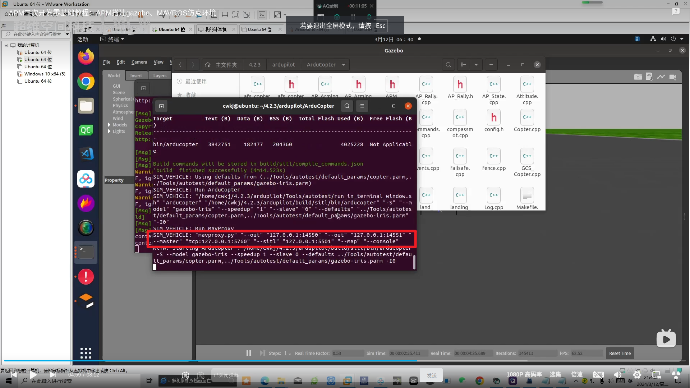
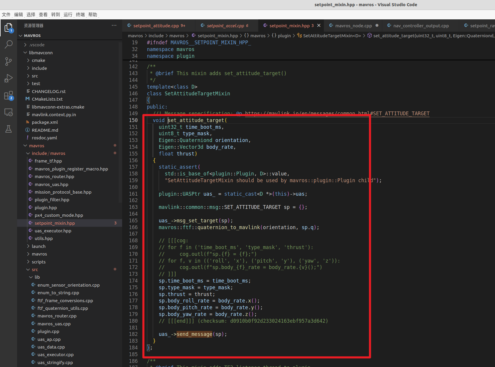

## Ubuntu搭建APM固件编译环境
### 下载源码
1. `git clone https://github.com/ArduPilot/ardupilot.git`，这句命令可以下载APM的源码，但是我发现这句命令有的时候不管用，硬是得从github官网上复制HTTP链接再 `git clone`才行，具体为什么还不知道，但最好手动复制一下，这样不会出错。
2. 下载完之后

        + cd ardupilot
        + git submodule init
        + git submodule update
    + 在执行git submodule update时若出现报错没有更新完毕子模块，则继续执行该命令，直至更新完毕。如果一次不成功就多次，如果下载慢的话就反复切换`proxy`和`unproxy`
### 配置编译环境
1. 在ardupilot目录下执行下面的命令安装环境：`Tools/environment_install/install-prereqs-ubuntu.sh -y`,如果一次不成功就多次尝试，知道最后底下出现`OK`字样。
2. 配置成功后执行：`. ~/.profile`
### 编译固件
1. 编译固件前，要配置编译的固件的目标硬件
我这里使用的是pix2.4.8飞控，所以使用fmuv3的固件，配置如下：`./waf configure --board fmuv3`
2. 如果出现报错`缺少waf子模块`，用命令`git submodule update --init --recursive --force`后解决。
3. 如果出现报错`ChibiOS build requires g++ version 10.2.1 or later, found 5.4.1`,原因是我们用源码下载依赖的时候下的版本就没有达到`10.2.1`以上，这地方很坑，我一直以为是`gcc`的版本问题，导致我不断地找gcc的问题，但其实不是，这里是用的ARM专用的工具链。而一开始我们下载的这个工具链的版本就是不对的，需要手动下载，链接是`https://developer.arm.com/downloads/-/gnu-rm`,这是ARM已经弃用的一个网站，但是可以从上面下载大于10.2.1的
`gcc-arm-none-eabi`版本。最好用命令`sudo tar -xvf gcc-arm-none-eabi-10.x-linux.tar.bz2 -C /opt`解压到opt路径下,然后最关键的一步设置环境变量。进入`~/.bashrc`中，最后一行加上`export PATH=/opt/gcc-arm-none-eabi-10.x/bin:$PATH`,这里注意路径一定要找正确，应该是有这些文件的文件夹目录下：。
4. 完成操作以后再运行`arm-none-eabi-gcc --version`，此时arm-none-eabi-gcc的版本已经成功换成高版本的了。
5. 最后正常编译车/船部分，`./waf rover`，成功
        
### 仿真
1. 以无人车/船为例，在ardupilot/Rover目录下执行：`../Tools/autotest/sim_vehicle.py -f rover`，执行完毕后会弹出下面的页面，然后打开地面站就可以链接到仿真的无人车了。

2. 仿真水下机器人的话，就在ardupilot/ArduSub目录下执行：`sim_vehicle.py -L RATBeach --out=udp:0.0.0.0:14550 --map --console`。执行成功后：
3. gazebo安装：参考连接：`https://blog.csdn.net/qq_38768959/article/details/131133686`
        + ```sudo sh -c 'echo "deb http://packages.osrfoundation.org/gazebo/ubuntu-stable `lsb_release -cs` main" > /etc/apt/sources.list.d/gazebo-stable.list'```
        + `wget http://packages.osrfoundation.org/gazebo.key -O - | sudo apt-key add -`
        + `sudo apt update`
        + `sudo apt install gazebo9 libgazebo9-dev`
        + 安装成功后执行：`gazebo --verbose`
        + 如果能弹出空的gazebo界面，说明安装成功
4. 装gazebo插件：
        + `git clone https://github.com/khancyr/ardupilot_gazebo`
        + `cd ardupilot_gazebo`
        + `mkdir build`
        + `cd build`
        + `cmake ..`
        + `make -j4`
        + `sudo make install`
        + 成功后如下：
5. 修改环境变量：
        + `source /usr/share/gazebo/setup.sh`
        + `export GAZEBO_MODEL_PATH=~/ardupilot_gazebo/models:${GAZEBO_MODEL_PATH}`
        + `export GAZEBO_MODEL_PATH=~/ardupilot_gazebo/models_gazebo:${GAZEBO_MODEL_PATH}`
        + `export GAZEBO_RESOURCE_PATH=~/ardupilot_gazebo/worlds:${GAZEBO_RESOURCE_PATH}`
        + `export GAZEBO_PLUGIN_PATH=~/ardupilot_gazebo/build:${GAZEBO_PLUGIN_PATH}`
        + 然后启动仿真：`gazebo --verbose worlds/iris_arducopter_runway.world`,可以看到弹出一个gazebo页面，里面有一架无人机（如果没有无人机，检查环境变量设置），但此时的无人机无法连接地面站
### 仿真连接mavros
+ 参考博客`https://blog.csdn.net/qq_38768959/article/details/131133686`
### 多机仿真
1. 参考博客`https://blog.csdn.net/qq_38768959/article/details/131133686`


## APM实物上手
+ 想顺利的用APM固件控制电机有以下需要注意的点
1. APM的电机通道是通道1和通道3，而PX4的电机通道是通道1和通道2
2. 校准APM的时候涉及到遥控器的校准，但是在QGC地面站上校准APM的遥控器似乎有bug，只要碰到右下角或者左下角的校准就没反应了，根本无法校准。解决办法是用`Mission Planner`地面站校准遥控器，而其他的不变可以继续用QGC地面站，因为MP地面站太丑了，不想用。MP地面站的安装见下面的教程。
3. 进入地面站以后，要先点击右上角的连接，和飞控建立连接。
4. 连接好飞控以后点击初始设置，找到必选硬件，找到遥控器校准，即可进行遥控器的校准。
5. 校准好遥控器以后还是打开QGC地面站观察，尝试解锁，发现报错`Hardware safety switch`，这是因为APM固件在解锁之前需要按下飞控上的物理按钮，在飞控的右边有一个小按钮。为了以后的使用方便，我们把这个选项禁用掉。在QGC地面站的参数搜索`BRD_SAFETYDEFLT`，将这个参数改成0即可。，
6. 禁用完以后发现还是解锁不了，报错`Arm: Throttle (RC3) is not neutral`，这是因为还要配置遥控器油门通道（RC3）的中立值参数，将参数`RC3_TRIM`改成1500。在某些需要偏中立油门的模式（如中性点在中间）中，RC3_TRIM会设置为1500（通常是中间位置）。
7. 再解锁，成功启动电机。
8. 注意，此时要注意观察电机的正反转，以及遥控器的通道设置，检查修改即可，这个很简单。
9. 在室外进行调试的时候，发现`roslaunch mavros apm.launch`无法正常启动，这是因为apm.launch中的端口默认是ACM0，且波特率默认是57600。当出现类似的问题，应该`roscd mavros`,`cd launch`,`vim apm.launch`，把端口号改为`USB0`，且波特率改为`921600`。
10. 改完以后要与地面站的端口号的波特率一致，将参数`SERIAL2_BAUD`参数改为921600。

## MP地面站的安装
1. `Mission Planner`可以在官网免费下载，`https://firmware.ardupilot.org/Tools/MissionPlanner/MissionPlanner-latest.msi`
2. 下载好以后解压，注意要提取到一个文件夹里，不然根目录下就会多出几百个文件和文件夹，非常乱。
3. 解压好以后需要安装Mono包。`sudo apt update`，`sudo apt install mono-complete`，运行以下命令查看是否安装成功`mono --version` ，
4. 进入`/MissionPlanner-latest`文件夹，运行指令`mono MissionPlanner.exe`,即可打开MP地面站

## APM仿真
+ 其实APM的仿真很简单。和实物很类似，我们只需要指定以下UDP就行了
1. 进入bash文件关闭分布式
2. 启动仿真，参考上面仿真的步骤
3. 启动mavros`roslaunch mavros apm.launch fcu_url:=udp://:14550@127.0.0.1:14555`。:`错误的`。
4. 注意，上面的3是错误的。当时没有理清楚这里的关系，教条的认为博客就是对的。其实不对。这里回环仿真相当于一个APM固件的飞控，启动回环仿真就相当于启动APM固件的飞控，但是我们的飞控要与地面站相连，还要与mavros相连，这个地方真的非常坑，他默认的只有一个端口，不分流，也就是说默认情况下，启动`roslaunch apm.launch`，默认只有一个对象可以接受这个数据流，而我们既想用地面站监控又想用mavros进行操控必须有两个数据源流，所以这个回环仿真就必须通过两个端口号来分流，使得两个端口号都可以接收他的数据。至于我是为什么发现这里我是一帧一帧找许军的教学视频看他是有几个UPD输出流的，在教学视频`https://www.bilibili.com/video/BV1gZ421h7Bt/?spm_id_from=333.1007.top_right_bar_window_history.content.click&vd_source=9cecaf1cdbe9321fee9e510aede34abf`中的第`4：59`有一帧，看到他是两个输出流到UDP。所以这里的解决办法就是在`ardupilot/Rover`下运行指令`../Tools/autotest/sim_vehicle.py -f rover --out=udp:127.0.0.1:14550 --out=udp:127.0.0.1:14551`。
5. 这就是为什么我一开始运行`roslaunch mavros apm.launch fcu_url:=udp://:14550@127.0.0.1:14555`有用，但是同时地面站会断开连接的原因，因为他们此时共享了一个端口的数据流，会冲突，只能有一个存在。而`apm.launch`中的`14551`会报错也是这个原因，因为`14551`压根就没有数据源流，回环是`14550`，当然会报错了。
6. 总结，也就是说，关键是数据源流要分两个通道。地面站对应`14550`，mavros对应`14551`。
                + 在ardupilot/Rover下启动回环仿真`../Tools/autotest/sim_vehicle.py -f rover --out=udp:127.0.0.1:14550 --out=udp:127.0.0.1:14551`
                + 启动mavros`roslaunch apm.launch`或者`roslaunch mavros apm.launch fcu_url:=udp://:14551@127.0.0.1:14555`
                + 再启动地面站，就可以了正常运行mavros代码进行仿真了。
## APM无人船姿态控制代码的逻辑整理
1. mavros中的`setpoint_attitude.cpp`，通过`set_attitude_target`函数转为mavlink消息发送给飞控，，具体的`set_attitude_target`函数实现是，这里转成了`SET_ATTITUDE_TARGET`的mavlink消息类型。然而这里发送是`send_message`函数发送消息。,这里封装和发送MAVLink消息，它将一个MAVLink消息对象序列化为标准的MAVLink数据包，并将其转换为ROS话题消息，然后通过ROS话题发布。这里的`uint8_t src_compid`是MAVLink 消息的来源组件ID，这个ID就是mavlink不同消息包对应的ID号。
2. 上层发送的`setpoint_attitude`消息到了APM中的Rover模块下的`GCS_Mavlink.cpp`接收，具体是在`handle_message`这个函数中处理，，这个函数会根据消息的msgid（即消息类型）决定调用相应的处理函数，这里我们调用的是情况1。也就是`handle_set_attitude_target`这个函数在处理消息。
3. 在`handle_set_attitude_target`函数中有推力转化成速度的计算，四元数转换成姿态的计算。`set_desired_heading_and_speed`进入这个函数就来到了`Rover`模块下的`mode_guided.cpp`这个板外控制模块了。在这里会设置接收到的目标航向角和目标速度，供后续函数调用。但其实想知道这里是怎么一步步到电机的还是卡住了，所以还得找。
4. 这个时候我就会想，这个值肯定是要实时更新的，不然他怎么持续的运作呢？这个时候就在`mode_guided.cpp`中搜`update`，发现确实有一个更新模块。而且正正好就是对不同控制器的数据更新。
5. 我们这里是`HeadingAndSpeed`，航向角和速度子模式。这里计算转向推力是`calc_steering_to_heading`函数。
6. 进入发现到了`mode.cpp`，在这里是将转向缩放，并设置到转向系统，。进入`set_steering`函数，。发现他是在`set_steering`函数中调用电机控制模块的。
7. 再进入`set_steering`，，到这里好像又卡住了，就用了`_steering`，储存当前的转向值，`_scale_steering`记录是否需要对转向值应用比例缩放。
8. 这个时候肯定是要输出PWM波的，我就在这个`AP_MotorsUGV.cpp`中搜索`Output`，发现确实是有这个`Run`函数的，,这里调用不同类型的输出方法，这里我们是普通转向和油门。进入`output_regular`,。发现是在`set_output_scaled`函数中计算得到的转向值的，再进入`set_output_scaled`
9. 进去以后发现还是没有PWM波的输出，但是有pwm波的状态更新。此时又卡住了。又回到`AP_MotorsUGV.cpp`文件，因为我们就是从这个output函数找过来的。回到这以后仔细阅读发现最后做了PWM波的更新，调用的是`SRV_Channels::calc_pwm()`方法，，进入`calc_pwm`函数中。
10. 发现在后面的`.calc_pwm`函数计算PWM波值，将output_scaled作为输入转化为PWM波
11. 进入`calc_pwm`函数，，发现在`pwm_from_scaled_value`做了逻辑值到PWM波的转换。,进入`pwm_from_scaled_value`.
12. 发现他只是一个判断，我们是角度类型的，返回第一个`pwm_from_angle`。进去
13. 发现他这里就是输出PWM波的最终逻辑，问题解决，逻辑理顺。

## APM固件下载
1. `https://firmware.ardupilot.org/`

## APM控制无人船掩码相关整理
1. 此次学习重点查看的代码有`mode_guided.cpp`、`GCS_Mavlink.cpp`这两段代码中和掩码相关的是`GCS_Mavlink.cpp`。其实这两段代码我每个函数都打上了注释。但是在这里面只找到`defines.h`这个头文件定义了忽略文件。对应的数字39、163、1024等等还是没找到。
2. 这里其实有点卡住了，但是只能硬着头皮继续往后看，科研就是要耐得住寂寞对吧。当我快要看完的时候，找到`uint64_t GCS_MAVLINK_Rover::capabilities() const`这个函数，发现这里在设置某些功能，可能涉及到掩码，这里点进去`MAV_PROTOCOL_CAPABILITY_SET_POSITION_TARGET_LOCAL_NED`，来到了`common.h`
3. 到了这里发现这里的`1、2、4、8、16、32、64、128`和许军写的掩码非常类似，我怀疑掩码可能就在这里设置，但是还没找到具体定义，还不敢确定。
4. 这个时候实际上又卡了一会，我又回去翻看许军的教学视频`https://www.bilibili.com/video/BV1Hoege5EVe/?spm_id_from=333.788.top_right_bar_window_history.content.click&vd_source=9cecaf1cdbe9321fee9e510aede34abf`。发现APM有说明文档。
5. 进去之后发现姿态控制和许军写的掩码确实一致。
6. 其次，发现在`type_mask`这一栏有一个参数`POSITION_TARGET_TYPEMASK`，在源码左侧搜索，发现`common`中有这个选项，点进去发现就是在这里定义的掩码。
7. 根据许军的代码，也都能对得上，其实就是要忽略什么就把什么加上去就行了。
8. 但是姿态控制的掩码怎么都对不上。39、163都找不到缘由。但是我发现39-1-2-4=32，而且163-1-2-128=32。这里都是多了一个32。这里其实又卡了一会，但是我推测这个32可能是预留位，然后我把32减去，我只传7进去，发现效果一直，猜测验证，多加的这32就是预留位。
9. 至此，掩码分析完毕。