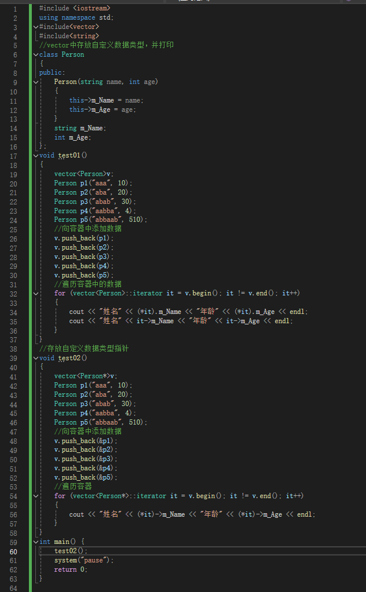
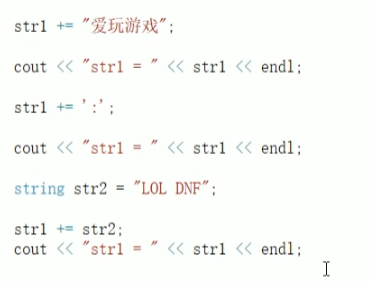
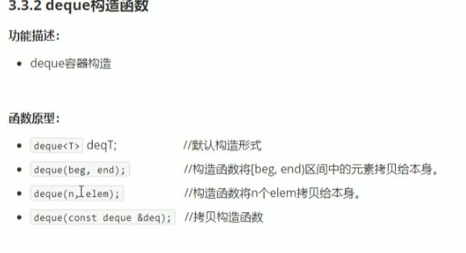
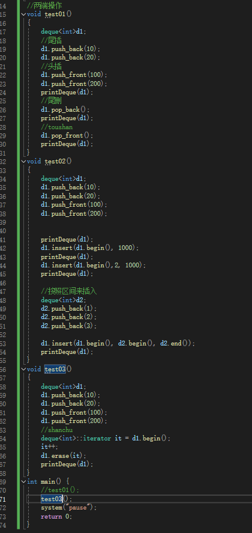
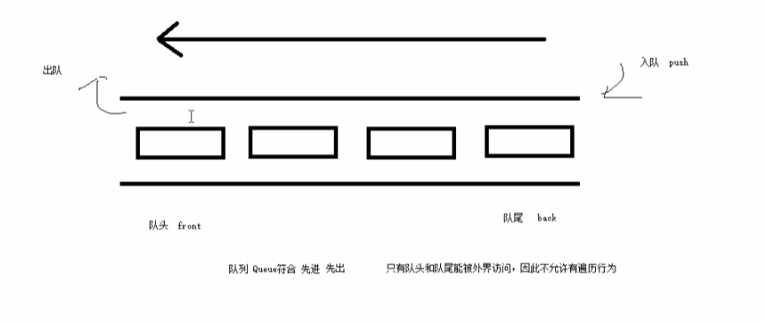
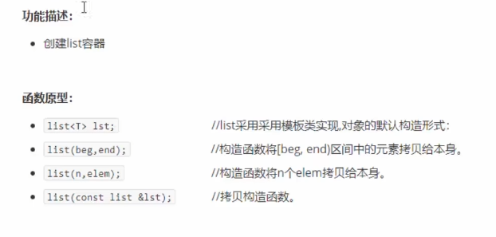

# 函数
## 函数的定义
    + 返回值类型
    + 函数名
    + 参数列表
    + 函数体语句
    + return表达式
1. 语法：
2. ``int add（int num1,int num2）{
    int sum = num1 + num2;
    return sum;
}``
## 函数的调用
+ 函数调用语法：函数名称（参数）

+ 在函数定义的时候，num1和num2并没有真实的数据，只是一个形式上的参数，简称形参。
+ a和b称为 实际参数，简称实参。
+ 当调用函数的是时候，实参的值会传递给形参。
## 值传递
+ 所谓值传递，就是函数调用时实参将数值传入给形参
+ 值传递时，如果形参发生变化，并不会影响实参。

## 常见的样式
1. 无参数，无返回
2. 有参数，无返回
3. 无参数，有返回
4. 有参数，有返回

## 函数的声明
+ 作用：告诉编译器函数名称及如何调用函数。函数的实际主体可以单独定义。
+ 声明可以写多次，但是定义只能有一次。
+ 声明是为了告诉编译器这个函数存在，不会报错，保证函数的顺利运行。

## 函数的分文件编写
+ 作用：让代码结构更加清晰。函数分文件编写一般有4个步骤。
1. 创建后缀名为`.h`的头文件。
2. 创建后缀名为`.cpp`的源文件。
3. 在头文件中写函数的声明。
4. 在源文件中写函数的定义。

5. 在其他源文件中只需要把函数的头文件名称包含进去，就可以调用该函数了。一般在头部写`#include “头文件名称.h”`即可。
# 重要！！！！！！！！！！！！！
***
***
# 指针
## 指针的基本概念
1. 指针的作用：可以通过指针间接访问内存。
    + 内存编号是从0开始记录的，一般用十六进制数字表示
    + 可以利用指针变量保存地址
2. 定义指针
    + 指针定义的语法：数据类型*指针变量。
    + 让指针记录变量a的地址用`&`来实现。
  3. 使用指针
    + 可以通过解引用的方式来找到指针指向的内存。即，指针前加一个 * 代表解引用，找到指针指向的内存中的数据。
4. eg.
## 指针所占内存空间
1. 提问：指针也是一种数据类型，那么这种数据类型占多少内存空间？
+ 在32位系统下，占4个字节，64位下占8个字节。
## 空指针和野指针
1. 空指针：指针变量指向内存中编号为0的空间。
    + 用途：初始化指针变量。
    + 注意：空指针的内存是不可以访问的。原因是，0～255之间的内存是系统占用的，因此不可以访问。
2. 野指针：指针变量指向非法的内存空间。
    +  在程序中，尽量避免出现野指针。

## const修饰指针
1. 常量指针
    + 特点是：指针的指向可以修改，但是指针指向的值不可以改。
    + eg：
2. 指针常量
    + 特点：指针的指向不可以改，指针指向的值可以改。
    + 
3. 修饰常量
    + 特点：指针的指向和指针指向的值都不可以改
    + 
### 辨别是哪种修饰指针的技巧：看const右侧紧跟着的是指针还是常量，是指针就是常量指针，是常量就是指针常量。
### 指针和数组
+ 作用：利用指针访问数组中的元素
## 指针和函数。作用：利用指针作函数参数，可以修改实参的值。
1. 值传递
2. 地址传递

# 结构体
1. 定义：自定义数据类型，一些类型集合组成的一个类型
2. 语法：`struct 类型名称{ 成员列表 }`注意：定义结构体时`struct`关键字不能省略。
3. 创建结构体变量的方法有三种(创建结构体变量时关键字`struct`可以省略)
    + 
    + 
    + 
4. 结构体变量利用操作符`.`来访问成员
### 结构体数组
+ 
## 结构体指针
1. 作用：通过指针访问结构体中的成员
  + ***利用操作符->可以通过结构体指针访问结构体中的成员属性***
2. 操作：
   + 创建学生结构体变量
    
   + 通过指针指向结构体变量
    
   + 通过指针访问结构体变量中的数据
    
    
## 结构体嵌套结构体
1. 定义学生的结构体

2. 定义老师的结构体

3. 创建老师

# 结构体作函数参数
+ ***作用：将结构体作为参数向函数中传递***
+ 传递的方式有两种：
    1. 值传递
    2. 地址传递
## 结构体中const使用场景

### 全局区
+ C++中在程序运行前分为全局区和代码区
+ 代码区特点是共享和只读
+ 全局区中存放全局变变量、静态变量、常量
+ 常量区中存放const修饰的全局常量和字符串常量
## 栈区
+ 注意事项：
1. 不要返回局部变量的地址

2. 栈区的数据由编译器管理开辟和释放
## 引用
### 引用的基本使用
1. 作用：给变量起别名
2. 语法：数据类型 &别名 = 原名
3. 优点：可以简化指针修改实参
## 菱形继承
菱形继承概念：  
1. 两个派生类继承同一个基类
2. 又有某个类同时继承这两个派生类
3. 这种继承被称为菱形继承，或者钻石继承  

4. 菱形继承问题：

        1. 羊继承了动物的数据，驼同样继承了动物的数据，当草泥马使用数据时，就会产生二义性。
        2. 草泥马继承自动物的数据继承了两份，其实我们应该清楚，这份数据我们只需要一份就可以，当菱形继承时，两个父类拥有相同的数据，需要加以作用域区分
5. 利用虚继承  解决菱形继承的问题
6. 继承之前  加上关键字  virtual  把父类变为虚继承   我们把Animal类称为虚基类

# 多态
+ 多态是C++面向对象三大特性之一
+ 多态分为两类：  
    1. 静态多态：函数重载和运算符重载属于静态多态，复用函数名
    2. 动态多态：派生类和虚函数实现运行时多态
+ 静态多态和动态多态区别：  
    1. 静态多态的函数地址早绑定 - 编译阶段确定函数地址
    2. 动态多态的函数地址晚绑定 - 运行阶段确定函数地址
# 多态的原理

当在父类中声明了虚函数之后，构成动态，会生成一个指针，指向该父类虚函数表，这个表记录的是父类虚函数的地址，当子类重写父类的虚函数时，子类中的虚函数表内部会替换成子类的虚函数表，从而输出子类的虚函数结果。这也是地址的晚绑定
## 多态案例————计算器类

案例：  

## 纯虚函数和抽象类

实际代码

注意：纯虚函数和虚函数的区别在于，凡是有纯虚函数的类则不能定义出实例对象 ，而没有纯虚函数有虚函数的类可以定义出实例对象。
## 多态案例二-制作饮品
案例描述：  

+ 需要注意的是，父类一定要设定为纯虚函数，子类一定要重写父类函数，并且一定要用指针调用才会从父类中访问子类的函数。
## 虚析构和纯虚析构
1. 
2. 
3. 总结： 
4. 代码实现：    
5. 
## 电脑组装案例
1. 
2. 电脑在组装案例的思路整理：

        + 首先需要抽象出零件的父类，写入对应的纯虚函数，以便子类重写纯虚函数。
        + 再抽象出电脑类，定义出三个零件的指针，并建立工作函数，让指针调用子类中重写后的函数。
        + 构建出Intel的子类，因特尔分别有这三种零件，继承上述的三种父类，并定义输出函数。Lenovo也是如此。
        + 编写测试函数，给第一台电脑的零件在堆区创建三个新的指针，再创建第一台电脑，定义第一台电脑的指针指向第一台电脑的对象，将new出来的三种零件传入第一台电脑中。
        + 最后用电脑的指针调用工作函数即可。
+ 
+ 
+ 
+ 
## 文件操作：写文件
1. 
2. 5个步骤：
3. 
# 模板
1. 本阶段主要针对C++泛型编程和STL技术做详细讲解，探讨C++更深层次的使用
2. 
3. 特点：
## 函数模板
+ 
+ 语法：
+ 实例：

        创建两个函数，
        发现两个函数除了传入的数据类型不一样以外，几乎都是一样的，为了再调用时更方便，是语言具有一定的复用性，我们利用函数模板的概念和方法，为这两个函数创建一个模板!
        这样一来，函数的调用就非常简介明了了，甚至使用自动识别的方式来引用。
## 模板的注意事项
1. template<typename>//typename 可以替换成class，但人们通常用class来区分类模板，其他情况也可以使用，但始终要养成使得代码具有一点可读性的好习惯
2. 自动类型推导，必须要推导出一致的数据类型T才可以使用
3. 模板必须要确定出T的数据类型，才可以使用
## 函数模板案例
1. 
2. 
3. 
## 普通函数和函数模板的区别
1. 
2. 
## 普通函数与函数模板的调用规则
1. 如果函数模板和普通函数都可以实现，优先调用普通函数
2. 可以铜通过空模板参数列表来强制调用函数模板
3. 函数模板也可以发生重载
4. 如果函数模板可以产生更好的匹配，优先调用函数模板
5. 实例：

        
        
        注意：既然提供了函数模板，最好就不要提供普通函数，否则容易出现二义性
## 模板的局限性
1. 局限性：模板的通用性并不是万能的  例如：  再例如：
2. 
3. 
4. 
5. 总结

        + 利用具体化模板，可以解决自定义类型的通用化
        + 学习模板并不是为了写模板，而是在STL能够运用系统提供的模板
6. 其实这段代码中对Person这个类的模板的编写与规定，就相当于是重载了”=“号，当然也可以直接用运算符重载的方式，重载”=“号，以达到目的，但是直接重载相对较为麻烦，所以这里用模板的方式。
## 类模板
1. 
2. 
3. 这段代码中主要是要记住创建类模板的方式以及怎么规范的调用

        类似函数模板，在类上面写入模板声明，这个类就称为类模板了，  template <class NameType,class AgeType>，对象中有几种数据类型就规定几种
        在测试函数中，使用Person<string，int>p1（”孙悟空“，999）来调用
## 类模板与函数模板的区别
+ 类模板与函数模板的区别主要有两点：  
    1. 类模板没有自动类型推导的使用方式

    2. 类模板在模板参数列表中可以有默认参数

如果传了，就用你的，如果没传就用默认类型
## 类模板中的成员函数创建时机
+ 类模板中成员函数和普通类中成员函数创建时机是有区别的：  
    
    1. 普通类中的成员函数一开始就可以创建
    2. 类模板中的成员函数在调用时才创建
+ 
+ 总结：类模板中的成员函数并不是一开始就创建的，在调用时才去创建的。
## 类模板对象做函数参数
1. 
2. 代码实现：  

3. 总结：

        + 通过类模板创建的对象，可以有三种方式像函数中进行传参
        + 使用比较广泛的是第一种：指定传入类型
## 类模板与继承
当类模板碰到继承时，需要注意以下几点：
  + 当子类继承的父类是一个类模板时，子类在声明的时候，要指定出父类中T的类型
  + 如果不指定，编译器无法给子类分配内存
  + 如果想灵活指定出父类中T类型，子类也需变为类模板
总结：正常来讲一般不会这么用，除非是碰到及其复杂的情况，我们一般会将代码写的尽量具有可读性，过于简单或者过于抽象，反而不利于读懂代码。只需要知道，如果父类时类模板，子类需要指定出父类中T的数据类型。 
## 类模板中成员函数的类外实现
1. 
2. 总结：  类模板中成员函数类外实现时，需要加上模板参数列表。
## 类模板分文件编写

## 类模板与友元

实例： 

# STL
## 初步认识STL
1. 
2. 
3. 
4. 
5. 
6.  
  使用的时候把迭代器当成指针来看
##  容器算法迭代器初识
了解STL中容器、算法、迭代器的概念之后，我们利用代码感受STL的魅力。  STL中最常用的容器为Vector，可以理解为数组，下面我们将学习如何向这个容器中插入数据、并便利这个容器。 

+ 首先先创建vector容器对象，并且通过模板参数指定容器中存放的类型。
+ 用push_back命令向容器中放数据
+ 每一个容器都有自己的迭代器，迭代器是用来遍历容器中的元素。
+ v.begin()返回迭代器，这个迭代器指向容器中的第一个数据。
+ v.end（）返回迭代器，这个迭代器指向容器元素中的最后一个元素的下一个位置 
+ vector<int>::iterator 拿到vector<int>这种容器的迭代器类型
+ 第一种遍历方式是用while循环的方式
+ 第二种遍历方式是用for循环的方式
+ 第三种遍历方式用STL提供标准遍历算法，头文件 algorithm。特别要注意使用时候的语法。
## vector中存放自定义数据类型 ，并打印输出

## 容器嵌套容器

## string容器
本质：  
+ string是C++风格的字符串，而string本质上是一个类  
string和char*区别：  
+ char*是一个指针
+ string是一个类，类内部封装了char*，管理这个字符串，是一个char*型的容器
特点：  
1. string类内部封装了很多成员方法  例如：查找find，拷贝copy，删除delete，替换replace，插入insert
2. string管理char*所分配的内存，不用担心复制越界和取值越界等，由类内部进行负责
3. 
##  string赋值操作

## string字符串的拼接

1. 
2. 
3. 
4. 总结：字符串拼接的重载版本很多，初学阶段记住几种即可。
## string的查找和替换
1. 
2. find查找：  ，如果没有该字符串则返回负一。  
3. rfind：  和find的区别是rfind是从右往左查找 ，find是从左往右查找  
4. 替换：  ，  ，把从1到3的字符串全部替换成`1111`，有多少替换多少。
5. 总结：  
+ find查找是从左往右，rfind是从右往左
+ find找到字符串后返回查找的第一个字符位置，找不到返回-1
+ replace在替换时，要指定从哪个位置起，多少个字符，替换成什么样的字符串。
## string字符串的比较
1. 
2. 
3. 
4. 总结：字符串对比主要适用于比较两个字符串是否相等，判断谁打谁小的意义不是很大。
## string中的字符存取
1. 
2.  
3. 通过[]访问单个字符：  
4. 通过at方式访问单个字符：  
5. 修改单个字符[]：  
6. 修改单个字符at：  
## string中的插入和删除
1. 
2. 通过insert插入：  
3. 通过erase删除：  
4. 总结：插入和删除的起始下标都是从0开始
## string子串
1. 
2. substr来求子串  
3. 使用操作  （0，8），从0开始不包括8
4. 总结：  灵活的运用求子串的功能，可以在实际开发中获取有效的信息。
## vector容器
1. 
2. 
3. 
4. 
5. 总结：  vector的多种构造方式没有可比性，灵活使用即可。
## vector赋值操作
1. 
2. 
3. 总结：vector赋值方式比较简单，使用operator=，或者assign都可以。
## vector容量和大小
1. 
2. 
3. 总结：

        + 判断是否为空——empty
        + 返回元素个数——size
        + 返回容器容量——capacity
        + 重新制定大小——resize
## vector插入和删除
1. 
2. 
3. 总结：  

        + 尾插——push_back
        + 尾删——pop_back
        + 插入——insert（位置迭代器）
        + 删除——erase（位置迭代器）
        + 清空——clear
## vector容器数据储存
1. 
2. 
3. 总结：   

        + 除了用迭代器获取vector容器中的元素，[]和at也可以
        + front返回容器第一个元素
        + back返回容器最后一个元素
## vector互换容器
1. 
2. 
3. 
4. 总结： swap可以使两个容器互换，可以达到使用的收缩内存效果
## vector容器的预留空间
1. 
2. 
3. 总结：如果数据量较大，可以一开始利用reserve预留空间，节省空间和性能。
## deque容器的概念
1. 
2. 
3. deque容器的构造函数：  
4. 总结：  deque容器和vector容器的构造方式几乎一致，灵活使用即可
## deque的赋值操作
1. 
2. 
3. 
4. 总结： deque赋值操作也与vector相同，需要熟练掌握
## deque大小操作
1. 
2. 
3. 但是需要注意的是，deque容器没有容量的概念，它可以无限的存放数据进去
4. 
5. 总结：  

        + deque没有容量的概念
        + 判断是否为空——empty
        + 返回元素个数——size
        + 重新指定个数——resize
## deque插入和删除
1. 
2. 
3. 总结：  
        
        + 插入和删除提供的位置是迭代器
        + 尾插——push_back
        + 尾删——pop_front
        + 头插——push_front
        + 头删——pop_front
## 数据存取
1. 
2. 
3. 
4. 总结：  
        + 除了用迭代器获取deque容器中的元素，[]和at也可以
        + front返回容器第一个元素
        + back返回容器最后一个元素
## deque容器的排序
1. 
2. 
3. 要注意的是，sort算法排序的规则是从小到大 
4. 对于支持随机访问的迭代器的容器，都可以利用sort算法直接对其进行排序
5. vector容器也可以利用sort进行排序
6. 总结：   sort算法非常实用，使用时包含头文件<algorithm>即可。
## stack容器基本概念
1. 
2.   栈不允许有遍历行为，因为只有栈顶部的元素才能被访问到。栈可以判断容器是否为空，用empty。栈也可以返回元素个数，用size
3. 另外，栈区是自上向下的。而堆区是自下向上的。
4.   生活中的弹匣实际上就是栈
## stack常用接口
1. 
2. 
3. 总结：  
        + 入栈——push
        + 出栈——pop
        + 返回栈顶——top
        + 判断是否为空——empty
        + 返回栈大小——size
## queue容器
1. 队列是先进先出
2. 
3. 
4.   生活中排队打饭就是队列的实例
## queue常用接口
1. 
2. 
3. 总结：  
        + 入队——push
        + 出队——pop
        + 返回队头元素——front
        + 返回队尾元素——back
        + 判断队是否为空——empty
        + 返回队列大小——size
## list容器
1. 
2.   缺点是：容器遍历速度没有数组快，而且它占用的空间比数组大。
3. 
4. 
## list容器的构造函数
1. 
2. 
3. 总结：  list构造方式同其他几个STL常用容器，熟练掌握即可。
## list容器赋值和交换
1. 
2. 
3. 
4. 
## list大小操作
1. 
2. 
3. 
4. 总结：  
        + 判断是否为空——empty
        + 返回元素个数——size
        + 重新指定个数——resize
## list容器的插入和删除
1. 
2. 
3. 
4. 
5. 
6. 
7. 
8. 总结：
        + 尾插——push_back
        + 尾删——pop_back
        + 头插——push_front
        + 头删——pop_front
        + 插入——insert
        + 删除——erase
        + 移除——remove
        + 清空——clear
## list容器的数据存取
1. 
2. L[0]  不可以用[]方式访问list容器中的元素
3. L.at(0)  不可以用at方式访问list容器中的元素
4. 原因是list本质是一个链表，不是用连续线性空间存储数据，迭代器也是不支持随机访问的。
5. 
6. 
7. 总结：  
        + list容器不可以通过[]和at()方式访问数据
        + 返回第一个元素——front
        + 返回最后一个元素——back
## list 容器中的反转和排序
1. 
2. 
3. 注意：  所有不支持随机访问迭代器的容器，不可以用标准的算法。不支持随机访问嗲带起的容器，内部会提供对应的一些算法。例如下图就是需要调用成员函数才能使用sort，默认的排序规则是从小到大。降序排序直接用reverse  
4. 总结：  
        + 反转——reverse
        + 排序——sort（成员函数）
## set容器
1. 
2. 
3. 
4. 总结：  
        + set容器插入的数据时应该用insert
        + set容器插入数据时会自动排序
        + multiset插入数据时可以产生重复
## set大小和交换
1. 
2. 
3. 
4. 
5. 总结：  
        + 统计大小——size
        + 判断是否为空——empty
        + 交换容器——swap
## set插入和删除
1. 
2. 
3. 总结：  
        + 插入——insert
        + 删除——erase
        + 情况——clear
## set容器的查找和统计
1. 
2. 
3.    //对于set而言统计结果要么是0要么是1，但对于multiset则不一样
4. 总结：   
        + 查找——find（返回的是迭代器）
        + 统计——count（对于set，结果为0或者1）
## set和multiset的区别
1. 
2. 总结：  
        + 如果不允许插入重复的数据可以利用set
        + 如果需要插入重复数据利用multiset
## pair对组的创建
1. 
2. 
3. 总结：两种方法都可以创建队组，记住一种即可。
## set容器的排序
1. 
2. 
3. 总结：  
        + 利用仿函数可以指定set容器的排序规则。
## set容器存放自定义内容
1. 
2. 对于自定义数据类型，set必须指定排序规则才可以插入数据
## map基本概念（类似python中的字典）
1. 
## map构造和赋值
1. 
2. 总结：  
        + map中所有的元素都是成对出现，插入数据时候要使用对组。
## map大小和交换
1. 
2. 
3. 
4. 总结：  
        + 统计大小——size
        + 判断是否为空——empty
        + 交换容器——swap

