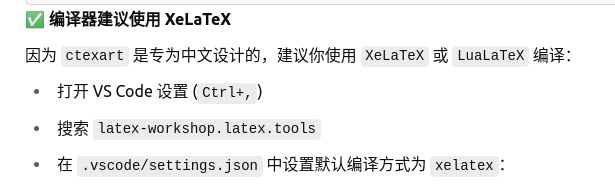

## 设置编译
1. 由于有时要写中文或者英文文章，所以有必要设置编译时的默认编译器。
2. 我的问题是，在一开始的默认情况下，我是从中文上手的，每次第一次保存都会报错，问了GPT告诉我是默认编译器的问题，然后我找到帅师兄，他的设置是第一次点击的编译器作为后面每次保存的编译器。
3. 具体设置为：```    "latex-workshop.latex.tools": [
        {
            "name": "xelatex",
            "command": "xelatex",
            "args": [
                "-synctex=1",
                "-interaction=nonstopmode",
                "-file-line-error",
                "%DOC%"
            ]
        },
        {
            "name": "pdflatex",
            "command": "pdflatex",
            "args": [
                "-synctex=1",
                "-interaction=nonstopmode",
                "-file-line-error",
                "%DOC%"
            ]
        },
        {
            "name": "bibtex",
            "command": "bibtex",
            "args": [
                "%DOCFILE%"
            ]
        },
        {
            "name": "biber",
            "command": "biber",
            "args": [
                "%DOCFILE%"
            ]
        },
        {
            "name": "latexmk",
            "command": "latexmk",
            "args": [
                "-synctex=1",
                "-interaction=nonstopmode",
                "-file-line-error",
                "-pdf",
                "%DOC%"
            ]
        }
    ],
    "latex-workshop.latex.recipes": [
        {
            "name": "PDFLaTeX",
            "tools": [
                "pdflatex"
            ]
        },
        {
            "name": "XeLaTeX",
            "tools": [
                "xelatex"
            ]
        },
        {
            "name": "BibTeX",
            "tools": [
                "bibtex"
            ]
        },
        {
            "name": "latexmk (all-in-one-automatically)",
            "tools": [
                "latexmk"
            ]
        },
        {
            "name": "pdflatex*2",
            "tools": [
                "pdflatex",
                "pdflatex"
            ]
        },
        {
            "name": "xelatex*2",
            "tools": [
                "xelatex",
                "xelatex"
            ]
        },
        {
            "name": "pdflatex -> bibtex -> pdflatex*2",
            "tools": [
                "pdflatex",
                "bibtex",
                "pdflatex",
                "pdflatex"
            ]
        },
        {
            "name": "pdflatex -> biber -> pdflatex*2",
            "tools": [
                "pdflatex",
                "biber",
                "pdflatex",
                "pdflatex"
            ]
        },
        // {
        //     "name": "xelatex -> bibtex -> xelatex*2",
        //     "tools": [
        //         "xelatex",
        //         "bibtex",
        //         "xelatex",
        //         "xelatex"
        //     ]
        // },
        {
            "name": "xelatex -> biber -> xelatex*2",
            "tools": [
                "xelatex",
                "biber",
                "xelatex",
                "xelatex"
            ]
        },
    ],
    "latex-workshop.view.pdf.viewer": "tab",
    "latex-workshop.latex.clean.fileTypes": [
        "*.aux",
        "*.bbl",
        "*.blg",
        "*.idx",
        "*.ind",
        "*.lof",
        "*.lot",
        "*.out",
        "*.toc",
        "*.acn",
        "*.acr",
        "*.alg",
        "*.glg",
        "*.glo",
        "*.gls",
        "*.ist",
        "*.fls",
        "*.log",
        "*.bcf",
        "*.run.xml",
        "*.fdb_latexmk"
    ],
    "latex-workshop.latex.autoClean.run": "onBuilt",
    // "latex-workshop.latex.autoClean.run":"never",
    "latex-workshop.latex.autoBuild.run": "onSave",
    "latex-workshop.latex.recipe.default": "lastUsed",```
4. 设置方法为：