## linux的目录结构


## linux常见的帮助命令
1. man获取帮助信息（简单记为有问题找那个男人）
   
+ ls：查询当前目录表

+ man ls：
2. help
+ 只能显示shell内置的命令
## 开关机命令
1. 基本语法：
2. 选项：
## 文件目录类命令
1. pwd：显示当前工作目录的局对路径（从根目录开始写起）
2. ls -a:显示当前目录的隐藏文件
3. cd：进入某一文件夹
4. ls -l：显示完整信息（long）前面是文件类型及权限  第二列是连接数  第三为作者  第四列为大小（bate）  时间   文件（夹）名字
5. 最最常用的切换命令：cd
   + 
   + 注意使用cd使用的绝对路径和相对路径，熟练使用相对路径会节省大量时间
   + cd..：退回上一路径
   + cd（直接回车）或者cd ~：回到家目录
   + cd -:切换到上一次使用的目录
## 创建目录和删除目录
1. mkdir：创建目录（/继续创建文件夹）注意，要一级一级创建，要一次性创建则需要使用递归创建目录命令：mkdir -p。
2. rmdir：删除空目录
## 创建空文件命令
1. touch：`touch 1.txt`
## 复制文件
1. cp：`cp 1.txt /1/2/3`
2. cp -r：递归复制文件夹
3. 复制文件中所有的内容需要加*
4. \cp：不询问，直接覆盖
## 删除文件（夹）命令
1. rm：询问删除
2. rm -f：不询问直接删除
3. rm -r：递归删除文件夹中的所有内容（询问）
4. rm -rf：直接干掉文件夹，不询问
5. rm -rv：显示指令的详细执行过程
6. mv `文件名` `地址` `重命名文件名`
## 查看文件内容命令
1. cat `文件名`：查看文件内容
2. cat -n `文件名`：带上行号（有回车则是换行）
3. more `文件名`：全屏按页显示，操作之后可通过若干快捷键查看内容
4. less `要查看的文件`：效率高，可以根据文件的大小来显示内容，推荐使用，功能比more强大
5. q：离开这个程序
## 查看文件头
1. head -`n` `文件名`：显示文件的n行内容
## 查看文件尾
1. tail -`n` `文件名`：查看尾部，通常用来查看文件后面的错误信息
2. tail -f `文件名`：挂起，持续观察文件，实时监控
3. tail `文件`：查看后10行内容
## 打印信息，输出命令（同c++）
1. echo


## 覆盖与追加
1. `ll > 1.txt`：覆盖`1.txt`中的内容
2. `ll >> 1.txt`：在`1.txt`后追加内容
## 硬链接、软链接不常用
## history
1. history：查看所有历史命令
2. 
3. 或者按上下查看，且方便使用
# 使用VI和VIM编辑器
## 什么是VI和VIM编辑器

在linux没有交互界面的环境中，可以利用VI或者VIM对一些文本来进行编辑和修改。
## 一般模式
+ 进入编辑界面无法使用鼠标，也叫一般模式
1. 输入两下gg：移动到页面开头
2. `shift+g`：到末尾（实际上是大写的G）
3. 如果想到某一行，则键盘输入`100+shift+g`，（不会显示，只需要操作就行）
4. 两次大写的ZZ：`ZZ`退出编辑器模式
5. yy：复制
6. p：粘贴
7. dd：删除全部内容
## 编辑模式
1. 在一般模式中按下`ℹ或者a或o`可以进入编辑模式（光标为a前，i后，o为下一行）。其他命令不推荐使用，不符合我们的编辑习惯故舍弃
`注意：在linux终端系统中，按下鼠标滚轮中键可以快速粘贴`
## 命令模式
1. 先按下键盘`esc`键，进入命令模式，在编辑模式中输入`：`通常我们用`wq`命令来保存并推出。
需要注意的是，`q`一般表示退出，而`wq`一般表示写入并退出。
1. 查找：`：/+内容`
2. 替换，`%s/内容/后内容/`。一般用的比较少。
3. 查找过后会高亮，通过`：noh`回车取消高亮。
4. 取消行号：`set nonu`
5. 有的时候修改文档的权限会不够，故通常在命令后面加一个`！`。
# VIM的三种模式的切换

# 文件查找
1. 文件名查找
## 语法
	find 搜索路径 -name "文件名关键词"
***例子***
	find / -name "passwd"
	find / -name "ifcfg-*"
2. 文件内容查找
## 语法
	grep -参数 要查找的目录范围
	# 参数
	-n 显示查找结果所在行号
	-R 递归查找目录下的所有文件
***例子***
	grep aries /etc
	grep aries /etc/passwd
# 系统管理
1. 静态查看系统进程 
    + 使用命令`ps -aux`   
2. 时时查看系统进程
    + 使用`top`命令，上下反动，q退出
3. 关闭进程
    + `kill 进程id`
4. 强制关闭进程（谨慎使用）
    + `kill -9 进程id`
# 系统软件管理
## 压缩解压缩
1. 压缩语法：`tar -zcvf 压缩后文件名 被压缩文件`
2. 解压语法：`tar -zxvf 解压缩文件名 -C 解压后文件所在目录`。实际上`-C`指的是解压后的文件存放的位置
## rpm软件（类似windows中的.exe程序）
1. 安装rpm软件
    语法：`rpm -ivh xxx.rpm`
2. 查看系统中是否一安装过该rpm软件
    语法：`rpm -qa 软件名`
3. 卸载rpm软件
    语法：`rpm -e 软件名`
## yum
+ 说明：（yum基于rpm实现的，提供了除了rpm的安装软件、卸载软件等功能以外还有，自动查找、下载软件并自动处理软件的彼此之间的依赖关系，下载并安装依赖包。）
1. 列出所有可以安装的软件包。语法：`yum list`
2. 安装软件。语法：`yum install -y 软件名`
3. 卸载软件。语法：`yum remove 软件名`
4. 查找软件包。语法：`yum search all 软件名`
# dpkg命令的使用
+ 说明：管理系统的里deb包,可以对其安装、卸载、deb打包、deb解压等操作，与之相关apt-get工具可以在线下载 deb包 安装。
## 参数：
1. `-i：安装软件包； `
2. `-r：删除软件包； `
3. `-P：删除软件包的同时删除其配置文件； `
4. `-L：显示于软件包关联的文件； `
5. `-l：显示已安装软件包列表； `
6. `--unpack：解开软件包； `
7. `-c：显示软件包内文件列表； `
8. `--confiugre：配置软件包。`
***
***
1. 安装软件。命令：`dpkg -i deb文件名`
2. 列出与该包相关联的文件。命令：`dpkg -L 包名`
3. 显示包的版本。命令`dpkg -l 包名`
4. 移除软件（保留配置）。命令:`dpkg -r 包名`
实例:dpkg -r zabbix-release
5. 移除软件（不保留配置）命令:`dpkg -P 包名`
实例:dpkg -P zabbix-release
6. 查找包的详细信息。命令:`dpkg -s 包名`
实例:dpkg -s zabbix-release
7. 列出deb包的内容。命令:`dpkg -c 包名.deb 列出 deb 包的内`
实例:dpkg -c zabbix-release
8. 解开deb包的内容
命令：`dpkg –unpack 包名.deb 解开 deb 包的内容`
9. 搜索所属的包内容
命令：`dpkg -S keyword 搜索所属的包内容`
10. 配置包
`dpkg –configure package 配置包`
注意：详细教程可以打开[https://blog.csdn.net/qq_35078688/article/details/119382985?ops_request_misc=%257B%2522request%255Fid%2522%253A%2522172092295616800215080288%2522%252C%2522scm%2522%253A%252220140713.130102334..%2522%257D&request_id=172092295616800215080288&biz_id=0&utm_medium=distribute.pc_search_result.none-task-blog-2~all~top_positive~default-1-119382985-null-null.142^v100^pc_search_result_base8&utm_term=dpkg&spm=1018.2226.3001.4187](./.assets_IMG/Linux/)
# 重点！！！！！！！！！！！
***
***
***
# 基于SSH的远程登陆方法的说明
说明：Secure Shell(./.assets_IMG/Linux/SSH) 是由 IETF(./.assets_IMG/Linux/The Internet Engineering Task Force) 制定的建立在应用层基础上的安全网络协议。
## 安全机制
1. 口令级别：只要你知道自己帐号和口令，就可以登录到远程主机。但安全度不高，容易受到攻击或者连接到错误的主机。
2. 密钥级别：你必须为自己创建一对密钥，并把公钥放在需要访问的服务器上。
## SSH的安装
+ SSH分为客户端和服务器两个部分
+ 可以输入`dpkg -l | grep ssh`确认或者检查电脑上是否安装了客户端和服务器。
+ 如果只是想远程登陆别的机器只需要安装客户端（Ubuntu默认安装了客户端），如果要开放本机的SSH服务就需要安装服务器。
+ 安装：
    1. `sudo apt-get install openssh-client`(./.assets_IMG/Linux/客户端)
    2. `sudo apt-get install openssh-server`(./.assets_IMG/Linux/服务器)
## 启动服务器的SSH服务
1. 首先要确认ssh-server是否已经启动。在终端输入命令：`ps -e | grep ssh`出现sshd，代表ssh-server已经启动了。
    + 如果没有启动，可以使用以下命令启动。`sudo /etc/init.d/ssh start `
2. 停止和重启ssh服务的命令分别为：
    + `sudo /etc/init.d/ssh stop `#server停止ssh服务 
    + `sudo /etc/init.d/ssh restart  `#server重启ssh服务
## 一、口令登陆
1. 口令登录非常简单，只需要一条命令，命令格式为： ssh 客户端用户名@服务器ip地址  
eg:`ssh ldz@192.168.0.1`
2. 如果需要调用图形界面程序可以使用 -X 选项
eg:`ssh -X ldz@192.168.0.1`
3. 如果客户机的用户名和服务器的用户名相同，登录时可以省略用户名。eg:`ssh 192.168.0.1`
4. 还要说明的是，SSH服务的默认端口是22，也就是说，如果你不设置端口的话登录请求会自动送到远程主机的22端口。我们可以使用 -p 选项来修改端口号，比如连接到服务器的1234端口：`ssh -p 1234 ldz@192.168.0.1`。
5. 客户机必须要知道服务器的ip地址。可以在服务器端电脑上利用 `ifconfig`命令查看该机的ip地址。
6. 如果是第一次登录远程主机，系统会给出下面提示：
   
7. 意思是，该远程主机的真实性无法确定，其公钥指纹为 SHA256:FFobshqrGOachj7Xp4LsJ9+xkNBlyyOe8ZIPl7K+qQI，确定想要继续连接吗？
输入yes即可。这时系统会提示远程主机被添加到已知主机列表。
8. 然后会要求我们输入远程主机的密码，输入的密码正确就可以成功登录了。命令提示符会修改为远程主机的提示符，现在开始，终端中输入的命令都将在服务器中执行。
## 二、公钥登陆
1. 每次登录远程主机都需要输入密码是很不方便的，如果想要省去这一步骤，可以利用密钥对进行连接，还可以提高安全性。
2. 在本机生成密钥对。使用`ssh-keygen -t rsa`。然后根据提示一步步的按enter键即可（其中有一个提示是要求设置私钥口令passphrase，不设置则为空，这里看心情吧，如果不放心私钥的安全可以设置一下），执行结束以后会在 /home/当前用户 目录下生成一个 .ssh 文件夹,其中包含私钥文件 id_rsa 和公钥文件 id_rsa.pub。
3. 将公钥复制到远程主机中。使用`ssh-copy-id`命令将公钥复制到远程主机。`ssh-copy-id`会将公钥写到远程主机的` ~/ .ssh/authorized_key `文件中.
4. `ssh-copy-id ldz@192.168.0.1`
5. 经过以上两个步骤，以后再登录这个远程主机就不用再输入密码了。
## 三、SSH的高级应用
***使用远程主机不中断的跑程序***
+ 当我们利用ssh在远程主机上跑程序的时候，只要关闭了终端就会中断ssh连接，然后远程主机上正在跑的程序或者服务就会自动停止运行。我们可以利用`nohup + 需要运行的程序` 使运行的程序在切断ssh连接的时候仍然能够继续在远程主机中运行。`nohup`即`no hang up`(./.assets_IMG/Linux/不挂起)。
+ 除此之外还有很多远程操作应用，包括 数据传输、端口操作(./.assets_IMG/Linux/将不加密的网络连接绑定到ssh端口实现间接加密) 等等，可以参考柚子皮大神的博客：[https://blog.csdn.net/pipisorry/article/details/52269785](./.assets_IMG/Linux/)
# Linux 系统命令大全
## 一、Linux系统的基本介绍
1. 基本简介
+ Linux 是一个基于Linux 内核的开源类Unix 操作系统，Linus Torvalds于 1991 年 9 月 17 日首次发布的操作系统内核。Linux 通常打包为Linux 发行版。

+ Linux 最初是为基于Intel x86架构的个人计算机开发的，但此后被移植到的平台比任何其他操作系统都多。由于基于 Linux 的Android在智能手机上的主导地位，截至 2022 年 5 月，Linux（包括 Android）在所有通用操作系统中拥有最大的安装基础。

+ Linux 也可以在嵌入式系统上运行，即操作系统通常内置在固件中并针对系统高度定制的设备。这包括路由器、自动化控制、智能家居设备、视频游戏机、电视（三星和 LG智能电视分别使用Tizen和WebOS）

+ Linux 是免费和开源软件协作最突出的例子之一。任何人都可以根据其各自的许可条款，例如GNU 通用公共许可证(GPL)，以商业或非商业方式使用、修改和分发源代码。例如，Linux 内核在 GPLv2 下获得许可，但系统调用有一个特殊例外，因为没有系统调用例外，任何调用内核的程序都将被视为衍生程序，因此GPL必须适用于该程序。
2. Linux文件系统
+ 核心
    1. Linux一切皆文件（众生平等）
    2. 只有一个顶级目录，不像windows分C盘、D盘、E盘。
+ 目录结构
    
+ 文件含义
        
## Linux文件管理命令
***注意事项***：命令区分大小写
1. 命令的格式固定为：命令 [-选项] [参数]   （中间有空格）
    + 说明：
      1. 个别命令使用不遵循此格式
      2. 当有多个选项时，可以写在一起
      3. 简化选项与完整项。例如-a等于 --all

2. 列出目录的内容：ls命令
    + 查看当前目录下的文件列表：ls
    + 查看指定目录下的文件：ls /
    + 查看详细信息，元数据信息（用户、组、大小、创建时间、权限信息、文件类型）
    + 查看隐藏文件：ls -a
    + 参数并用：ls -la
    + 当使用ls -l会显示文件的详细信息，包含权限信息：
3. 切换工作目录：cd命令
    + cd 目标文件夹：    
        命令所在路径：shell内置
        
        命令执行权限：所有用户
        
        语法：cd [目录]，其功能是切换目录
    + 绝对路径切换：cd 绝对路径
    + 相对路径切换：cd 相对路径
4. 显示当前路径：pwd命令
    + 查看当前命令所在的目录
        
        命令所在路径：/bin/pwd

        执行权限：所有用户
        
        语法：pwd

        功能描述：显示当前目录

        示范：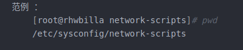
    + 特殊目录符号：

        ~ 当前用户的home目录
        . 当前目录
        .. 上一级目录
5. 创建目录：mkdir命令
    + 命令所在路径：/bin/mkdir
    + 执行权限：所有用户
    + 语法：mkdir -p 递归创建
    
    示范：
    + 在当前位置新建文件夹：mkdir 文件夹名
    + 在指定目录位置创建文件夹，并创建父文件夹：mkdir -p /a/b/文件夹名
    + 在当前目录下新建文件：touch 文件名
6. 删除空目录：rmdir 命令
    + 命令名称：rmdir
    + 命令所在路径：/bin/rmdir
    + 执行权限：所有用户
    + 语法：rmdir [目录名]
    + 功能描述：删除空目录
    + 示范:$:rmdir /tem/huang/test
7. 删除文件：rm命令
    + 命令所在路径：/bin/rm
    + 执行权限：所有用户
    + 语法：rm -rf [文件或目录]

        -r 删除目录

        -f 强制执行
    + 功能描述：删除文件
    + 示范:$:rm /temp/yun.txt
    
        删除文件/temp/yun.txt
    
        $:rm rf /temp/huang/test2

        删除目录/temp/huang/test2
    + 删除文件：rm 文件
    + 删除文件夹：rm -r 文件夹
    + 强制删除不询问：rm -rf 文件
8. 拷贝文件：cp命令
    + 命令所在路径：/bin/cp
    + 执行权限:所有用户
    + 语法cp -rp [原文件或目录] [目标目录]

    -r 复制目录

    -p 保留文件属性
    + 功能描述：复制文件或目录
    + 示范：$：cp -r /temp/huang/test /root

    将目录/temp/huang/test复制到 /root下

    $：cp -rp /temp/huang/test1 /temp/huang/test2 /root

    将/temp/huang目录下的test1和test2复制到 /root下，保持目录属性
    + 拷贝文件：cp 原文件 新文件
    + 拷贝文件夹：cp -r 原文件 新文件夹
9. 移动文件：mv命令
   + 移动原文件到目标文件夹中：mv 文件 文件夹
   + 修改文件A的名字为B：mv 文件A 文件B
10. 获取文件的md5指纹：md5sum命令
    + md5sum 文件名

    介绍：

    1. 数字签名，又称数字指纹
    2. 可以验证文件是否被修改
    3. 一个文件通过计算得到的一串字符串，文件内容的唯一标记（文件内容不变，指纹不变）
## 文本内容（查看|处理）命令
1. 创建文件：touch命令
   + 命令所在路径：/bin/touch
   + 执行权限：所有用户
   + 语法：touch [文件名]
   + 功能描述：创建空文件
   + 示范：$：touch test
2. 显示文件内容：cat命令
    + 命令所在路径：/bin/cat
    + 执行权限：所有用户
    + 语法：cat [文件名]
    + 功能描述：显示文件内容

        -n显示行号
    + 示范：
    $:cat /etc/issue

    $:cat -n /etc/services
3. 分屏显示：more命令
    + 命令所在路径：/bin/more
    + 执行权限：所有用户
    + 语法：more [文件名]
    
    （空格）或f ：翻页
    （enter）：换行
    q或Q：退出
    + 功能描述：分页显示文件内容
    + 示范：$:more /etc/services
4. 分屏显示：less命令
    + 以分页的方式浏览文件信息（适合查看大文档），进入浏览模式
    + 浏览模式快捷键：
    
        
        
        G：最后一页
        g：第一页
        空格：下一页
        /关键词：搜索关键词
    + 退出浏览模式，回到命令模式：q 退出
    + 命令所在路径：/user/bin/less
    + 执行权限：所有用户
    + 语法：less [文件名]
    + 功能描述：分页显示文件内容（可向上翻页）
    + 示范：$:less /etc/services
    
    tips:按下 / 后可以搜索 会反显高亮  按q退出  （more也可以）
5. 取首n行：head命令
   + 命令所在路径：/user/bin/head
   + 执行权限：所有用户
   + 语法：head [文件名]
   + 功能描述：显示文件前面几行

        -n 指定行数
    + 示范：

    $:head -n 20 /etc/services
6.取尾n行：tail命令
    + 命令所在路径：/user/bin/tail
    + 执行权限：所有用户
    + 功能描述：显示文件后面几行

        -n 指定行数

        -f 动态显示文件末尾内容
    + 示范：$:tail -n 18 /etc/services
    + 实时滚动显示文件的最后10行信息（默认10行）

        tail -f 文件名
    + 显示文件的最后20行信息

        tail -n 20 文件名

        tail -n -20 文件名
    + 显示文件信息从第20行至行文末尾
## 文件搜索
1. 查找文件：find命令
    + 命令所在路径：/bin/find
    + 执行权限：所有用户
    + 语法：find [搜索范围] [匹配条件]

        find 搜索路径 -name "文件名关键词"
    + 功能描述：文件搜索
    
    示范：find /etc -name init

    在/etc目录中查找文件init

    -iname不区分大小写

    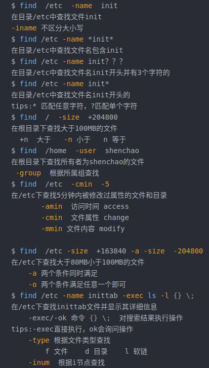
2. 文件资料库查找：locate命令
    + 命令所在路径：/eser/bin/locate
    + 执行用户：所有用户
    + 语法：locate 文件名
    + 功能描述：在文件资料库中查找资料
    
    示范：$:locate inittab

    tips:新建文件locate找不到，可以update一下 ，更新文件资料库后查找[tmp不在文件资料库内]

    $:locate -i text01
3. 查看命令位置：whereis命令
    + 命令所在路径：/user/bin/whereis
    + 执行权限：所有用户
    + 语法：whereis [命令]
    + 功能描述：搜索命令所在目录及别名信息
    + 示范：$:whereis ls
4. 查看命令位置：whereis命令
    + 命令所在路径：/user/bin/which
    + 执行权限：所有用户
    + 语法：which [命令]
    + 功能描述：搜索命令所在目录及别名信息
    + 示范：$:which ls
5. 文本搜索：grep命令
    + 命令所在路径：/bin/grep
    + 执行权限：所有用户
    + 语法：grep -iv [指定字串] [文件]

        grep -参数 要查找的目录范围
        
        参数：

            -n 显示查找结果所在行号
            -R 递归查找目录下的所有文件

    + 功能描述：在文件中搜寻字串匹配的行并输出

        -i 不区分大小写
        -v 排除指定字串
    + 示范：
        
            grep aries /etc
            grep aries /etc/passwd
            grep mysql /root/install.log
            grep -v ^# /etc/inittab
            表示去除以#开头的所有行信息，^表示以XXX开头
## 文件链接
### Linux文件管理
1. 文件链接
    + 命令所在路径：/bin/ln
    + 执行权限：所有用户
    + 语法：ln -s [原文件] [目标文件]

            -s  创建软链接
    + 功能描述：生成链接文件
    + 示范：

            创建文件/etc/issue的软链接/tmp/issue.soft

            $:ln -s /etc/issue /tem/issue.soft

            创建文件/etc/issue的硬链接/tmp/issue.hard
    + 模型图：

        
    + 说明：
            
            文件名：该文件的名字
            inode：该文件的元数据
            datablock：该文件真正保存的数据
    + 注意：

            1. inode中保存的是文件的元数据
            2. ls命令查看的都是元数据信息
            3. 数据块中才是文件的真正的数据
#### 硬链接
+ 硬链接特征：

        1. 拷贝cp -p+同步更新
        2. 可通过i节点识别
        3. 不能跨分区
        4. 不能针对目录使用

        
        5. 命令：ln -s 目标文件或文件夹 软链接名字
## 权限管理
1. 用户组（如图所示）


+ 相关命令

        1. 创建组：groupadd 组名
        2. 删除组：groupdel 组名
        3. 查找系统中的组：
        cat /etc/group | grep -n “组名”
2. 用户

        1. 创建用户
        useradd -g 组名 用户名
        2. 设置密码
        passwd 用户名
        3. 查找系统账户
        说明：系统每个用户信息保存在/etc/passwd文件中
        4. 切换用户
        su 用户名
        5. 删除用户
        userdel 用户名
3. 权限管理命令
+ 问题：linux系统未来可能有程序员、用户、数据库管理员、项目经理等各种角色各种级别人使用，甚至还有身份不明的人链接到linux，控制不好权限容易导致系统崩溃、数据丢失等问题。
+ 权限含义：
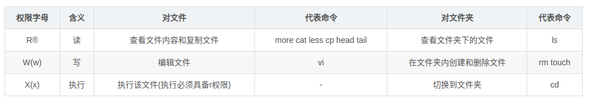
+ 权限访问控制列表（ACL access controll list）
#### 修改文件权限：chmod命令
+ 命令所在路径：/bin/chmod
+ 执行权限：所有用户
+ 语法：

    chmod [{ugoa}{+-=}{rwx}] [文件或目录] [mode=421] [文件或目录]
+ 权限的数字表示

        r：4
        w：2
        x：1
        rwx-rw-r：7-6-4 （相加）
+ 示范：
     
     赋予文件testfile所属组写权限
     $:chmod g+w testfile
     修改目录testfile及其目录下文件为所有用户具有全部权限
     $:chmod -R 777 testdir
+ 权限设置1

    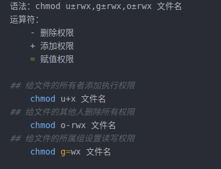
+ 权限设置2

    
#### 修改文件所有者：chown命令
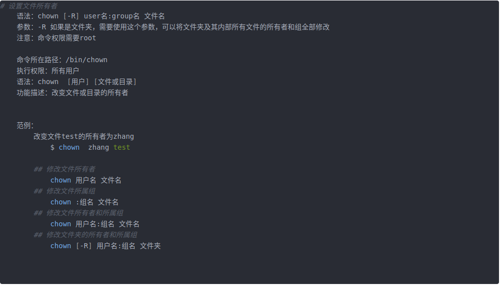
#### 修改文件所属组：chgrp命令
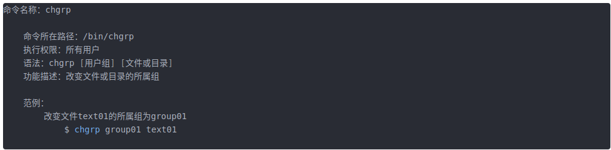
#### 默认权限：umask命令

#### 查看权限：ll命令
+ ls -la 文件
+ ll 文件 
## 帮助命令
1. man命令
    + 命令所在路径：/user/bin/man
    + 执行权限：所有用户
    + 语法：man [命令或配置文件]

            （空格）或f代表翻页
            （enter）代表换行
            q或Q代表退出
    + 功能描述：获取帮助信息
    + 示范：
    $:man ls
    
        查看ls命令的帮助信息
    $:man services

        查看配置文件services的帮助信息
2. 获取简介：whatis命令
+ 语法：whatis命令
+ 功能描述：获得命令的简单介绍信息
+ 示范：whatis ls
3. 获取帮助：help命令
+ 命令所在路径：Shell内置命令
+ 执行权限：所有用户
+ 语法：help命令
+ 功能描述：获得Shell内置命令的帮助信息
+ 示范：
    
    $:help umask

    查看umask命令的帮助信息
## 用户管理命令
1. 添加用户：useradd命令
    + 命令所在路径：/user/bin/useradd
    + 执行权限：root
    + 语法：useradd 用户名
    + 功能描述：添加新用户
    + 示范：
        
        $passwd huangjingbo
2. 查看登陆用户：who命令
+ 
3. w命令
+ 
4. 修改密码：passwd命令
+ 命令所在路径：/usr/bin/passwd 
+ 执行权限：所有用户
+ 语法：passwd 用户名 
+ 功能描述：设置用户
+ 范例：
    $ passwd huangjingbo
5. 切换用户：su命令
    
## 压缩解压所命令
1. 压缩：gzip命令
    + 命令所在路径：/bin/gzip 
	+ 执行权限：所有用户 
	+ 语法：gzip [文件]  
	+ 功能描述：压缩文件 
	+ 压缩后文件格式：.gz
	+ 范例：
		gzip text01
2. 解压缩：gunzip 命令
    + 命令所在路径：/bin/gunzip 
	执行权限：所有用户 
	语法：gunzip [压缩文件] 
	功能描述：解压缩.gz的压缩文件 
	 
	范例： 
		
    $ gunzip text01.gz
	
    tips:只能压缩文件不能压缩目录
3. 归档管理：tar命令
   + 压缩语法：tar -zcvf 压缩后文件名 被压缩文件
   + 解压缩语法：
   tar -zxvf 压缩后文件名 -C 解压后文件所在目录
   
   参数1：

        
        -z:操作tar.gz文件需要使用
        -x：解压缩
        -c：压缩
        -v：显示压缩或者解压缩的执行过程信息
        -f：要处理的文件file，必须放在最后
    参数2：

    + -C 制定解压后的文件存放的位置
    + tar与gzip命令结合使用实现文件打包、压缩。tar只负责打包文件，但不压缩，用gzip压缩tar打包后的文件，其扩展名一般用xxxx.tar.gz
    + 命令所在路径：/bin/tar
    + 执行权限：所有用户
    + 语法：tar 选项[-zcf] [压缩后文件名] [目录]

            -c指打包
            -v指显示详细信息
            -f指指定文件夹
            -z指打包同时压缩
    + 功能描述：打包目录 压缩后文件格式：.tar.gz
    + 示范：
        
        $tar  -zcf   Japan.tar.gz Japan
        将目录Japan打包并压缩为.tar.gz文件
    + tar命令解压缩语法：           
		-x     解包           
		-v    显示详细信息           
		-f     指定解压文件           
		-z     解压缩 
	+ 范例：
		$ tar -zxvf Japan.tar.gz
4. zip命令
    + 命令所在路径：/usr/bin/zip 
	+ 执行权限：所有用户 
	+ 语法：

        zip 选项[-r] [压缩后文件名] [文件或目录]
        -r 压缩目录
    + 功能描述：压缩文件或目录
    + 压缩后文件格式：.zip
    + 示范：

        $:zip text01.zip text01
        $:zip -r huang.zip huang
        压缩目录
        
        tips：会保留文件
        
5.  unzip命令
+ 命令所在路径：/user/bin/unzip
+ 执行权限：所有用户
+ 语法：unzip [压缩文件]
+ 功能描述：解压.zip的压缩文件
+ 示范：$:unzip text01.zip
## 网络命令
1. writ命令
+ 指令所在路径：/user/bin/write
+ 执行权限：所有用户
+ 语法：write <用户名>
+ 功能描述：给用户法信息，以Ctrl+D保存结束
+ 示范：

    write huang
2. wall命令
+ 指令所在路径：/user/bin/wall
+ 执行权限：所有用户
+ 语法：wall [message]
+ 功能描述：发广播消息
+ 示范：

    wall HelloWord
3. 测试网络连通性：ping命令
+ 命令所在；路径
+ 执行权限：所有用户
+ 语法：ping 选项 IP地址

    -c指定发送次数
+ 示范：

    ping 192.168.1.156
4. 查看和设置网卡信息：ifconfig
+ 命令所在路径：/user/bin/ifconig
+ 执行权限：root
+ 语法：ifconfig 网卡名称 IP地址
+ 功能描述：查看和设置网卡信息
+ 示范：

    ifconfig
5. 查看发送电子邮件：mail命令
+ 命令所在路径：/bin/mail
+ 执行权利：所有用户
+ 语法：mail [用户名]
+ 功能描述：查看发送电子邮件
+ 示范：

    mail root
6. 查看登陆用户历史信息：last命令
+ 命令所在路径：user/bin/last
+ 执行权限：所有用户
+ 语法：last
+ 功能描述：列出目前与过去登入系统的用户信息
+ 示范：

    last
7. 显示网络相关信息：netstat命令
+ 命令所在路径：/bin/nestat
+ 执行权限：所有用户
+ 语法：netstat [选项]
+ 功能描述：显示网络相关信息
+ 选项：

        -t：TCP协议
        -u：UDP协议
        -l：监听
        -r：路由
        -n:显示IP地址和端口号
示范：

    netstat -tlm 查看本机监听的端口
    netstat -an 查看本级所有的网络连接
    netstat -rn 查看本级路由表
    查看某一端口是否被占用：netstat -tunlp | grep 2181
8. 配置网络：setup命令
+ 命令所在路径：/user/bin/setup
+ 执行权限：root
+ 语法：setup
+ 功能描述：配置网络
+ 示范：

    setup
9. 挂载：mount命令
+ 命令位置：/bin/mount
+ 执行权限：root
+ 语法：setup
+ 功能描述：配置网络
+ 示范：

    setup
10. 系统命令（关机重启命令）
+ shutdown [选项] 时间

    + shutdown now

    + 选项：

            -c：取消前一个关机命令
            -h：关机
            -r：重启
+ 查看IP地址：

    + ip a
    + ip addr
+ ping网络（测试网络连通）

    ip 目标机器的ip
+ 查看系统时间

    date
+ 注销

    logout
+ 重启
    
    reboot
+ 清屏

    clear
+ 静态查看系统进程

    ps -aux
+ 实时查看系统进程

    top!
        
    
+ 关闭进程

    kill 进程id
+ 强制关闭进程（谨慎使用）

    kill -9 进程id
+ 覆盖输出

    + 将命令1的执行结果，输出到后面的文件中。

        命令1 > 文件
    + 示范：

        date > date.log
+ 追加输出
    + 将命令1的执行结果，输出到后面的文件中。

        命令1 >> 文件
    + 示范：

        date >> date.log
## Linux服务

## ip设置
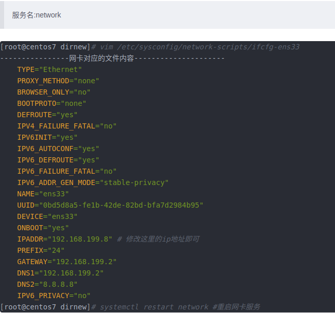
## 防火墙
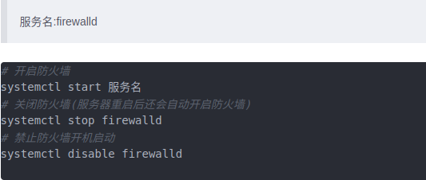
## 主机名

## ip映射
+ 域名解析
+ 本地hosts

    + $:vim/etc/hosts
## SSH
+ 在终端输入指令`ssh ro@192.168.1.104`，  这里的ro指的是要链接的linux端（服务器）的用户名。 回车连接成功。
+ 连接成功后就可以在指定系统上进行特定的操作。
+ 在本地把文件夹推送至指定服务器的文件夹：  
    + scp -r /home/yunxia/test ro@192.168.1.103:/home/ro/program
+ 在本地拿取指定服务器的文件：  
    + scp -r ro@192.168.1.103:/home/ro/program /home/yunxia/test
# 设置静态IP
## 通过图形界面设置
1. 在linux上设置静态ip，可以通过这种方式，快捷的设置，但是设置完成后一定要注意，如下第二张图中所示，要将有线连接断开并重连一次，这样才能正确设置静态ip。    修改地址选项即可。  地址填：192.168.1.31  子网掩码固定填写255.255.255.0  网关固定填写：192.168.1.1  说明：
    + 地址的第四位参数是路由器分配的地址，这个参数要尽量独一无二，保证在同一局域网下不与别的客户机发生冲突，如果发生冲突则需要修改一个即可。
    + 子网掩码一般是固定的，它会过滤出网段分配给用户。
    + 网关则是路由器的IP地址，但两个不同的路由器可能会有相同的网关，不过一般都是固定的。
## 通过yaml文件设置
1. 打开终端，在终端输入`ifconfig`命令，查看当前网卡
2. 继续在终端输入`route -n`查看当前网关，这一布要注意，不然配置的时候网关不对会导致配置完之后虽然有IP，但是无法链接网络的情况
3. 继续在终端将输入指令`sudo vim /etc/netplan/01-network-manager-all.yaml`，修改yaml文件如下（注意格式要正确，每个冒号后要留一个空格）：  
        
        network:
        version: 2
        renderer: NetworkManager
        ethernets: 
            wlp4s0: 
        addresses: [192.168.1.201/24]
        gateway4: 192.168.1.1
        nameservers: 
            addresses: [114.114.114.114, 8.8.8.8]
        mtu: 9000
+ 终端输入`sudo netplan apply`，如果没有任何提示说明就生效了。
+ 注意，以上的第五行`wlp4s0`是网关，即在终端查到的  
+ DNS域名也要设置正确 [114.114.114.114, 8.8.8.8] ，分别是电信和谷歌
## vscode实现SSH远程通讯
1. 打开vscode，      
2. 从下至上第一个，点击选项叫做远程资源管理器，右击SSH新建远程，输入命令`ssh ro@192.168.1.103`,回车配置成功，点击-->符号连接至远程客户端。
## windows系统使用git教程的一些说明
1. 安装Git。打开浏览器搜索Git，下载，最好安装在C盘（安装在其他盘可能会导致使用期间出现无法解释的错误）
2. 安装好Git之后，我们打开Git Bush。在终端依次输入git config --global user.name "Yunxia"和git config --global user.email "2226038143@qq.com"。这里双引号中的分别是电脑的用户名和注册Github时所用的邮箱。
3. 在终端输入ssh-keygen -t rsa -C "My-SSH"，创建以rsa为加密方式的公钥。和Linux系统不同的是，创建好密钥以后会在C盘，C/用户/"用户名"/.ssh文件夹中生成一个.pub文件，这里面贮存的是密钥，我们以记事本的方式打开，并复制。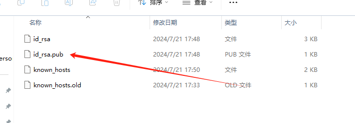
4. 复制以后，我们登录Github，进入settings，点击左侧SSH and GPG keys选项。  
点击New SSH key。输入好Title（随意输入）后在key框中粘贴刚才得到的密钥。
1. 至此，密钥的配对已经完成。
2. 我们打开任意文件夹，在文件夹下建立一个 测试文件，内容暂时随意写入。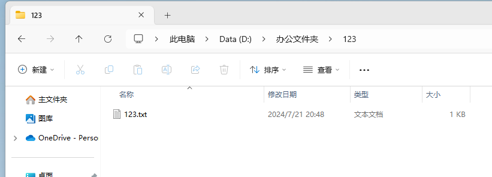
3. 然后在当前文件夹打开Git Bash，在终端输入git init，初始化一个空的本地仓库。接着终端输入git add .  将该文件夹中所有的文件上传至临时仓库，输入git commit -m“备注”,将文件上传至本地仓库。
4. 进入GitHub，新建一个仓库。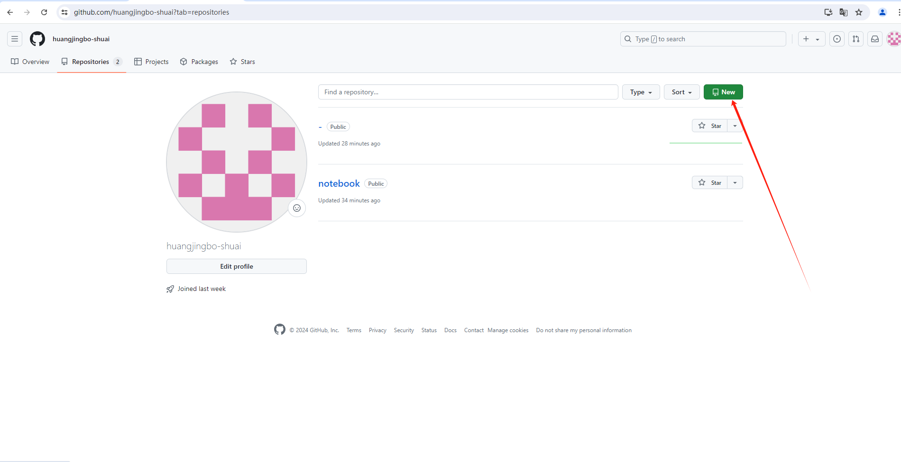。输入好name以后直接点击Create repository。创建一个新的仓库。
5. 。按照顺序，以此在终端复制进这三条指令。显示同步成功
6.  打开Github，刷新，，我们发现文件已经顺利上传至Github云端。
7.  说明：密钥的配对是一次性操作，一个系统只需要配对一次，但是配置用户和Github用户是需要每次启动系统都配置的，否则系统无法与云端建立联系，就无法将文件上云。
## windows系统利用vscode从Github云同步在Ubuntu系统中上云的文件，实现windows系统和Ubuntu系统的数据同步
1. 打开一个想要同步文件的仓库，复制该仓库的Url。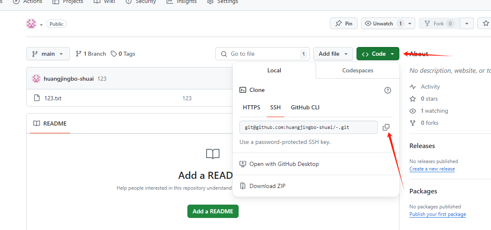。在终端输入git clone <复制的Url>。回车，即可在桌面得到仓库中的所有文件。此后只需要在linux端拉取仓库中的新内容即可。
## linux系统使用git教程的一些说明
## 管道命令
+ 简单来说，Linux中管道的作用是将上一个命令的输出作为下一个命令的输入，像pipe一样将各个命令串联起来执行，管道的操作符是`|`。
1. 利用管道命令查看当前运行的程序中，名为java的程序  ：ps -ef|grep java
2. 查看/etc/passwd文件中的root内容  :cat /etc/passwd | grep 'root'
3. 查看当前系统的ip链接  ：netstat -an
4. 将sh test.sh任务放到后台，并将打印的日志输出到`nohup.out`文件中，终端不再能够接收任何输入（标准输入）：  nohup sh test.sh  &
5. 将sh test.sh任务放到后台，并将打印的日志输出到test.out文件中，终端不再能够接收任何输入（标准输入）:  nohup sh test.sh >> test.out  &
6. 将sh test.sh任务放到后台，并将打印的日志输出到nohup.out文件中，终端能够接收任何输入:  nohup sh test.sh  &
# 日常笔记
## 在windows系统上通过mobaXterm连接linux系统
1. 进入官网下载mobaXterm
2. 解压后双击打开，点击servers
3. 输入要连接客户端的IP地址和用户名即可连接成功
## github上开展团队协作的操作指引
+ 引言：由于无人艇入坞项目需要构建一个复杂的控制系统，所以代码这一部分的任务就特别重，我们就想三个人同时在github上共同开发，分别是我、帅华飞、徐明、宋灿灿主要参与，下面具体介绍如何创建团队协作。
+ 解决办法：
        1. 登陆github，然后进入要共同开发的项目，这里以我的notebook为例
        2. 点击Collaborators，操作如图所示。
        3. 最后点击`Add people`把要加入的团队协作的人员加入就行了，操作如图所示。
+ 注意：如果出现报错。
        1. 第一可能是网络问题，如果排除网络问题更可能是证书问题，系统可能缺少正确的根证书，导致TLS连接无法验证。
        2. 解决办法是用命令`sudo apt-get install --reinstall ca-certificates`，更新证书后即可正常拉取和推送。
## 配置科学上网
这里不适用clash for windows，使用clash内核上网，在其他电脑上通过网页显示clash ui。具体步骤如下：
1. 在其他电脑上ssh连接nano板
2. `sudo su root`，因为下面很多地方需要root权限，直接切换到root用户
3. `uname -m`，查看系统架构，如果返回的是aarch64，就使用clash-linux-arm64-latest.gz这个版本的core，如果返回x86_64，就使用clash-linux-amd64-latest.gz这个版本的core。下载源[GitHub网址](https://github.com/szkzn/Clash_Core_Latest_Bak_2023-09-05.git)
4. `mkdir /opt/clash && cd /opt/clash`，将对应版本的core，通过ssh复制到板载计算机/opt/clash的文件夹中
5. `gunzip clash-linux-arm64-latest.gz`，解压缩
6. `chmod +x clash-linux-arm64-latest`，添加可执行权限
7. `mv clash-linux-arm64-latest clash`，将文件重命名，名字太长
8. 以上clash已经可以运行，但是需要配置文件，没有配置文件，就只是clash运行，但是没有节点。配置文件可以从主机的Linux端的clash获取，通过如下图所示方式获取，并将其移动到小电脑的`/opt/clash/`目录下
9. `./clash -f 1705112484308.yml`，此时就可以直接运行了
10. 但是上述运行过程过于复杂，可以将其简化为一个系统命令
11. `mv 1705112484308.yml config.yaml`，先将1705112484308.yml文件重命名
12. `vim /etc/systemd/system/clash.service`，clash.service的内容为
   ```txt
   [Unit]
   Description=clash-core
   [Service]
   Type=simple
   ExecStart=/opt/clash/clash -f /opt/clash/config.yaml
   ```
13. `systemctl daemon-reload`，重新加载 Systemd 的配置文件
14. `systemctl start clash`，启动clash
15. `systemctl status clash`，查看clash状态，可以发现已经启动
16. 但是此时终端`curl -i google.com`还是无法连通
17. `vim ~/.bashrc`，这里是直接在root目录下的.bashrc中修改，在最一开始添加
18. `source ~/.bashrc`，刷新环境变量
19. `proxy`，运行在.bashrc文件中定义的指令名
20. `curl -i google.com`，此时可以发现google可以ping通
21. 以上可以实现，在终端中输入`proxy`，就可以在终端科学上网，在终端中输入`unproxy`，就可以在终端停止科学上网。然后可以退出root用户，将当前用户的.bashrc文件中也加上那两行，这样不论是普通用户还是root用户都可以科学上网。然后再切换至root用户。但是上述方式目前为止，只能在终端查看clash的状态`systemctl status clash`，最好能有个ui，下面的步骤将介绍如何在同局域网的其他计算机的浏览器中查看clash状态。
        + 注意：有的时候做完上述操作还是没办法ping通Google，这个时候不妨重启一下小电脑，断电，待10秒钟以后插上电重新试一试。上次因为这个问题找了好久都找不到，最后心态小崩直接重启发现竟然可以ping通了。
22. [下载](https://gitlab.com/accessable-net/clash-dashboard/-/tree/gh-pages?ref_type=heads)ui相关的zip。
23. `mkdir /opt/clash/ui && cd /opt/clash/ui`，在Linux端新建一个目录/opt/clash/ui
24. 将下载好的zip文件移动到Linux端的目录/opt/clash/ui中，或者复制下载链接，在终端中执行`wget 下载链接`直接下载也可以
25. 下载后使用unzip解压。解压后，将压缩文件删除，并将解压出来的文件夹中的文件都移出来`mv clash-dashboard-gh-pages/* .`。并退回到/opt/clash目录中`cd ..`
26. `vim config.yaml`，在config.yaml文件中添加一行，使其指向`ui/index.html`这个文件，这样才能在网页中看到。添加的一行为`external-ui: /opt/clash/ui`，位置如图中红框所示。还需修改一行，否则无法从其他计算机浏览器访问这个网页，修改处如图中绿框中所示，将其中的127.0.0.1修改为0.0.0.0。
27. 修改完成后保存，并`systemctl restart clash`重启clash。重启后可`systemctl status clash`，查看clash状态
28. 重启完成后在同局域网的其他计算机的浏览器中输入该Linux端的IP地址加端口号，`192.168.1.107:9090/ui`，即可看到clash的ui，可在其中选择节点。如果此时跳出来一个界面，输入Linux端的IP地址即可。
### Jeston Nano启动clash
1. 如何启动和关闭clash
   ```bashs
   # 启动clash
   sudo systemctl start clash
   # 查看clash状态，是否被启动
   sudo systemctl status clash
   # 在终端环境变量中定义的变量，终端可上网
   proxy
   # 在终端环境变量中定义的变量，终端关闭上网
   unproxy
   # 关闭clash
   sudo systemctl stop clash
   ```
## 关于分布式操作的问题
1. 有一天发现分布式配置了以后想回到分布式以前的状态，发现修改了环境变量并刷新环境变量还是没办法正常roscore，最后发现原因是source命令可能不起作用，需要重新关闭黑窗口重新打开，问题即可解决。有时候大部分办法都解决不了的问题，可能重启一次就可以解决了。
## 卸载mavros并源码安装
1. 卸载mavros：`sudo apt-get remove ros-noetic-mavros ros-noetic-mavros-extras`
2. 源码安装mavros，参考链接`https://docs.px4.io/main/en/ros/mavros_installation.html`
3. 首先检查一下home目录下是否有.catkin_tools文件夹，如果有，就删除，否面后面编译时会报类似下面的错：`[build] Error: Unable to find source space /home/amov/src`
4. 然后新建工作空间，名称可以自己任取`mkdir -p ~/catkin_ws/src`,`cd ~/catkin_ws`,`catkin init`,`wstool init src`
5. 安装ROS Python工具` sudo apt-get install python-catkin-tools python-rosinstall-generator -y`
6. 初始化源码空间` wstool init ~/catkin_ws/src`
7. 注意，后面的操作都在catkin_ws目录下执行,执行下面语句安装mavlink`rosinstall_generator --rosdistro noetic mavlink | tee /tmp/mavros.rosinstall`,成功后如下：
8. 执行下面两条语句的其中一条安装mavros:
        + 稳定版mavros`rosinstall_generator --upstream mavros | tee -a /tmp/mavros.rosinstall`
        + 最新版mavros`rosinstall_generator --upstream-development mavros | tee -a /tmp/mavros.rosinstall`
        + 成功后如下：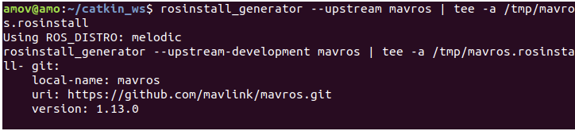
9. 执行`wstool merge -t src /tmp/mavros.rosinstall`,执行过程中输入y，成功后如下：
10. 执行下面语句下载源码`wstool update -t src -j4`，成功后如下：
11. 执行`rosdep install --from-paths src --ignore-src -y`,成功后如下：
12. 执行`sudo ./src/mavros/mavros/scripts/install_geographiclib_datasets.sh`
13. 成功后如下：
14. 执行`catkin build`,
15. 最后执行`source devel/setup.bash`，把这个放进`.bashrc`中，`roscd mavros`如果安装mavros安装成功的话，显示如下：
16. 总结，这是再不需要仿真环境下的mavros安装，如果需要仿真环境的话还需要更多操作，详细操作参考上面链接`https://blog.csdn.net/qq_38768959/article/details/106041494?ops_request_misc=%257B%2522request%255Fid%2522%253A%252290337672-42C1-4015-95D2-8962DEBA58D6%2522%252C%2522scm%2522%253A%252220140713.130102334.pc%255Fblog.%2522%257D&request_id=90337672-42C1-4015-95D2-8962DEBA58D6&biz_id=0&utm_medium=distribute.pc_search_result.none-task-blog-2~blog~first_rank_ecpm_v1~rank_v31_ecpm-11-106041494-null-null.nonecase&utm_term=%E4%BB%8E%E6%94%BE%E5%BC%83%E5%88%B0%E7%B2%BE%E9%80%9A&spm=1018.2226.3001.4450`
## Intel小电脑重装Ubuntu20.04.06系统
1. 先下载好镜像包，用32Disk把系统盘做好
2. 小电脑开机疯狂点按`Delete`进入启动界面，选择`Setting set up`进入
3. 在`Advance`选项的第一个启动项改成启动盘的第一个，也就是字少的那一个
4. 选择好了以后转到`boot`点击`save changes and exit`
5. 然后会回到启动界面，选择`Ubuntu`第一个，进入
6. 注意，Checking完了以后不要改成中文，不然就会出现点击不了下一步的情况
7. 最好先不要联网
8. 然后选择正常安装和最后一个，安装最后一个可能会解决部分驱动和网络问题
9. 安装类型选择其他
10. 然后来到分磁盘的界面，这里非常非常重要。注意，现在的电脑磁盘格式一般都是`GPT`格式，而非`MBR格式`。进入这个界面以后，把能删的分区全部删除。然后按照下列步骤操作
        + 先分好开机引导区，选中空闲分区，点击左下角的`+`，在`用于`一栏选择`EIF系统分区`，大小我们给`512MB`
        + 然后是交换空间的分配，同上，选中空闲分区，点击左下角的`+`在`用于`一栏选择`交换空间`，大小我们给`10000MB`
        + 我们再把跟挂载点和home分区合并，以免后续的空间不足。空闲分区，点击左下角的`+`在`用于`一栏选择`/`，大小不动，就是把所有剩下的内存全部分给这个分区。
        + 最后还有很关键的一步，就是选择启动项，在`+`下面这一栏，把引导项更换成我们分出来的EIF分区。然后点击continue。
11. 名字和密码统一为`minipc`,`0`
12. 地区我们改成`Shanghai`，下一步
13. 等待安装完成以后，拔掉U盘重新启动
14. 安装完成
## Ubuntu系统配置科学上网端口
### 浏览器
1. clash在Ubuntu系统上安装包下载`https://www.clash.la/releases/#google_vignette`
2. 下载好了以后解压
3. 解压好了以后打开`cfw`，注意，要先运行指令`chmod +x cfw`，给他加上可执行权限才可以正常运行
4. 运行指令`./cfw`，配置节点后即可科学上网
5. 打开设置，点击左侧第二个网络，网络代理选择成`手动`，把HTTP和HTTPS改成`127.0.0.1`,`7890`。
### 终端上网
1. 在环境变量的最前面加上
        + alias proxy="export http_proxy=http://127.0.0.1:7890;export https_proxy=http://127.0.0.1:7890"
        + alias unproxy="unset http_proxy;unset https_proxy"
2. 
## Ubuntu系统安装ros系统
1. 参考ROS官网链接安装`https://wiki.ros.org/noetic/Installation/Ubuntu`
2. 进入这个网站，找到Install部分前面我们已经配置好了科学上网，所以我们不管1.1
3. 运行指令`sudo sh -c 'echo "deb http://packages.ros.org/ros/ubuntu $(lsb_release -sc) main" > /etc/apt/sources.list.d/ros-latest.list'`,运行以后不报错就是配置好了。
4. 运行指令`sudo apt install curl`
5. 运行指令`curl -s https://raw.githubusercontent.com/ros/rosdistro/master/ros.asc | sudo apt-key add -`,如果这里运行以后显示`OK`就是配置好了。
6. 运行指令`sudo apt update`
7. 运行指令`sudo apt install ros-noetic-desktop-full`，等待漫长的安装，这里可以尝试在运行这条指令之前，运行`proxy`命令，让终端上网后可能下载速度会更快。
8. 运行指令`echo "source /opt/ros/noetic/setup.bash" >> ~/.bashrc`
8. 运行指令`source ~/.bashrc`
9. 运行指令`roscore`,可以看到成功启动
10. 运行指令`sudo apt install python3-rosdep python3-rosinstall python3-rosinstall-generator python3-wstool build-essential`
8. 运行指令`sudo rosdep init`，注意，这里可能会出现无法连接的情况，这里的解决办法是用3条指令
        + 安装Python的软件管理包pip，`sudo apt-get install python3-pip`
        + 使用pip安装我们的配置修改文件`sudo pip3 install 6-rosdep`
        + 最后一条指令，运行刚才下载好的配置修改文件`sudo 6-rosdep`
        + 重新运行`sudo rosdep init`
11. 安装完成
## MobaXterm详细使用教程
### MobaXterm详细使用教程（一）
1. 软件的安装
官网下载后解压文件，运行 MobaXterm_Personal_11.1.exe 即可开始安装。第一次打开会自解压，会比较慢，后续就正常了。
2. 创建SSH session
安装完毕之后界面长这个样。
+ 
当然你们刚安装完成是不会有任何session的。下面来创建第一个SSH session。点击菜单栏 「sessions」 –> 「new session」，即可弹出 「session setting」 对话框。由上面那一大串的连接方式我们就可以知道Moba的强大之处。
+ 
3. 我们点选第一个SSH图标，并填入相关信息，就可以完成session创建了。
点击确定后，输入密码(输入密码时并不会显示，只管输入后按确定即可，第一次登陆成功后会提示保存密码，一般选择同意)，就可以连接上虚拟机了。而且边上虚拟机之后，它会自动通过FTP也连接到虚拟机，直接拖拽就可以进行文件复制了。登陆后界面主要分两块，左边的是主机的文件，右边是终端。勾选左下角的 “Follow terminal folder” 可以让两个的工作路径保持一致。
+ 
4. 快速连接session
+ 创建一个session之后，就可以在左侧的session标签里留下它的信息，下次需要连接的时候直接双击即可。
+ 
5. 创建串口session
+ 下面介绍串口session的创建。
+ 如同第2步，在「session setting」 对话框里选择serial，再选好串口号及波特率，点击OK就完成连接了。
+ 同样session会保存在左侧的session标签页里，方便下次连接。
+ 
6. 文件传输和下载
+ 可以采用直接拖拽的方式，或者采用鼠标右键选择相应功能。
+ 
7. 参考链接`https://blog.csdn.net/xuanying_china/article/details/120080644?ops_request_misc=%257B%2522request%255Fid%2522%253A%252286b5e7d6642670b171b02c018bcec0c2%2522%252C%2522scm%2522%253A%252220140713.130102334..%2522%257D&request_id=86b5e7d6642670b171b02c018bcec0c2&biz_id=0&utm_medium=distribute.pc_search_result.none-task-blog-2~all~top_positive~default-1-120080644-null-null.142^v100^pc_search_result_base2&utm_term=mobaxterm%E4%BD%BF%E7%94%A8%E6%95%99%E7%A8%8B&spm=1018.2226.3001.4187`
## 关于网桥的使用
1. 实验室的网桥属于即插即用的那种。可以理解为插上了网桥就相当于两台电脑通过有线连接了，在同一个局域网下
2. 一开始我以为有线的IP地址要固定为`192.168.1.2`，但其实不是，和在248网络下一样，只要正常配置分布式就行了，有线的IP和无线的IP的意义是一样的，只需要正常配置就行了。
3. 我为了方便我把我电脑在248无线的IP地址和有线的IP地址都固定为了`192.168.1.31`，而白船的小电脑的IP也固定为了`192.168.1.100`这样就不用每次有线和无线切换就要重新写环境变量了。
## 关于分布式通讯的一些说明
1. 今天突然发现赵虚左的笔记有一个之前没有发现的地方，现在觉的很奇怪，就是我们配置分布式的时候roscore的主机两个环境变量命令都是同样的IP地址。而从的环境变量的两个IP地址是不同的，如图所示。
2. 想了一下发现就是对的，就应该是这样的。这两行命令的意义是，第一行指定运行`roscore`的主机，这里我们通常把`roscore`的机子称作为主机。主机的分布式配置就是应该指定自己的IP为`roscore`的IP，还要指定主机的IP地址，用于其他从机访问该主机。而对于从机来说，同样指定ROS主节点的URI（主机IP），从机需要通过这个地址与主机通信（ROS_MASTER_URI）。设置当前从机的IP地址，用于标识从机（ROS_HOSTNAME）。
## 在Ubuntu上安装星火应用商店
1. Google搜索`星火应用商店`，进入官网。
2. 首先下载软件本体`spark-store_4.3.3.2_amd64.deb`，下载完以后不要着急解压，还要下载相应的依赖包
3. 然后下载依赖包`spark-store-dependencies-kylin.zip`
4. 下载完以后进入`spark-store-dependencies-kylin.zip`所在的文件夹，`unzip spark-store-dependencies-kylin.zip`解压，得到`spark-store-dependencies-kylin`，进入文件夹，还会看到有一个`解压我.tar`，`tar -xvf 解压我.tar`，会得到`all-depends`文件夹。
5. 进入`all-depends`文件夹，再进入`Debian10-or-ubuntu-20.04`文件夹。
6. 分别运行命令`sudo apt update`,`sudo apt install -yf ./*.deb`，这样就把依赖安装好了，接下来安装软件本体。
7. 进入`spark-store_4.3.3.2_amd64.deb`文件所在的目录，在终端运行`sudo apt install -y ./spark-store_4.3.3.2_amd64.deb`，注意这里一定不能用`sudo dpkg -i spark-store_4.3.3.2_amd64.deb`来安装，这样是安装不上的，具体为什么不知道，官特别提示了这一点。
8. 安装完成。
## 查看磁盘空间
1. `df -hl`
## 查看当前内核版本
1. uname -a
## Ubuntu缺少字体问题解决
1. 参考博客`https://blog.csdn.net/willingtolove/article/details/116423173`
## 安装git
1. `sudo apt-get install git`
2. `git --version`
# 在Jeston Nano上部署Yolov11
## Jeston Nano上手
1. 我拿到的新的Nano板子是商家事先刷好Ubuntu20.04版本的，现在说一下新板子怎么配置以快速上手
2. 配置网络，固定Nano的IP地址，这里我设置为，IP为33。子网掩码设置为“255.255.255.0”，网关设置为"192.168.1.1"。再找到网络设置里面的网络代理，设置网络代理为手动，如果不设置还是没法科学上网，因为找不到梯子的代理口，。然后在`bashrc`里写入proxy，不然后后面用到黑窗口下载东西会出现下载不上的情况。。从主电脑复制即可，注意，写完了以后记得`source ~/.bashrc`不然环境变量不会刷新。
3. 安装Clash。现在自己电脑上下载"Clash.for.Windows-0.20.39-arm64-linux.tar.gz",这个压缩包在谷歌上很容易搜到，注意要下载arm64的，因为Nano板子是ARM架构的。解压到家目录下新创建的Clash文件夹，进去找到`cfw`，给这个附上可执行权限，然后通过`./cfw`可以执行。执行打开clash以后，从主电脑中scp一个节点到Clash文件夹，然后在clash中开启开机自启动，即可。
4. 安装curl。`sudo apt update``sudo apt install curl -y`。安装完成以后就可以测试是否能科学上网。`curl -i google.com`，显示如图所示的画面即为能够科学上网。
# Jeston Nano配置yolov11环境
## 安装 Jetpack
Jetpack是专供英伟达的嵌入式计算平台使用的人工智能包。首先安装 jtop，这是一个监控 CPU，GPU 等使用情况的工具。`sudo pip install jetson-stats`然后安装 JetPack：`sudo apt install nvidia-jetpack`安装完 JetPack 后，命令行输入 jtop 并运行，即可看到当前电脑的 CPU 运行状态，按数字键可以切换页面，切换到 INFO 页面，可看到已经安装好的包：```可以发现，当前你的 NX 已经安装好了很多难装的底层库：Cuda，cuDNN，TensorRT, OpenCV。这下可能你大致明白了咱们的定义：
Jetpack 是英伟达提供的专门供他自己的嵌入式计算平台使用的人工智能包。
Jetpack 把人工智能开发常用的底层驱动和库一股脑给你打包好，你安装了
Jetpack，就把这几样东西都安装上去了。
注意：上图 opencv 的版本后有“with CUDA NO”的字样，说明 opencv 也
有支持 GPU 加速的版本，但是默认安装的 opencv 不支持 GPU 加速（pip 也只能
安装 cpu 版本的 opencv）。由于作者的项目不涉及太多的 opencv 操作，配置 GPU
版本的 opencv 对整体性能影响不大，所以作者没有深入研究，如果需要安装支
持 GPU 加速的 opencv，需要将原 opencv 卸载，并通过源码编译安装，在 cmake
阶段指定相应 cuda 配置，即可编译出支持 cuda 加速的 opencv。读者可自行百度
解决。后文不会再提及 cuda，cudnn，opencv 的安装。```
## cuda cudnn tensorrt配置
1. cuda配置：添加cuda环境变量。打开~/.bashrc。`sudo vim ~/.bashrc`在文本末输入如下代码：```export LD_LIBRARY_PATH=/usr/local/cuda/lib64
export PATH=$PATH:/usr/local/cuda/bin
export CUDA_HOME=/usr/local/cuda```
2. 使新的环境变量或修改生效.`source ~/.bashrc`
3. 验证，出现下图信息则成功配置。`nvcc -V`
4. cudnn配置。Jetpack中虽然安装了cuDNN，但没有将对应的头文件、库文件放到cuda目录。
因此需要复制cudnn的头文件和库文件到cuda目录下`sudo cp /usr/include/cudnn*.h /usr/local/cuda/include`,`sudo cp /usr/lib/aarch64-linux-gnu/libcudnn* /usr/local/cuda/lib64`或者使用软链接替代：`sudo ln -s /usr/include/cudnn*.h /usr/local/cuda/include/`,`sudo ln -s /usr/lib/aarch64-linux-gnu/libcudnn* /usr/local/cuda/lib64/`
## TensorRT Python环境配置
1. TensorRT默认安装位置在/usr/lib/python3.8/dist-packages/中，若找不到trt， 则先执行以下命令，安装NVIDIA TensorRT 的 Python3绑定库`sudo apt install python3-libnvinfer`这样再进入上述路径后tensorrt就存在了。输入pip list后tensorrt也出现了。
## Conda 虚拟Python环境中的TensorRT配置
1. 若要在虚拟环境中使用tensorrt，由于tensorrt不能被虚拟环境pytorch中定位使用。因此我们需要软链接一下，运行如下命令：`sudo ln -s /usr/lib/python3.8/dist-packages/tensorrt* /home/nx/anaconda3/envs/pytorch/lib/python3.8/site-packages/`
2. 测试一下，运行如下指令:`python -c "import tensorrt;print(tensorrt.__version__)"`若出现版本号8.5.2.2，则成功。
## Miniconda安装与配置
1. 下载Miniconda3。前往清华大学开源软件镜像站，选择次新aarch64版本Miniconda，下载到Jetson Downloads的目录`cd ~/Downloads`,`wget https://mirrors.tuna.tsinghua.edu.cn/anaconda/miniconda/Miniconda3-py39_24.9.2-0-Linux-aarch64.sh`
2. 安装Miniconda3。`cd /home/nx/Downloads/`,`chmod +x Miniconda3-py39_24.9.2-0-Linux-aarch64.sh`,`./Miniconda3-py39_24.9.2-0-Linux-aarch64.sh	`安装完成Miniconda后，可以发现其修改了.bashrc文件。
3. 创建环境。`conda create -n pytorch python=3.8`.`conda activate pytorch`。
4. 注意，这里要打开`.bashrc`配置环境变量，让终端默认进入`pytorch`环境
## PyTorch&Torchvision安装
1. 安装PyTorch。安装依赖项`sudo apt install libopenblas-dev`
2. 下载torch wheel安装包。前往`pytorch for Jeston`,`https://forums.developer.nvidia.com/t/pytorch-for-jetson/72048`,下载所安装的jetpack版本支持的最高版本的torch wheel 安装包到Downloads目录下。
3. `cd /Downloads`，`wget https://developer.download.nvidia.cn/compute/redist/jp/v512/pytorch/torch-2.1.0a0+41361538.nv23.06-cp38-cp38-linux_aarch64.whl`例如：jetpack5.1.x对应下图中红框的torch安装包，需注意Python 版本为 3.8。
4. 安装。`pip install torch-2.1.0a0+41361538.nv23.06-cp38-cp38-linux_aarch64.whl`
5. 安装torchvisiion。安装依赖`pip install numpy requests Pillow`,`sudo apt install libjpeg-dev libpng-dev zlib1g-dev libpython3-dev libavcodec-dev libavformat-dev libswscale-dev`
6. 编译安装torchvision。torchvision暂未发布直接能pip安装的whl版本，因此直接从源码编译。
7. Torchvisiion版本选择。以torch2.1.0为例，对应的torchvisiion版本为0.16.x。版本对应关系为`https://github.com/pytorch/vision`
8. 下载torchvisiion到Downloads目录下。网络ok的话，直接克隆到本地。`cd ./Downloads`，`git clone --branch v0.16.2 https://github.com/pytorch/vision`。网络不行clone慢的话，直接下载压缩包到PC，再上传jetson，解压即可。`unzip vision-0.16.2.zip`
9. 编译安装torchvision。`cd vision`,`export BUILD_VERSION=0.16.2`,`python3 setup.py install --user`需要等待30min左右，出现以下提示则安装成功。。安装成功后退出torchvision的安装目录再import torchvision进行验证，否则会出现以下warning
## Ultralytics YOLOv11配置
1. 下载YOLOv11 github项目。创建一个目录，用于存放YOLOv11的项目文件。`mkdir ~/Desktop/yolov11`,`cd ~/Desktop/yolov11`，同理，网络好的话可以直接克隆到文件夹，网络不好的话就下载压缩包再解压。
2. 安装ultralytics包。采用可编辑模式安装`ultralytics`包：`pip install -e .`
3. 验证ultralytics安装。把`ros_auv_ws`克隆到`Jeston Nano`上，重新编译并执行识别步骤。
## 注意事项
1. 编译的时候还是老样子，会报一系列的错误，最常见的就是`Yolov11`的`empy=3.3.4`这个包，一定要是这个版本，其他的版本就是会报错。
2. 另外还有一个很重要的，就是环境变量，我在运行的时候发现，`Miniconda`对`ROS`的兼容不是很好，最常见的就是`/lib/aarch64-linux-gnu/libp11-kit.so.0: undefined symbol: ffi_type_pointer, version LIBFFI_BASE_7.0`,这是一个典型的 动态链接库冲突（libffi版本不兼容） 问题，尤其在 Jetson 上用 Conda 环境运行系统 ROS 程序时特别容易出现。。这个问题非常有代表性，尤其是在你用 `Jetson Nano`（一种嵌入式 `ARM64` 系统）+ `Conda` + `ROS` 的组合时常常遇到 `ffi_type_pointer` 这类 `libffi` 动态链接错误，而在你自己的笔记本（通常是 `x86_64` + `Ubuntu` + `Anaconda` + `ROS`）上却不会。`Jetson Nano` 使用的是 `ARM64` 架构 + 自带 `NVIDIA` 定制的系统库，而 `Conda` 的很多库是为 `x86_64` 优化设计的。两者冲突后导致系统库和 `Conda` 库动态链接不兼容。
3. 我的解决办法是`Nano`的`roscore`在大环境下运行，然后节点在`pytorch`环境里面运行，但是在运行之前要临时优先使用系统`libffi`，执行`export LD_PRELOAD=/usr/lib/aarch64-linux-gnu/libffi.so.7`，这样即可解决冲突问题。
4. 另外，`mavros`也需要一个环境变量，这个环境变量应当要在最后，之前也碰到过类似问题，具体原因还不太清楚，我这里推荐的环境变量顺序如图所示。
5. `Jeston Nano`有加速推理的功能，但是这个地方的坑太多，我按照网上比较的官方的教程来配了，应该是对的，但是问题应该就出在我没有写好`yolo_trt.py`模块，是整套 `YOLO + TensorRT + ROS` 实时检测系统中的推理引擎封装模块。
6. 具体的`TensorRT`加速功能的配置参考`https://blog.csdn.net/python_yjys/category_12885034.html`的`8-10`节。
7. 目前我测试的正常推理的帧率稳定在15-20帧，是完全可以用的，毕竟不是专门做视觉的，试了很久也没写出能用的加速封装模块，打算用来做日常推理，我认为是完全够用的。
## 其他问题配置
1. 时间不对，差了16个小时，运行`sudo timedatectl set-ntp true`，`sudo timedatectl status`,查看是否开启`NTP`时间同步,我的`Nano`显示```Time zone: America/Los_Angeles (PDT, -0700)
System clock synchronized: yes
NTP service: active```,说明你 已经启用了网络时间同步（NTP），而且 系统时间也是同步的，问题出在时区设置，当前的时区是, 
`America/Los_Angeles（太平洋时间，PDT）`所以你看到的时间是 北京时间 -16 小时。这会导致你误以为“时间不对”。
2. 解决方案`sudo timedatectl set-timezone Asia/Shanghai`
3. SSH远程开发`Nano`，具体办法参考赵虚左老师的ROS机器人笔记`http://www.autolabor.com.cn/book/ROSTutorials/di-9-zhang-ji-qi-ren-dao-822a28-shi-4f5329/92-vscodeyuan-cheng-kai-fa.html`第九章，不过我发现在第一次连接的时候需要下载`vscode远程开发工具`，第一次比较慢，耐心等待即可。