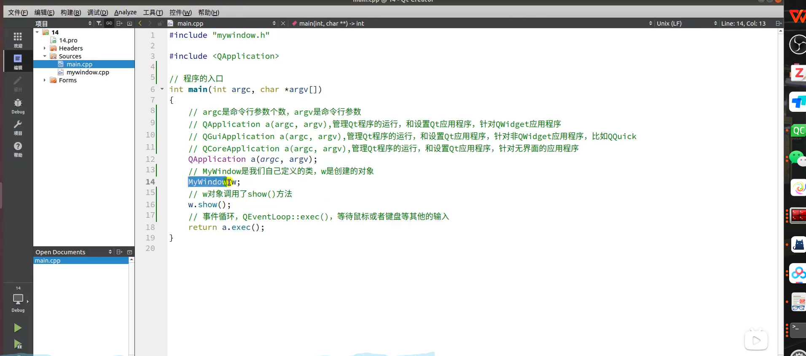
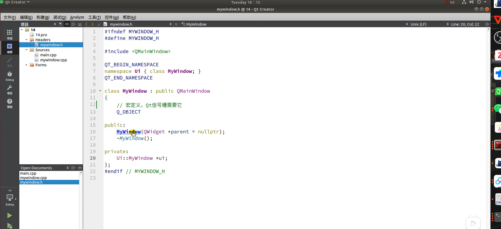
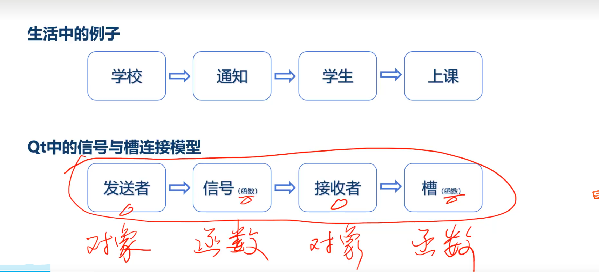
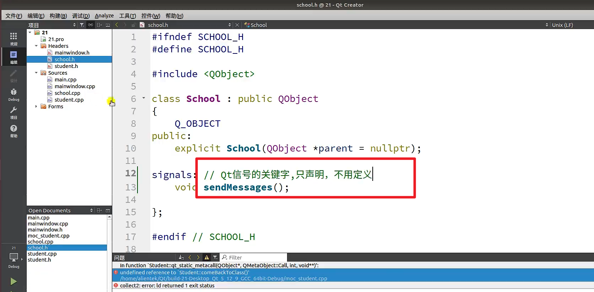
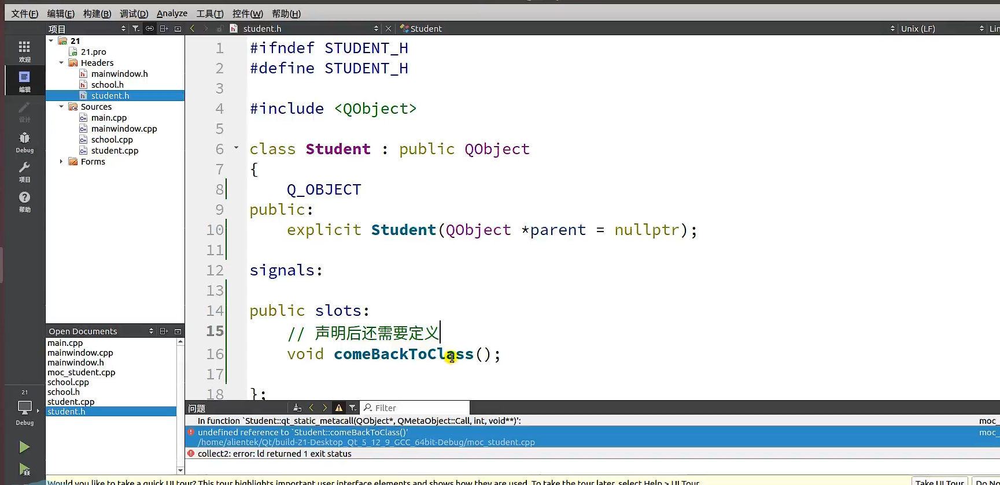
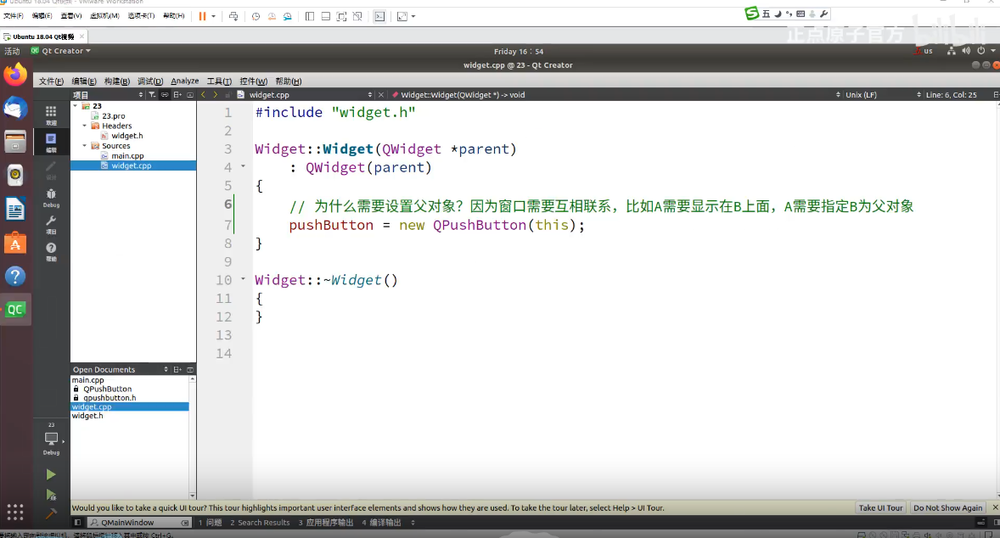
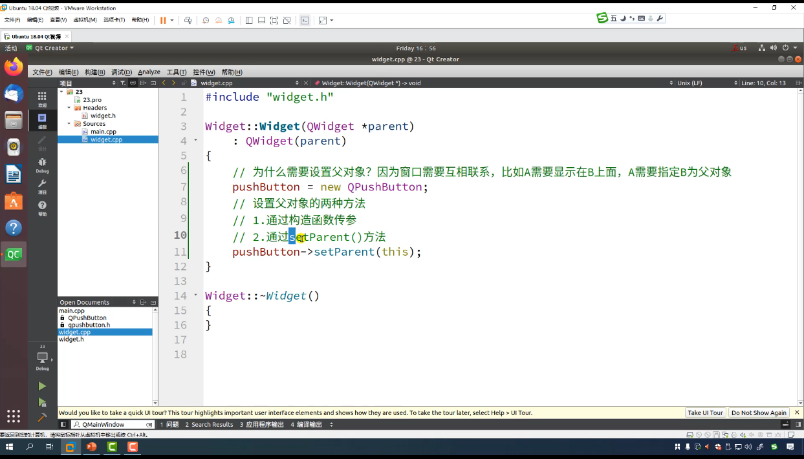
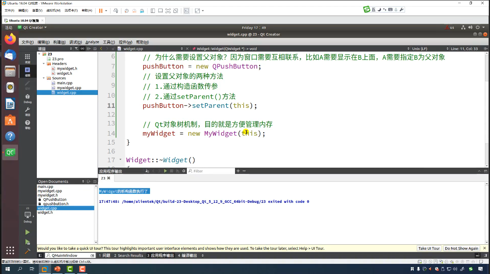
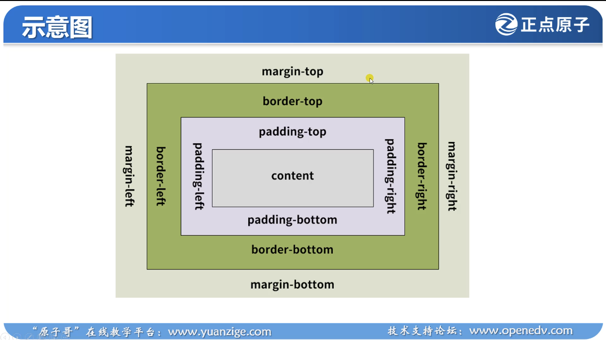

## 14
1. 
2. 
## 16
1. 快捷键
        + 新建项目`ctrl+shift+N`
        + 运行项目`ctrl+r`
        + 构建项目`ctrl+b`
        + 改变编辑器界面字体显示比例大小`ctrl+鼠标滚轮`
        + 对齐代码`ctrl+a`再`ctrl+i`
        + 跳转到上一行`ctrl+shift+enter`
        + 跳转到下一行`ctrl+enter`
        + 向上移动行`ctrl+shift+up`
        + 向下移动行`ctrl+shift+down`
        + 复制当前行到上一行`ctrl+alt+up`
        + 复制当前行到下一行`ctrl+alt+down`
        + 头文件和源文件切换`F4`
        + 快速写函数，在头文件写好定义，右击函数名称，点击重构，可以快速在文件里面写函数。
## 17 QT编程规范
1. 文件命名都是小写字母的
2. 类的名字手写字母是大写的，单词与单词之间也是大写的
3. 除了构造函数和析构函数，成员函数的首写字母都是小写的，单词和单词之间都是大写的
4. 变量的首写字母都是小写的，单词和单词之间都是大写的
5. 由于`argv`前面有一个空格，所以我们为了美观，写代码的时候也要注意空格的加入，和QT源码保持一致。
6. 条件判断语句的大括号一般不另起一行
7. 如果只有一句返回，一般不用大括号。只有`else`的一句也是。
## 19信号槽
1. 
## 20
## 21
1. ，信号函数可以只声明，不用定义
2. ，槽函数声明后必须定义
## 23
1. 
2. 
3. 
## 24 样式表的使用
## 31
1. 