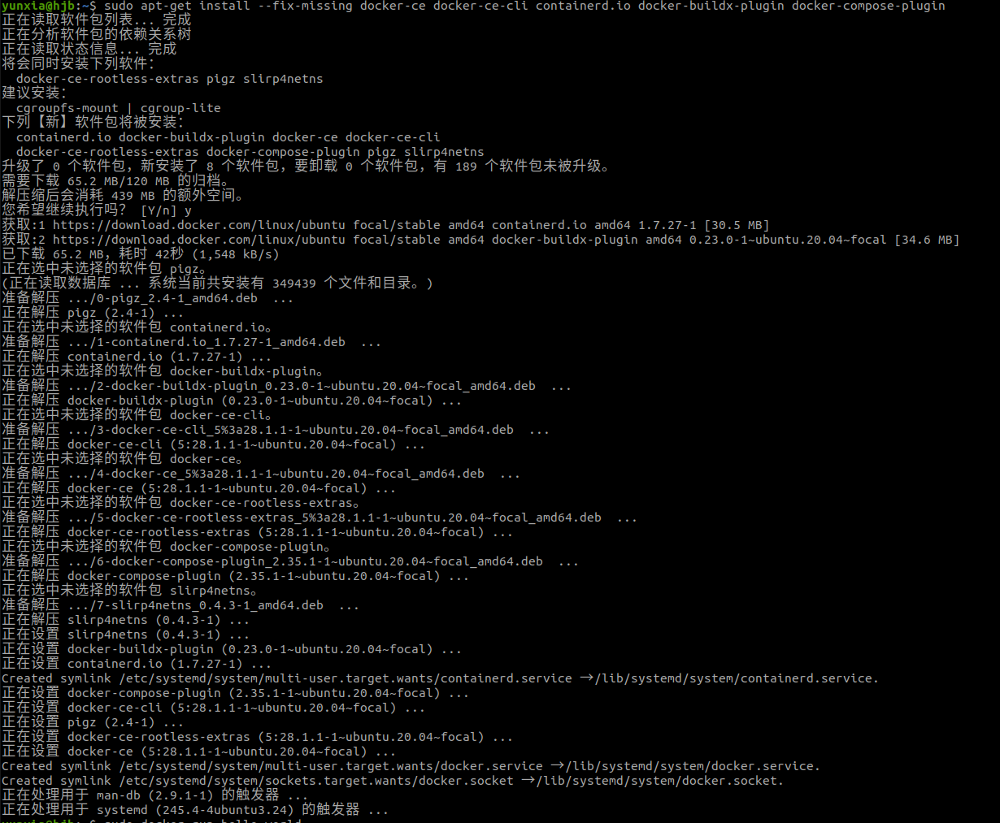
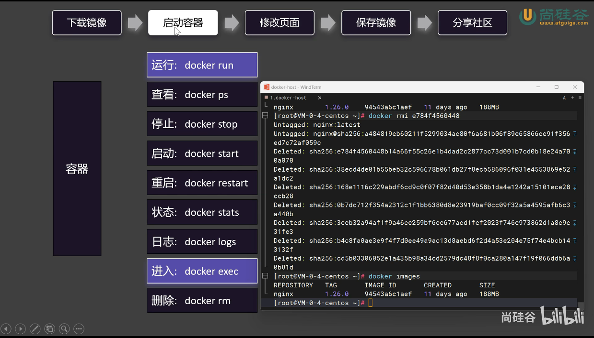

## 第零课
1. 
## 第一课
1. 
2. 理解容器： 
## 安装docker
1. 参考`docker.com`，找到`Developers`的`Documentation`,如图所示。。进去以后找到`Manuals`，然后`Docker Engine`——`Install`——`Ubuntu`
2. 然后按照步骤依次执行`for pkg in docker.io docker-doc docker-compose docker-compose-v2 podman-docker containerd runc; do sudo apt-get remove $pkg; done`这是先删除旧的`Docker`，也可以不执行，但最好执行一下。
3. 执行
        
        + sudo apt-get update
        + sudo apt-get install ca-certificates curl
        + sudo install -m 0755 -d /etc/apt/keyrings
        + sudo curl -fsSL https://download.docker.com/linux/ubuntu/gpg -o /etc/apt/keyrings/docker.asc
        + sudo chmod a+r /etc/apt/keyrings/docker.asc
4. 执行`echo \
  "deb [arch=$(dpkg --print-architecture) signed-by=/etc/apt/keyrings/docker.asc] https://download.docker.com/linux/ubuntu \
  $(. /etc/os-release && echo "${UBUNTU_CODENAME:-$VERSION_CODENAME}") stable" | \
  sudo tee /etc/apt/sources.list.d/docker.list > /dev/null`
5. 执行`sudo apt get update`。这里可能会显示这种提示，会对后面的安装产生影响，但不用担心，后面会有具体的解决办法，先这么执行。
6. 执行`sudo apt-get install docker-ce docker-ce-cli containerd.io docker-buildx-plugin docker-compose-plugin`，发现安装报错，显示如图的报错，这里我采用的解决办法是执行`sudo apt-get install --fix-missing docker-ce docker-ce-cli containerd.io docker-buildx-plugin docker-compose-plugin`,`Docker`此时顺利安装。
7. 执行`sudo docker run hello-world`检查是否成功安装。但我这里运行报错,如图：。`proxy`也没有用，这是因为`Docker`在国内被墙了，在大多数情况下，Docker 不会自动使用系统代理设置。你需要明确地为 Docker 配置代理。如果只设置了系统代理而没有在 Docker 中设置代理，Docker 可能无法通过代理访问网络资源。这是因为 Docker 容器和守护进程运行在一个隔离的环境中，默认情况下不会继承主机系统的代理设置。

        + PS：守护进程（Daemon）是一种在后台运行的服务，通常不与用户直接交互。Docker 守护进程 dockerd 负责管理 Docker 容器的生命周期，包括创建、运行、停止和删除容器。它还处理容器镜像的拉取和存储。(例如docker pull)。
8. 所以我们要单独的为`Docker`配置代理，见下。
### Docker配置代理
1. 检查系统代理设置。首先，确认你在系统中正确配置了代理。例如，在 Linux 上，你可以在 ~/.bashrc 或 ~/.bash_profile 中设置代理：（这里之前配置过猫的代理端口为7890，这里还是一样的沿用7890）

        export HTTP_PROXY=127.0.0.1:7890
        export HTTPS_PROXY=127.0.0.1:7890
        export NO_PROXY=localhost,127.0.0.1
2. 配置 Docker 使用代理
    + 创建或编辑 Docker配置文件，在Docker主机上，编辑或创建`/etc/systemd/system/docker.service.d/http-proxy.conf`文件。
    + `sudo mkdir -p /etc/systemd/system/docker.service.d`
    + `sudo nano /etc/systemd/system/docker.service.d/http-proxy.conf`
3. 在文件中添加代理配置：

        [Service]
        Environment="HTTP_PROXY=127.0.0.1:7890"
        Environment="HTTPS_PROXY=127.0.0.1:7890"
        Environment="NO_PROXY=localhost,127.0.0.1"
4. 重新加载系统守护进程并重启 Docker

        sudo systemctl daemon-reload
        sudo systemctl restart docker
5. 验证 Docker 代理配置

        检查 Docker 信息：运行以下命令来确认 Docker 是否使用了代理设置：
        docker info | grep -i proxy
        测试拉取镜像：尝试从 Docker Hub 或其他注册表中拉取镜像，确保代理配置工作正常：
        docker pull busybox
6. 现在再运行`sudo docker run hello-world`，测试成功。
7. 配置Docker Compose使用代理，如果使用 Docker Compose，还需要确保 Docker Compose 使用代理。可以在 Docker Compose 文件中添加环境变量，或者在运行 Docker Compose 命令时指定代理：

        version: '3'
        services:
          web:
            image: nginx
            environment:
              - HTTP_PROXY=http://proxy.example.com:7890
              - HTTPS_PROXY=https://proxy.example.com:7890
              - NO_PROXY=localhost,127.0.0.1
8. 或者在命令行中运行 Docker Compose：`HTTP_PROXY=http://proxy.example.com:7890 HTTPS_PROXY=https://proxy.example.com:7890 NO_PROXY=localhost,127.0.0.1 docker-compose up`
9. 虽然系统代理设置可以影响一些系统级别的工具和应用，但 Docker 运行在一个隔离的环境中，默认情况下不会继承系统的代理设置。因此，需要显式地为 Docker 配置代理。通过上述步骤配置和验证 Docker 的代理设置，可以确保 Docker 正确通过代理访问网络资源。
10. 你的用户 yunxia 没有权限访问 /var/run/docker.sock，这是 Docker 客户端和守护进程通信的 Unix Socket，默认只能被 root 或 docker 组用户访问。

        方法一：sudo docker ps
        方法二：sudo usermod -aG docker $USER，reboot或者newgrp docker   # 临时切换用户组（无须重启）
## Docker命令
1. 
2. 
3. ，要下载指定的镜像版本则要去`https://hub.docker.com/`上寻找。,,,复制命令到黑窗口即可。
4. 给`docker`添加权限，使得不用每次都`sudo`,执行`sudo chmod 777 /var/run/docker.sock `
## 启动容器
1. 
2. 
3. 
4. 
5. 
6. 
## docker run 细节
1. docker rm a19是删除容器，docker rmi 是删除镜像
2. `docker run -d --name mynginx nginx`
        + -d是后台启动
        + --name 是给这个容器一个名字 ，这里我后面跟的是`mynginx`
3. ，这里非常重要的一个点就是如果我们使用docker启动一个容器，想让外边随时能访问，一定要为这个容器暴露一个端口，也就是来做端口映射。
4. 思考：88能不能重复：80能不能重复？ 也就是说，如果启动一个新容器，这个新的容器内部也用80，让他外部也暴露88，答案是88不能重复，同一个端口只能开一个而80可以重复。 因为这个80是你的容器的80，而我这块如果再有个80，这是我的容器的80，互不影响，只要注意防冲突就行了。以后，我们可以认为每个容器，都是一个独立的Linux服务器。
## docker exec
1. 这里是官方文档说明。
2. `yunxia@hjb:~$ docker exec -it mynginx /bin/bash`
        + -it是命令交互模式，/bin/bash是控制台
3. ,容器内部 纯净到连vi、vim这样的命令都没有，所以用`echo "<h1>Hello,Docker_shuai.<H1>" > index.html `来实现。刷新浏览器界面，显示，成功。
4. 使用`exit`退出这个容器
## 保存镜像
1. ，提交、保存和加载

                docker commit
                docker save
                docker load
2. 
3. 查看正在运行的容器
4. 查看镜像
5. 
6. 
## 分享社区
1. 
2. 首先在`hub.docker.com`上用`git hub`账号登陆，然后在黑窗口运行`docker login`，会提示按回车，回车以后进入网页授权登录即可。
3. 最好是添加一个`latest`版本，这样别人不带版本号下载也不会报错了。
4. 总结：  
## 启动同一个容器
1. 
2. 同一个容器的端口暴露在不同的主机端口
3. 而如果使用服务器的话需要配置防火墙才能访问。
## docker存储
1. 目录挂载：
2. `docker run -d -p 80:80 -v /app/nghtml:/usr/share/nginx/html --name app01 nginx`把容器外部的目录挂载到容器内部的位置。
3. 卷映射：默认以外面的目录为准。
4. 统一放在目录:`/var/lib/docker/volums/<volume-name>`
5. 这里特别注意我们在用docker的时候一般先把权限提升为`root`用户，先`sudo su`
6. `docker exec -it app03 bash`
7. `docker volume ls `
8. `docker volume create haha`
9. `docker volume ls`
10. `docker volume inspect ngconf`
11. 
12. 删除容器外部映射的卷不会删除，还在，可以用。
## docker 的网络构建
1. 
2. 可以通过这样来访问容器，但是太麻烦了，可以用docker自带的`docker0`网络。这个网络，每一个应用也就是容器，docker会再为他分配每一个IP
3. `docker container inspect app2`
4. 
5. 
6. 
7. `docker network --help`
8. `docker network create mynet`
9. `docker network ls`
10. `docker run -d -p 88:80 --name app1 --network mynet nginx`
11. `docker run -d -p 99:80 --name app2 --network mynet nginx`
12. `docker inspect app1`
13. `docker exec -it app1 bash`
14. `curl http://app2:80`
15.  
## Redis主从同步集群
1. `docker run -d -p 6380:6379 -v /app/rd2:/bitnami/redis/data -e REDIS_REPLICATION_MODE=slave -e REDIS_MASTER_HOST=redis01 -e REDIS_MASTER_PORT_NUMBER=6379 -e REDIS_MASTER_PASSWORD=123456 -e REDIS_PASSWORD=123456 --network mynet --name redis02 bitnami/redis`
## 最佳实践
1. 
2. `docker run -d -p 3306:3306 -v /app/myconf:/etc/mysql/conf.d -v /app/mydata:/var/lib/mysql -e MYSQL_ROOT_PASSWORD=123456 mysql:8.0.37-debian`
3. 然后启动mysql数据库客户端
## docker compose
1. 
2. 
3. `docker run -d -p 3306:3306 \
-e MYSQL_ROOT_PASSWORD=123456 \
-e MYSQL_DATABASE=wordpress \
-v mysql-data:/var/lib/mysql \
-v /app/myconf:/etc/mysql/conf.d \
--restart always --name mysql \
--network blog \
mysql:8.0`
4. `docker run -d -p 8080:80 \
-e WORDPRESS_DB_HOST=mysql \
-e WORDPRESS_DB_USER=root \
-e WORDPRESS_DB_PASSWORD=123456 \
-e WORDPRESS_DB_NAME=wordpress \
-v wordpress:/var/www/html \
--restart always --name wordpress-app \
--network blog \
wordpress:latest`
5. 语法：
                 
                
## dockerfile
1. 
2. 
3. 
