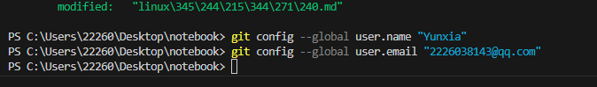

# Linux 系统命令大全
## 一、Linux系统的基本介绍
1. 基本简介
+ Linux 是一个基于Linux 内核的开源类Unix 操作系统，Linus Torvalds于 1991 年 9 月 17 日首次发布的操作系统内核。Linux 通常打包为Linux 发行版。

+ Linux 最初是为基于Intel x86架构的个人计算机开发的，但此后被移植到的平台比任何其他操作系统都多。由于基于 Linux 的Android在智能手机上的主导地位，截至 2022 年 5 月，Linux（包括 Android）在所有通用操作系统中拥有最大的安装基础。

+ Linux 也可以在嵌入式系统上运行，即操作系统通常内置在固件中并针对系统高度定制的设备。这包括路由器、自动化控制、智能家居设备、视频游戏机、电视（三星和 LG智能电视分别使用Tizen和WebOS）

+ Linux 是免费和开源软件协作最突出的例子之一。任何人都可以根据其各自的许可条款，例如GNU 通用公共许可证(GPL)，以商业或非商业方式使用、修改和分发源代码。例如，Linux 内核在 GPLv2 下获得许可，但系统调用有一个特殊例外，因为没有系统调用例外，任何调用内核的程序都将被视为衍生程序，因此GPL必须适用于该程序。
2. Linux文件系统
+ 核心
    1. Linux一切皆文件（众生平等）
    2. 只有一个顶级目录，不像windows分C盘、D盘、E盘。
+ 目录结构
    
+ 文件含义
        
## Linux文件管理命令
***注意事项***：命令区分大小写
1. 命令的格式固定为：命令 [-选项] [参数]   （中间有空格）
    + 说明：
      1. 个别命令使用不遵循此格式
      2. 当有多个选项时，可以写在一起
      3. 简化选项与完整项。例如-a等于 --all

2. 列出目录的内容：ls命令
    + 查看当前目录下的文件列表：ls
    + 查看指定目录下的文件：ls /
    + 查看详细信息，元数据信息（用户、组、大小、创建时间、权限信息、文件类型）
    + 查看隐藏文件：ls -a
    + 参数并用：ls -la
    + 当使用ls -l会显示文件的详细信息，包含权限信息：
3. 切换工作目录：cd命令
    + cd 目标文件夹：    
        命令所在路径：shell内置
        
        命令执行权限：所有用户
        
        语法：cd [目录]，其功能是切换目录
    + 绝对路径切换：cd 绝对路径
    + 相对路径切换：cd 相对路径
4. 显示当前路径：pwd命令
    + 查看当前命令所在的目录
        
        命令所在路径：/bin/pwd

        执行权限：所有用户
        
        语法：pwd

        功能描述：显示当前目录

        示范：
    + 特殊目录符号：

        ~ 当前用户的home目录
        . 当前目录
        .. 上一级目录
5. 创建目录：mkdir命令
    + 命令所在路径：/bin/mkdir
    + 执行权限：所有用户
    + 语法：mkdir -p 递归创建
    
    示范：
    + 在当前位置新建文件夹：mkdir 文件夹名
    + 在指定目录位置创建文件夹，并创建父文件夹：mkdir -p /a/b/文件夹名
    + 在当前目录下新建文件：touch 文件名
6. 删除空目录：rmdir 命令
    + 命令名称：rmdir
    + 命令所在路径：/bin/rmdir
    + 执行权限：所有用户
    + 语法：rmdir [目录名]
    + 功能描述：删除空目录
    + 示范:$:rmdir /tem/huang/test
7. 删除文件：rm命令
    + 命令所在路径：/bin/rm
    + 执行权限：所有用户
    + 语法：rm -rf [文件或目录]

        -r 删除目录

        -f 强制执行
    + 功能描述：删除文件
    + 示范:$:rm /temp/yun.txt
    
        删除文件/temp/yun.txt
    
        $:rm rf /temp/huang/test2

        删除目录/temp/huang/test2
    + 删除文件：rm 文件
    + 删除文件夹：rm -r 文件夹
    + 强制删除不询问：rm -rf 文件
8. 拷贝文件：cp命令
    + 命令所在路径：/bin/cp
    + 执行权限:所有用户
    + 语法cp -rp [原文件或目录] [目标目录]

    -r 复制目录

    -p 保留文件属性
    + 功能描述：复制文件或目录
    + 示范：$：cp -r /temp/huang/test /root

    将目录/temp/huang/test复制到 /root下

    $：cp -rp /temp/huang/test1 /temp/huang/test2 /root

    将/temp/huang目录下的test1和test2复制到 /root下，保持目录属性
    + 拷贝文件：cp 原文件 新文件
    + 拷贝文件夹：cp -r 原文件 新文件夹
9. 移动文件：mv命令
   + 移动原文件到目标文件夹中：mv 文件 文件夹
   + 修改文件A的名字为B：mv 文件A 文件B
10. 获取文件的md5指纹：md5sum命令
    + md5sum 文件名

    介绍：

    1. 数字签名，又称数字指纹
    2. 可以验证文件是否被修改
    3. 一个文件通过计算得到的一串字符串，文件内容的唯一标记（文件内容不变，指纹不变）
## 文本内容（查看|处理）命令
1. 创建文件：touch命令
   + 命令所在路径：/bin/touch
   + 执行权限：所有用户
   + 语法：touch [文件名]
   + 功能描述：创建空文件
   + 示范：$：touch test
2. 显示文件内容：cat命令
    + 命令所在路径：/bin/cat
    + 执行权限：所有用户
    + 语法：cat [文件名]
    + 功能描述：显示文件内容

        -n显示行号
    + 示范：
    $:cat /etc/issue

    $:cat -n /etc/services
3. 分屏显示：more命令
    + 命令所在路径：/bin/more
    + 执行权限：所有用户
    + 语法：more [文件名]
    
    （空格）或f ：翻页
    （enter）：换行
    q或Q：退出
    + 功能描述：分页显示文件内容
    + 示范：$:more /etc/services
4. 分屏显示：less命令
    + 以分页的方式浏览文件信息（适合查看大文档），进入浏览模式
    + 浏览模式快捷键：
    
        
        
        G：最后一页
        g：第一页
        空格：下一页
        /关键词：搜索关键词
    + 退出浏览模式，回到命令模式：q 退出
    + 命令所在路径：/user/bin/less
    + 执行权限：所有用户
    + 语法：less [文件名]
    + 功能描述：分页显示文件内容（可向上翻页）
    + 示范：$:less /etc/services
    
    tips:按下 / 后可以搜索 会反显高亮  按q退出  （more也可以）
5. 取首n行：head命令
   + 命令所在路径：/user/bin/head
   + 执行权限：所有用户
   + 语法：head [文件名]
   + 功能描述：显示文件前面几行

        -n 指定行数
    + 示范：

    $:head -n 20 /etc/services
6.取尾n行：tail命令
    + 命令所在路径：/user/bin/tail
    + 执行权限：所有用户
    + 功能描述：显示文件后面几行

        -n 指定行数

        -f 动态显示文件末尾内容
    + 示范：$:tail -n 18 /etc/services
    + 实时滚动显示文件的最后10行信息（默认10行）

        tail -f 文件名
    + 显示文件的最后20行信息

        tail -n 20 文件名

        tail -n -20 文件名
    + 显示文件信息从第20行至行文末尾
## 文件搜索
1. 查找文件：find命令
    + 命令所在路径：/bin/find
    + 执行权限：所有用户
    + 语法：find [搜索范围] [匹配条件]

        find 搜索路径 -name "文件名关键词"
    + 功能描述：文件搜索
    
    示范：find /etc -name init

    在/etc目录中查找文件init

    -iname不区分大小写

    
2. 文件资料库查找：locate命令
    + 命令所在路径：/eser/bin/locate
    + 执行用户：所有用户
    + 语法：locate 文件名
    + 功能描述：在文件资料库中查找资料
    
    示范：$:locate inittab

    tips:新建文件locate找不到，可以update一下 ，更新文件资料库后查找[tmp不在文件资料库内]

    $:locate -i text01
3. 查看命令位置：whereis命令
    + 命令所在路径：/user/bin/whereis
    + 执行权限：所有用户
    + 语法：whereis [命令]
    + 功能描述：搜索命令所在目录及别名信息
    + 示范：$:whereis ls
4. 查看命令位置：whereis命令
    + 命令所在路径：/user/bin/which
    + 执行权限：所有用户
    + 语法：which [命令]
    + 功能描述：搜索命令所在目录及别名信息
    + 示范：$:which ls
5. 文本搜索：grep命令
    + 命令所在路径：/bin/grep
    + 执行权限：所有用户
    + 语法：grep -iv [指定字串] [文件]

        grep -参数 要查找的目录范围
        
        参数：

            -n 显示查找结果所在行号
            -R 递归查找目录下的所有文件

    + 功能描述：在文件中搜寻字串匹配的行并输出

        -i 不区分大小写
        -v 排除指定字串
    + 示范：
        
            grep aries /etc
            grep aries /etc/passwd
            grep mysql /root/install.log
            grep -v ^# /etc/inittab
            表示去除以#开头的所有行信息，^表示以XXX开头
## 文件链接
### Linux文件管理
1. 文件链接
    + 命令所在路径：/bin/ln
    + 执行权限：所有用户
    + 语法：ln -s [原文件] [目标文件]

            -s  创建软链接
    + 功能描述：生成链接文件
    + 示范：

            创建文件/etc/issue的软链接/tmp/issue.soft

            $:ln -s /etc/issue /tem/issue.soft

            创建文件/etc/issue的硬链接/tmp/issue.hard
    + 模型图：

        
    + 说明：
            
            文件名：该文件的名字
            inode：该文件的元数据
            datablock：该文件真正保存的数据
    + 注意：

            1. inode中保存的是文件的元数据
            2. ls命令查看的都是元数据信息
            3. 数据块中才是文件的真正的数据
#### 硬链接
+ 硬链接特征：

        1. 拷贝cp -p+同步更新
        2. 可通过i节点识别
        3. 不能跨分区
        4. 不能针对目录使用

        
        5. 命令：ln -s 目标文件或文件夹 软链接名字
## 权限管理
1. 用户组（如图所示）

+ 相关命令

        1. 创建组：groupadd 组名
        2. 删除组：groupdel 组名
        3. 查找系统中的组：
        cat /etc/group | grep -n “组名”
2. 用户

        1. 创建用户
        useradd -g 组名 用户名
        2. 设置密码
        passwd 用户名
        3. 查找系统账户
        说明：系统每个用户信息保存在/etc/passwd文件中
        4. 切换用户
        su 用户名
        5. 删除用户
        userdel 用户名
3. 权限管理命令
+ 问题：linux系统未来可能有程序员、用户、数据库管理员、项目经理等各种角色各种级别人使用，甚至还有身份不明的人链接到linux，控制不好权限容易导致系统崩溃、数据丢失等问题。
+ 权限含义：

+ 权限访问控制列表（ACL access controll list）
#### 修改文件权限：chmod命令
+ 命令所在路径：/bin/chmod
+ 执行权限：所有用户
+ 语法：

    chmod [{ugoa}{+-=}{rwx}] [文件或目录] [mode=421] [文件或目录]
+ 权限的数字表示

        r：4
        w：2
        x：1
        rwx-rw-r：7-6-4 （相加）
+ 示范：
     
     赋予文件testfile所属组写权限
     $:chmod g+w testfile
     修改目录testfile及其目录下文件为所有用户具有全部权限
     $:chmod -R 777 testdir
+ 权限设置1

    
+ 权限设置2

    
#### 修改文件所有者：chown命令

#### 修改文件所属组：chgrp命令

#### 默认权限：umask命令

#### 查看权限：ll命令
+ ls -la 文件
+ ll 文件 
## 帮助命令
1. man命令
    + 命令所在路径：/user/bin/man
    + 执行权限：所有用户
    + 语法：man [命令或配置文件]

            （空格）或f代表翻页
            （enter）代表换行
            q或Q代表退出
    + 功能描述：获取帮助信息
    + 示范：
    $:man ls
    
        查看ls命令的帮助信息
    $:man services

        查看配置文件services的帮助信息
2. 获取简介：whatis命令
+ 语法：whatis命令
+ 功能描述：获得命令的简单介绍信息
+ 示范：whatis ls
3. 获取帮助：help命令
+ 命令所在路径：Shell内置命令
+ 执行权限：所有用户
+ 语法：help命令
+ 功能描述：获得Shell内置命令的帮助信息
+ 示范：
    
    $:help umask

    查看umask命令的帮助信息
## 用户管理命令
1. 添加用户：useradd命令
    + 命令所在路径：/user/bin/useradd
    + 执行权限：root
    + 语法：useradd 用户名
    + 功能描述：添加新用户
    + 示范：
        
        $passwd huangjingbo
2. 查看登陆用户：who命令
+ 
3. w命令
+ 
4. 修改密码：passwd命令
+ 命令所在路径：/usr/bin/passwd 
+ 执行权限：所有用户
+ 语法：passwd 用户名 
+ 功能描述：设置用户
+ 范例：
    $ passwd huangjingbo
5. 切换用户：su命令
    
## 压缩解压所命令
1. 压缩：gzip命令
    + 命令所在路径：/bin/gzip 
	+ 执行权限：所有用户 
	+ 语法：gzip [文件]  
	+ 功能描述：压缩文件 
	+ 压缩后文件格式：.gz
	+ 范例：
		gzip text01
2. 解压缩：gunzip 命令
    + 命令所在路径：/bin/gunzip 
	执行权限：所有用户 
	语法：gunzip [压缩文件] 
	功能描述：解压缩.gz的压缩文件 
	 
	范例： 
		
    $ gunzip text01.gz
	
    tips:只能压缩文件不能压缩目录
3. 归档管理：tar命令
   + 压缩语法：tar -zcvf 压缩后文件名 被压缩文件
   + 解压缩语法：
   tar -zxvf 压缩后文件名 -C 解压后文件所在目录
   
   参数1：

        
        -z:操作tar.gz文件需要使用
        -x：解压缩
        -c：压缩
        -v：显示压缩或者解压缩的执行过程信息
        -f：要处理的文件file，必须放在最后
    参数2：

    + -C 制定解压后的文件存放的位置
    + tar与gzip命令结合使用实现文件打包、压缩。tar只负责打包文件，但不压缩，用gzip压缩tar打包后的文件，其扩展名一般用xxxx.tar.gz
    + 命令所在路径：/bin/tar
    + 执行权限：所有用户
    + 语法：tar 选项[-zcf] [压缩后文件名] [目录]

            -c指打包
            -v指显示详细信息
            -f指指定文件夹
            -z指打包同时压缩
    + 功能描述：打包目录 压缩后文件格式：.tar.gz
    + 示范：
        
        $tar  -zcf   Japan.tar.gz Japan
        将目录Japan打包并压缩为.tar.gz文件
    + tar命令解压缩语法：           
		-x     解包           
		-v    显示详细信息           
		-f     指定解压文件           
		-z     解压缩 
	+ 范例：
		$ tar -zxvf Japan.tar.gz
4. zip命令
    + 命令所在路径：/usr/bin/zip 
	+ 执行权限：所有用户 
	+ 语法：

        zip 选项[-r] [压缩后文件名] [文件或目录]
        -r 压缩目录
    + 功能描述：压缩文件或目录
    + 压缩后文件格式：.zip
    + 示范：

        $:zip text01.zip text01
        $:zip -r huang.zip huang
        压缩目录
        
        tips：会保留文件
        
5.  unzip命令
+ 命令所在路径：/user/bin/unzip
+ 执行权限：所有用户
+ 语法：unzip [压缩文件]
+ 功能描述：解压.zip的压缩文件
+ 示范：$:unzip text01.zip
## 网络命令
1. writ命令
+ 指令所在路径：/user/bin/write
+ 执行权限：所有用户
+ 语法：write <用户名>
+ 功能描述：给用户法信息，以Ctrl+D保存结束
+ 示范：

    write huang
2. wall命令
+ 指令所在路径：/user/bin/wall
+ 执行权限：所有用户
+ 语法：wall [message]
+ 功能描述：发广播消息
+ 示范：

    wall HelloWord
3. 测试网络连通性：ping命令
+ 命令所在；路径
+ 执行权限：所有用户
+ 语法：ping 选项 IP地址

    -c指定发送次数
+ 示范：

    ping 192.168.1.156
4. 查看和设置网卡信息：ifconfig
+ 命令所在路径：/user/bin/ifconig
+ 执行权限：root
+ 语法：ifconfig 网卡名称 IP地址
+ 功能描述：查看和设置网卡信息
+ 示范：

    ifconfig
5. 查看发送电子邮件：mail命令
+ 命令所在路径：/bin/mail
+ 执行权利：所有用户
+ 语法：mail [用户名]
+ 功能描述：查看发送电子邮件
+ 示范：

    mail root
6. 查看登陆用户历史信息：last命令
+ 命令所在路径：user/bin/last
+ 执行权限：所有用户
+ 语法：last
+ 功能描述：列出目前与过去登入系统的用户信息
+ 示范：

    last
7. 显示网络相关信息：netstat命令
+ 命令所在路径：/bin/nestat
+ 执行权限：所有用户
+ 语法：netstat [选项]
+ 功能描述：显示网络相关信息
+ 选项：

        -t：TCP协议
        -u：UDP协议
        -l：监听
        -r：路由
        -n:显示IP地址和端口号
示范：

    netstat -tlm 查看本机监听的端口
    netstat -an 查看本级所有的网络连接
    netstat -rn 查看本级路由表
    查看某一端口是否被占用：netstat -tunlp | grep 2181
8. 配置网络：setup命令
+ 命令所在路径：/user/bin/setup
+ 执行权限：root
+ 语法：setup
+ 功能描述：配置网络
+ 示范：

    setup
9. 挂载：mount命令
+ 命令位置：/bin/mount
+ 执行权限：root
+ 语法：setup
+ 功能描述：配置网络
+ 示范：

    setup
10. 系统命令（关机重启命令）
+ shutdown [选项] 时间

    + shutdown now

    + 选项：

            -c：取消前一个关机命令
            -h：关机
            -r：重启
+ 查看IP地址：

    + ip a
    + ip addr
+ ping网络（测试网络连通）

    ip 目标机器的ip
+ 查看系统时间

    date
+ 注销

    logout
+ 重启
    
    reboot
+ 清屏

    clear
+ 静态查看系统进程

    ps -aux
+ 实时查看系统进程

    top!
        
    
+ 关闭进程

    kill 进程id
+ 强制关闭进程（谨慎使用）

    kill -9 进程id
+ 覆盖输出

    + 将命令1的执行结果，输出到后面的文件中。

        命令1 > 文件
    + 示范：

        date > date.log
+ 追加输出
    + 将命令1的执行结果，输出到后面的文件中。

        命令1 >> 文件
    + 示范：

        date >> date.log
## Linux服务

## ip设置

## 防火墙

## 主机名

## ip映射
+ 域名解析
+ 本地hosts

    + $:vim/etc/hosts
## SSH
+ ssh 远程linux的ip或者映射域名
## windows系统使用git教程的一些说明
1. 安装Git。打开浏览器搜索Git，下载，最好安装在C盘（安装在其他盘可能会导致使用期间出现无法解释的错误）
2. 安装好Git之后，我们打开Git Bush。在终端依次输入git config --global user.name "Yunxia"和git config --global user.email "2226038143@qq.com"。这里双引号中的分别是电脑的用户名和注册Github时所用的邮箱。
3. 在终端输入ssh-keygen -t rsa -C "My-SSH"，创建以rsa为加密方式的公钥。和Linux系统不同的是，创建好密钥以后会在C盘，C/用户/"用户名"/.ssh文件夹中生成一个.pub文件，这里面贮存的是密钥，我们以记事本的方式打开，并复制。
4. 复制以后，我们登录Github，进入settings，点击左侧SSH and GPG keys选项。  
点击New SSH key。输入好Title（随意输入）后在key框中粘贴刚才得到的密钥。
5. 至此，密钥的配对已经完成。
6. 我们打开任意文件夹，在文件夹下建立一个 测试文件，内容暂时随意写入。
7. 然后在当前文件夹打开Git Bash，在终端输入git init，初始化一个空的本地仓库。接着终端输入git add .  将该文件夹中所有的文件上传至临时仓库，输入git commit,将文件上传至本地仓库。
8. 进入GitHub，新建一个仓库。。输入好name以后直接点击Create repository。创建一个新的仓库。
9. 。按照顺序，以此在终端复制进这三条指令。显示同步成功
10. 打开Github，刷新，，我们发现文件已经顺利上传至Github云端。
11. 说明：密钥的配对是一次性操作，一个系统只需要配对一次，但是配置用户和Github用户是需要每次启动系统都配置的，否则系统无法与云端建立联系，就无法将文件上云。
## windows系统利用vscode从Github云同步在Ubuntu系统中上云的文件，实现windows系统和Ubuntu系统的数据同步
1. 在桌面打开Git Bash终端。先配置电脑用户和Github用户，。
2. 打开一个想要同步文件的仓库，复制该仓库的Url。。在终端输入git clone <复制的Url>。回车，即可在桌面得到仓库中的所有文件。此后只需要在linux端拉取仓库中的新内容即可。
## linux系统使用git教程的一些说明
## 管道命令
+ 简单来说，Linux中管道的作用是将上一个命令的输出作为下一个命令的输入，像pipe一样将各个命令串联起来执行，管道的操作符是`|`。
1. 利用管道命令查看当前运行的程序中，名为java的程序  ：ps -ef|grep java
2. 查看/etc/passwd文件中的root内容  :cat /etc/passwd | grep 'root'
3. 查看当前系统的ip链接  ：netstat -an
4. 将sh test.sh任务放到后台，并将打印的日志输出到`nohup.out`文件中，终端不再能够接收任何输入（标准输入）：  nohup sh test.sh  &
5. 将sh test.sh任务放到后台，并将打印的日志输出到test.out文件中，终端不再能够接收任何输入（标准输入）:  nohup sh test.sh >> test.out  &
6. 将sh test.sh任务放到后台，并将打印的日志输出到nohup.out文件中，终端能够接收任何输入:  nohup sh test.sh  &