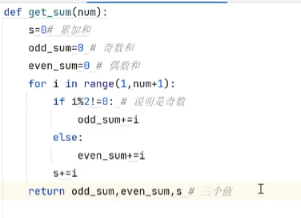
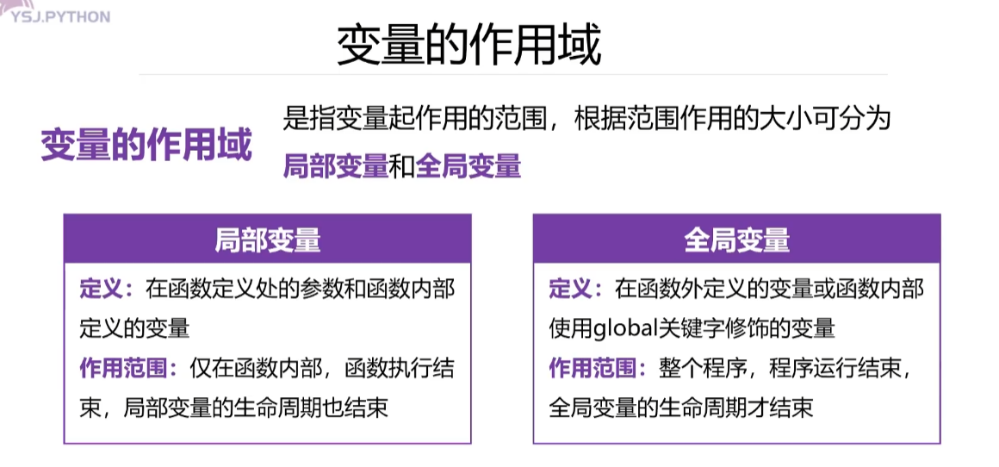

## 函数的定义及调用
1. 
2. 
3. 
4. 
5. 
6.   
7. 
8. 
9. 
10. 单个返回值：  
11. 多个返回值：  
12. 解包赋值：  
13. 
14.   当全局变量和局部变量的名称相同时，谁的优先级高呢？是局部变量。
15. global全局变量声明：  
## 匿名函数lambda
1. 
2. 
3. 
## 递归函数
1. 
2. 
3.  
## 常用的内置函数
1. 
2. 
3. 
## 常用的迭代器操作函数
1. 
2. 
3. 
# 类和对象
1. 
2. 
## 类的组成
1. 
2. 
3. 
4. 
5. 
6. 
## 面向对象三大特征
1. 
2. 