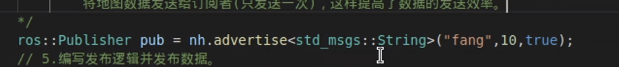
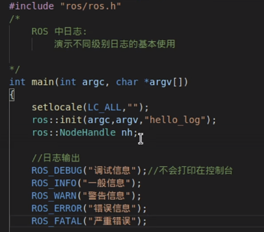
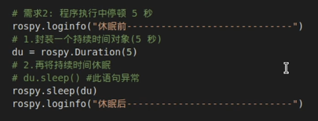

## ros通讯进阶
1. 初始化  
    + 作用：ROS初始化函数
    + 参数：
    1. argc：（命令行参数的数量）封装实参个数（n+1），因为第一个传入的是文件自身
    2. argv：封装参数的数组
    3. name：为节点命名（需要保证唯一性）
    4. options：节点启动选项
    5. 返回值：void。该函数的返回值为空
    + 使用：
            
        1. argc与argv的使用
            + 如果按照ros中的特定格式传入实参，那么ros可以加以使用，比如用来设置全局参数，给节点重命名....
        2. options的使用
            + 节点名称需要保证唯一，会导致一个问题：同一个节点不能重复启动。  ros中当有重名的节点启动时，之前的节点会被关闭。
            + 需求：特定场景下名需要一个节点多次启动且能正常运行，怎么办？!
            + 解决：设置启动项    
            ros::init_options::AnonymousName
            创建ros节点时，会在用户自定义的节点名称后缀随机数，从而避免重名问题。
2. 话题与服务相关对象：在话题和服务的相关对象一般由Nodeandle（节点句柄）创建。  
    + 作用：创建发布者对象
    + 模板：被发布的消息的类型
    + 参数：
        1. 话题名称
        2. 队列长度
        3. latch（可选）  如果设置为true，会保存发布方的最后一条消息，并且新的对象连接到发布方时，发布方会将这条消息发送给订阅者。
    + 使用：
        + latch设置为true的作用？
        + 以静态地图发布为例
          
          方案一：可以使用固定频率发送地图数据，但是效率低；
          
          方案2：可以将地图对象的 latch 设置为true，并且发布方值发送一次数据，每当订阅者连接时，就可以将地图数据发送给订阅者（只发送一次），这样提高了数据的发送效率。
          
3. 回旋函数（回头函数）  
在ROS程序中，频繁使用了ros::spin()和ros::spinOnce（）两个回旋函数，可以用于处理回调函数。
    + spinOnce（）  
    brief 处理一轮回调
    一般应用场景:
    在循环体内，处理所有可用的回调函数

        ROSCPP_DECL void spinOnce();
        
        执行一次后向后运行
    + spin（）
    brief 进入循环处理回调 

        ROSCPP_DECL void spin();
        
        进入循环体内就不会退出的，spin（）后的代码就不会运行到了。
    + 相同点：二者都用于处理回调函数
    + 不同点：ros::spin()是进入了循环执行回调函数，而ros::spinOnce()只会执行一次回调函数（没有循环），在ros::spin()后的语句不会执行到，而ros::spinOnce()后的语句可以执行。
4. 时间
    + 时刻：获取时刻，或者设置指定时刻。
    + 需求：演示时间相关操作（获取当前时刻 + 设置指定时刻）
    + 实现：
        1. 准备（头文件、节点初始化、NodeHandle创建）

                setlocale(LC_all,"");
                ros::init(argc,argv,"hello_time");
                ros::NodeHandle nh;//注意，这一步必须要实现，否则会导致时间API调用失败（在NodeHandle中会初始化时间操作）
        2. 获取当前时刻
        now函数会将当前时刻封装并返回
        当前时刻：now被调用执行的那一刻
        参考系：1970年1月1日 00：00：00
        ros::Time right_now=ros::Time::now();
        ROS——INFO("当前时刻:%.2f",right_now.toSec());
        toSec函数可以把逝去的时间转换成以秒为单位的数值（以1970年为参考）
        toSec函数可以把逝去的时
        ROS——INFO("当前时刻:%.d",right_now.sec());
        sec函数返回的是整数类型
        3. 设置指定时刻
        + ros::Time t1(20,312345678);
        
    + 持续时间
    1. 实现
        + 创建持续时间对象
            1. ros::Duration du(4.5);
                du.sleep();
        + 休眠
        
    + 持续时间与时刻运算
    1. 需求：一直程序开始运行的时刻和程序运行的时间，求运行结束时的时刻
    2. 实现：
        + 获取开始执行的时刻
        + 模拟运行的时间（N秒）
        + 计算结束时刻 = 开始 + 持续时间
        
        + 时刻与时刻的运算
        
        + 持续时间和持续时间的运算
        
        + 注意：
        1. 时刻与持续时间可以执行加减
        2. 持续时间之间也可以执行加减
        3. 时刻之间值可以相减，不可以相加
    + 设置运行频率
    
    + 定时器的使用
    1. 需求：每隔1秒钟，在控制台输出一段文本
    2. 实现：
    + 策略1：ros::Rate()
    + 策略2:定时器
    
    说明：
          1. 创建定时器需要调用句柄中的createimer函数来创建，返回值是一个ros::Timer对象
    + 回调函数
    
    + 注意：
        1. 创建：nh.createTimer()
        2. 参数1：时间间隔
        3. 参数2：回调函数（时间事件 TimerEvent）
        4. 参数3：是否执行一次
        5. 参数4：是否自动启动（当设置为 false，需要手动调用 timer.start()）
        6. 切记，定时器启动后：使用ros:spin()
    + 节点
    
    + 日志
    1. 
    2. 
    ### python的通讯进阶
    1. 节点初始化  
    2. 创建发布者对象  
    3. 回旋函数：python中没有spinOnce，只有spin()
    4. 时间
    + 获取当前时刻： 
    + 从某个时间值获取时间对象    
    + 持续时间：  
    + 时间运算：  
    + 设置运行频率：
    + 定时器：  
    + 节点的关闭：  
      
    5. 日志  
## ros中的头文件与源文件
本节主要介绍ROS的C++实现中，如何使用头文件与源文件的方式封装代码，具体内容如下:  

设置头文件，可执行文件作为源文件；
分别设置头文件，源文件与可执行文件。
在ROS中关于头文件的使用，核心内容在于CMakeLists.txt文件的配置，不同的封装方式，配置上也有差异。
###  自定义头文件调用
+ 需求:设计头文件，可执行文件本身作为源文件。

流程:

编写头文件；
编写可执行文件(同时也是源文件)；
编辑配置文件并执行。
1.   
注意：在 VScode 中，为了后续包含头文件时不抛出异常，请配置 .vscode 下 c_cpp_properties.json 的 includepath属性。`/home/用户/工作空间/src/功能包/include/**`
2. 可执行文件  
3. 配置文件  
### 自定义源文件调用
+ 需求:设计头文件与源文件，在可执行文件中包含头文件。

流程:

编写头文件；
编写源文件；
编写可执行文件；
编辑配置文件并执行。
1. 头文件  /
注意：在 VScode 中，为了后续包含头文件时不抛出异常，请配置 .vscode 下 c_cpp_properties.json 的 includepath属性。`/home/用户/工作空
2. 源文件  
3. 可执行文件  
4. 配置文件  
### python模块导入
1. 
2. 
## ros运行管理
### ROS元功能包

### ROS节点 运行管理launch文件
1. 
#### 文件标签launch

#### 文件标签node
1.  必选：  
2.  可选：  
#### 文件标签include

#### 文件标签remap

#### 文件标签param

#### 文件标签rosparam

#### 文件标签group

## rosbag
1. 
2. 
        + -a：all，订阅所有话题消息
        + -o：out，输出文件，设置输出路径
## rqt工具箱
1. 
2. 
3. 
4. 
5. 
# 机器人仿真系统
## URDF集成与Rviz的基本流程
1. 实现流程：

        + 1.准备：新建功能包，导入依赖
        + 2. 核心：编写urdf文件
        + 3. 核心：在launch文件集成URDF与Rviz
        + 4. 在Rviz中显示机器人模型
2. 创建功能包，导入依赖

    
3. 编写URDF文件

    
4. 在 launch 文件中集成 URDF 与 Rviz

    
5. 优化启动Rviz

    
## URDF link语法详解
+ 
1. robot标签
    
    
2. link标签
+ urdf 中的 link 标签用于描述机器人某个部件(也即刚体部分)的外观和物理属性，比如: 机器人底座、轮子、激光雷达、摄像头...每一个部件都对应一个 link, 在 link 标签内，可以设计该部件的形状、尺寸、颜色、惯性矩阵、碰撞参数等一系列属性。
+ 
1. 属性：name ---> 为连杆命名
2. 子标签：

    
### link标签的使用

### URDF语法详解03_joint
+ urdf 中的 joint 标签用于描述机器人关节的运动学和动力学属性，还可以指定关节运动的安全极限，机器人的两个部件(分别称之为 parent link 与 child link)以"关节"的形式相连接，不同的关节有不同的运动形式: 旋转、滑动、固定、旋转速度、旋转角度限制....,比如:安装在底座上的轮子可以360度旋转，而摄像头则可能是完全固定在底座上。  

    joint标签对应的数据在模型中是不可见的
+ 
+ 
## xacro
+ 
+ 
+ 
# ros日常笔记
## ros自定义消息类型的对比
### 赵旭左的方法
+ 赵旭左的方法是仅在某一个功能包里，把`.msg`文件放在一个`msg`文件里面，这样和下述阿木木的方法有一些差异，只能局限在一个功能包里用这种自定义的消息类型。步骤如下：
1. 首先新建`msg`文件夹，在这个文件夹下写入`.msg`文件，这个文件里应该是你定义的消息类型，如下图所示
2. 修改该功能包下的`.xml`文件，添加编译依赖和运行时依赖，分别是：`<build_depend>message_generation</build_depend>`和`<exec_depend>message_runtime</exec_depend>`
3. 修改该功能包下的`CMakeLists`文件
        + 首先添加编译依赖，这里意味着编译该功能包需要依赖于`message_generation`
        + 然后放开添加你自己定义的`msg`文件的那一段，
        + 再放开这一段：，这里意味着如果我要编译自己定义的消息类型文件，需要依赖于`std_msgs`，可以理解为是`std_msgs`组成的
        + 放开`catkin_package`中的`CATKIN_DEPENDS`,添加`message_runtime`,我理解为这里是添加运行时依赖，和第一步是相对应的。
### 阿木木的方法
+ 阿木木的方法就更加好用，相当于把范围扩大了，他是把上述的`msg`文件夹再包含在一个文件夹里面，比如是`common`文件夹下，这个`common`文件夹是与各个功能包平级的，然后编译的时候先编译`common`文件夹。对于我的`ros_boat_ws`项目则是`catkin build common`。这样所有的功能包就都可以使用这个`common`文件夹下，使用时候只需要包含头文件即可。如果想在功能包中使用自定义的消息类型的话，步骤如下，
1. 首先建立`common`文件夹和`msg`文件夹和底下的消息类型文件。
2. 这时，`common`就相当于一个功能包，在这个功能包下，就是和赵旭左的方法一样了，这是一个实现自定义消息类型的标准步骤。
3. 在使用自定义消息类型的功能包下的`.xml`文件中添加`common`的编译依赖和运行时依赖。如图：
4. 在该功能包的`CMakeLists`文件中，只需要添加编译时依赖和运行时依赖就可以了。如图：
### 注意事项
1. 注意：如果用阿木木的方法来使用自定义消息类型的话，需要在对应功能包下的`CMakeLists`文件把`add_dependencies(demo03_pub_person ${PROJECT_NAME}_generate_messages_cpp)`放开，这句的作用是保证在编译功能包之前把自定义消息类型文件先编译完，因为功能包的编译依赖于用到的自定义消息类型，如果自定义消息类型没有先编译的话，功能包的编译就可能会报错。
2. 阿木木的方法则不需要这一步，因为我们写的船的项目是先手动编译`common`功能包的。