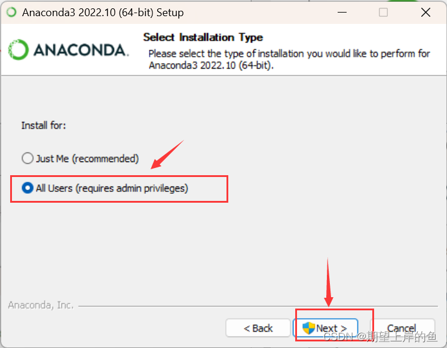
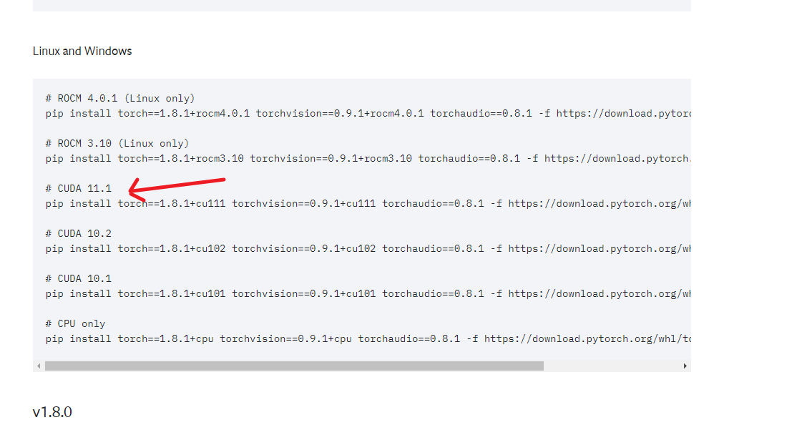
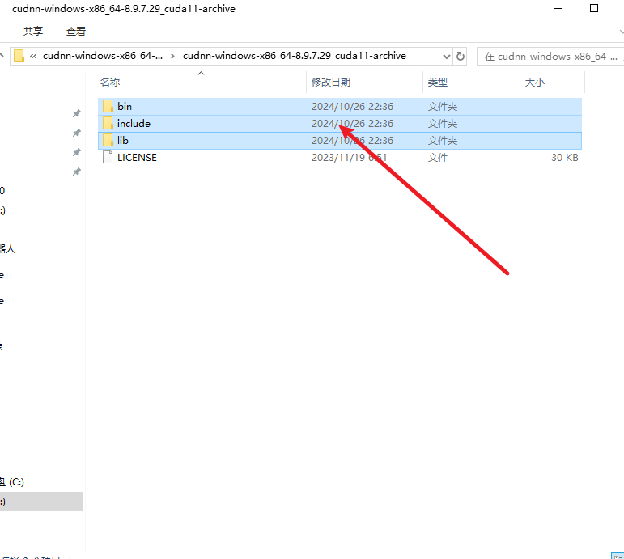
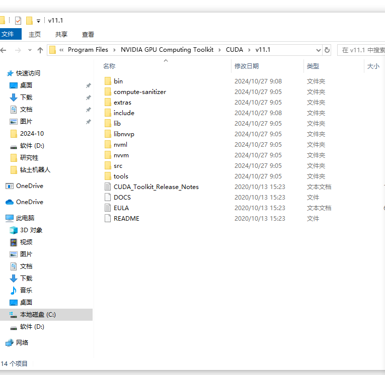
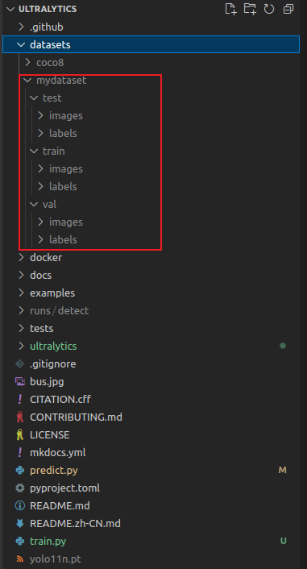
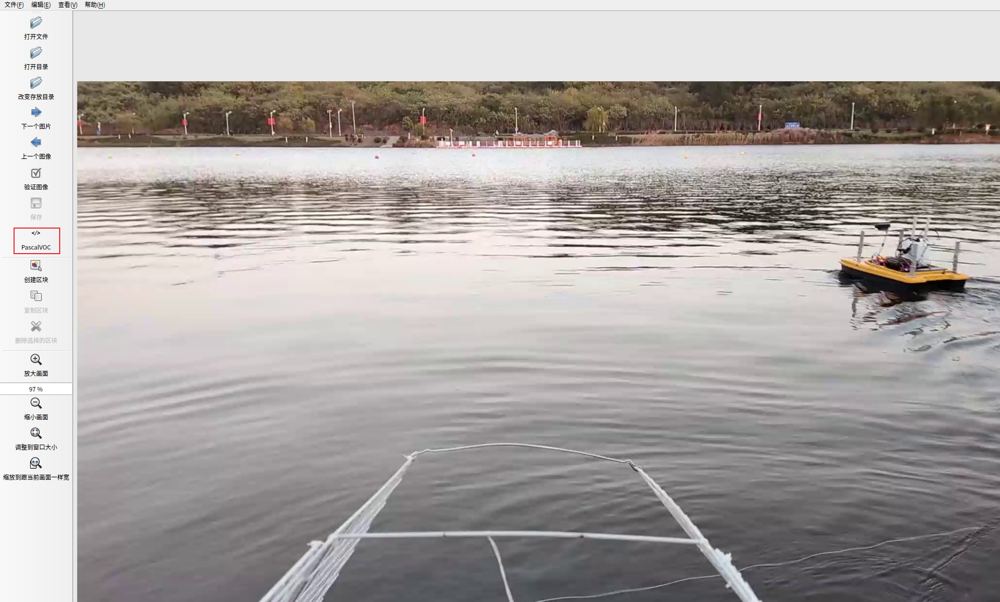
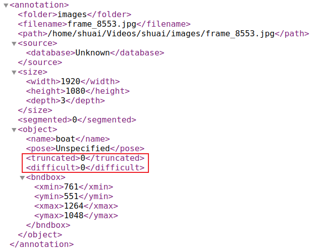
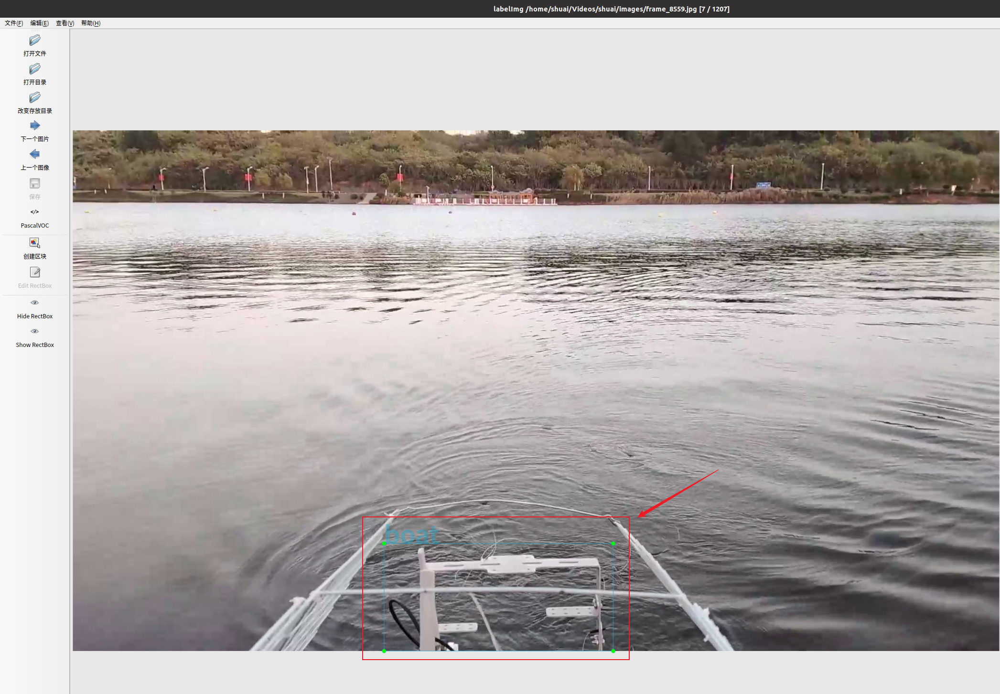
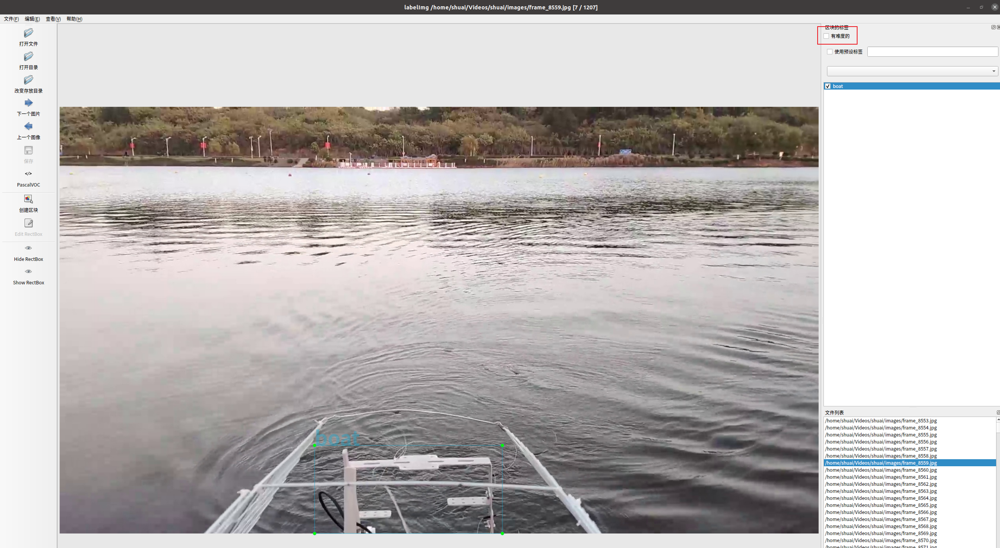
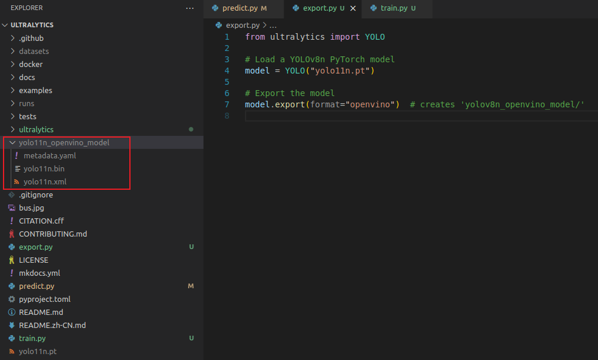

### 碰到一打开项目文件终端就自动进入最初的虚拟环境的解决办法
如果碰到一打开项目文件终端就自动进入最初的虚拟环境，且这个虚拟环境不是自己想要的虚拟环境的时候，解决办法很简单：
1. json里加一句就不会一打开就进去上一次的虚拟环境了，语句如下：
2. "python.terminal.activateEnvironment": false
3. 注意，加JSON语句的时候，这里要小心上一句是否添加了 `,`
### windows系统上配置视觉环境
1. 安装显卡驱动，最好安装高版本，支持的固件版本更多，不容易出现问题
2. 安装Anaconda，注意，安装的时候这里要选择all user，其实不选也没事，这是要所有的电脑用户都可以使用。
3. 安装cuda。`https://developer.nvidia.com/cuda-toolkit-archive`进入这个网址，下载11.1.1 Octorbor 2020 版本的cuda。
4. 打开Anaconda的prompt命令行窗口，创建一个新的conda环境`conda create -n yolov11 python=3.8`,这里一般只指定python版本，如果用它默认的版本的话会存在一些问题，虽然Anaconda会一次性安装完所有的依赖，但是有些历史版本不完整，导致后期要使用的一些历史版本会非常混乱。
5. 安装pytorch。注意，一定要进入环境后安装`https://pytorch.org/get-started/previous-versions/`进入网站下载对应cuda版本的pytorch，这里下载的cuda版本是1.11.1，所以对应的pytorch版本应该为.1.8.0和1.8.1都可以，区别不大。
6. 安装cudNN。这里的cudnn可以随意下载版本，最新版本的也可以，下载好了以后，把这三个文件夹移动到cuda安装的Computing\Toolkit\CUDA\11.1下面，替换掉之前的。


7. 安装完成。
## 启动labelImg
1. 进入conda环境`conda activate yolov11`
2. 执行`labelImg`
3. 进入`labelImg`之后注意要修改`label`的存放路径和打开文件的目录
4. 这里还要注意标签号对应的关系，我们这里是先打一个`dock`，再打`boat`，然后保存，再回到第一张把`dock`删除。
## 奥比中光Astra S相机配置
1. `https://developer.orbbec.com.cn/v/forum_detail/14557`进入这个网站，直接从第八步开始即可。
2. 编译完了以后`rqt_image_view`命令查看是否能够接收到数据流
## conda环境使用基本命令
1. `conda update -n base conda`update最新版本的conda
2. `conda create -n xxxx python=3.5`创建python3.5的xxxx虚拟环境
3. `conda activate xxxx`开启xxxx环境
4. `conda deactivate`关闭环境
5. `conda env list`显示所有的虚拟环境
6. `conda info --envs`显示所有的虚拟环境
# 如何在ros中部署yolov11
## 报错解决
1. [Unable to find either executable ‘empy‘ or Python module ‘em‘...和Invoking “cmake“ failed](https://blog.csdn.net/m0_56312629/article/details/130805625)  
   简言之：`pip install empy==3.3.4`
2. [catkin_make 时候报错 ImportError: “from catkin_pkg.package import parse_package“ failed](https://blog.csdn.net/ABC_ORANGE/article/details/109259862)  
   简言之：`pip install catkin_pkg`
3. 运行时报错：[/lib/x86_64-linux-gnu/libp11-kit.so.0](https://blog.csdn.net/CCCDeric/article/details/142342421)  
   简言之：
   ```bash
   # 这个库是在conda虚拟环境中，是可以删的，没事
   rm ${CONDA_PREFIX}/lib/libffi.7.so
   rm ${CONDA_PREFIX}/lib/libffi.so.7
   ```
# 如何使用yolov11做训练和预测
## 前置步骤
1. 安装NVIDIA显卡驱动
2. 下载cuda和cudnn，目前测试可用版本为cuda11.1
3. 创建conda虚拟环境，python=3.8
4. pip安装torch，目前测试可用版本为cuda11.1对应的torch1.8.0。安装指令为`pip install torch==1.8.0+cu111 torchvision==0.9.0+cu111 torchaudio==0.8.0 -f https://download.pytorch.org/whl/torch_stable.html`
5. git clone下载[yolov11的库](https://github.com/ultralytics/ultralytics.git)
6. pip install ultralytics安装ultralytics库。注意：这里不光会下载yolov11需要的依赖，还会在虚拟环境中再下载ultralytics库，路径为`/home/shuai/miniconda3/envs/yolov8/lib/python3.8/site-packages/ultralytics`。所以这里为了能直接在git clone下载的库中修改代码并使之生效，建议不使用官方的命令行指令如`yolo predict model=yolo11n.pt source='https://ultralytics.com/images/bus.jpg'`，因为使用这个指令可能是直接调用的是虚拟环境中ultralytics库中的代码，建议直接在git clone下载的库中添加`predict.py`和`train.py`来进行预测，这样通过python解释器来运行`predict.py`和`train.py`代码时，如果调用到ultralytics库，使用的就是git clone下载的ultralytics库。为什么呢？可以通过在`predict.py`或者`train.py`中运行如下代码，来查看python解释器默认的搜索路径。可以发现python解释器第一个搜索的路径就是当前目录
   ```bash
   # 先打开python解释器
   python
   # 再导入sys库
   >>> import sys
   # 然后直接输出路径
   >>> sys.path
   ```
7. 在小电脑中配置只需要第三和第六步。
## 如何训练
### 制作数据集
1. 在当前conda虚拟环境中安装labeimg，指令为`pip install labelimg`
2. 安装后运行`labelImg`，注意这里的img的i要大写。labelimg的使用方法见[博客](https://qiyuan-z.github.io/2022/01/12/LabelImg%E6%A0%87%E6%B3%A8%E5%B7%A5%E5%85%B7%E4%BD%BF%E7%94%A8%E5%8F%8A%E6%95%B0%E6%8D%AE%E6%A0%BC%E5%BC%8F%E8%A7%A3%E6%9E%90/)
3. 标注会在指定的标签生成路径中，生成很多yolo标注格式的txt文件。正常情况下正常标注完，关闭软件即可
4. 如果标注的时候不小心标注错了类别，或者多标注了类别。请按照如下方式解决，亲测可行：
   - 首先关闭labelimg软件
   - 删除标签生成路径中classes.txt文件中错误的类别名称
   - 再打开labelimg软件，接着之前的图片继续标注。注意这个时候需要重新手打标签类别才行
5. 标注完之后，所有图片和标签就分别放在了两个文件夹中，分别是images文件夹和labels文件夹
6. 对数据集进行训练集、验证集和测试集的划分，其实测试集可以不需要，如果数据集足够，可以保留。按照7:2:1的比例划分即可，没有严格规定。划分数据集的python代码如下：
   ```python
   import os
   import random
   import shutil
   ##########################################
   ## 需要修改的文件夹路径如下，其他代码可不用修改
   # 定义源文件夹和目标文件夹路径
   source_images_dir = 'D:/研究生/科研相关/无人艇专项/视觉数据集制作/total_202411041130/images'  # 替换为你的images文件夹路径
   source_labels_dir = 'D:/研究生/科研相关/无人艇专项/视觉数据集制作/total_202411041130/labels'  # 替换为你的labels文件夹路径
   output_base_dir = 'D:/研究生/科研相关/无人艇专项/视觉数据集制作/dataset'  # 替换为输出的根目录路径
   ##########################################
   # 创建输出文件夹
   train_images_dir = os.path.join(output_base_dir, 'train/images')
   train_labels_dir = os.path.join(output_base_dir, 'train/labels')
   val_images_dir = os.path.join(output_base_dir, 'val/images')
   val_labels_dir = os.path.join(output_base_dir, 'val/labels')
   test_images_dir = os.path.join(output_base_dir, 'test/images')
   test_labels_dir = os.path.join(output_base_dir, 'test/labels')

   for dir_path in [train_images_dir, train_labels_dir, val_images_dir, val_labels_dir, test_images_dir, test_labels_dir]:
      os.makedirs(dir_path, exist_ok=True)

   # 获取所有图片文件名（假设图片和标签文件名一致，且图片为.jpg格式，标签为.txt格式）
   all_images = [f for f in os.listdir(source_images_dir) if f.endswith('.jpg')]
   all_labels = [f.replace('.jpg', '.txt') for f in all_images]  # 确保标签文件名与图片文件名对应

   # 随机打乱文件顺序
   data = list(zip(all_images, all_labels))
   random.shuffle(data)

   # 按照7:2:1的比例进行划分
   train_size = int(len(data) * 0.7)
   val_size = int(len(data) * 0.2)

   train_data = data[:train_size]
   val_data = data[train_size:train_size + val_size]
   test_data = data[train_size + val_size:]

   # 定义复制函数
   def copy_data(data, target_images_dir, target_labels_dir):
      for image_file, label_file in data:
         # 复制图片
         shutil.copy(os.path.join(source_images_dir, image_file), os.path.join(target_images_dir, image_file))
         # 复制标签
         shutil.copy(os.path.join(source_labels_dir, label_file), os.path.join(target_labels_dir, label_file))

   # 复制数据到各个文件夹
   copy_data(train_data, train_images_dir, train_labels_dir)
   copy_data(val_data, val_images_dir, val_labels_dir)
   copy_data(test_data, test_images_dir, test_labels_dir)

   print("数据集划分完成！")
   ```
7. 划分好的数据集的目录结构如下：  
     
#### 注意事项
1. 数据集标注可以存为voc格式，这样就无需像标注yolo格式数据集一样需要在标注第一张图时区分好类别的先后顺序，可以直接标注类别，最后统一使用python脚本来转。(参考[博客1](https://blog.csdn.net/didiaopao/article/details/119910139)[博客2](https://blog.csdn.net/pvmsmfchcs/article/details/121809214)[博客3](https://wenku.csdn.net/answer/1oeqisq5rf))  
     
   ```python
   ## voc转yolo数据集
   import xml.etree.ElementTree as ET
   import pickle
   import os
   from os import listdir, getcwd
   from os.path import join


   def convert(size, box):
      x_center = (box[0] + box[1]) / 2.0
      y_center = (box[2] + box[3]) / 2.0
      x = x_center / size[0]
      y = y_center / size[1]
      w = (box[1] - box[0]) / size[0]
      h = (box[3] - box[2]) / size[1]
      return (x, y, w, h)


   def convert_annotation(xml_files_path, save_txt_files_path, classes):
      xml_files = os.listdir(xml_files_path)
      print(xml_files)
      for xml_name in xml_files:
         print(xml_name)
         xml_file = os.path.join(xml_files_path, xml_name)
         out_txt_path = os.path.join(
               save_txt_files_path, xml_name.split(".")[0] + ".txt"
         )
         out_txt_f = open(out_txt_path, "w")
         tree = ET.parse(xml_file)
         root = tree.getroot()
         size = root.find("size")
         w = int(size.find("width").text)
         h = int(size.find("height").text)

         for obj in root.iter("object"):
               difficult = obj.find("difficult").text
               cls = obj.find("name").text
               if cls not in classes or int(difficult) == 1:
                  continue
               cls_id = classes.index(cls)
               xmlbox = obj.find("bndbox")
               b = (
                  float(xmlbox.find("xmin").text),
                  float(xmlbox.find("xmax").text),
                  float(xmlbox.find("ymin").text),
                  float(xmlbox.find("ymax").text),
               )
               # b=(xmin, xmax, ymin, ymax)
               print(w, h, b)
               bb = convert((w, h), b)
               out_txt_f.write(str(cls_id) + " " + " ".join([str(a) for a in bb]) + "\n")


   if __name__ == "__main__":
      # 需要转换的类别，需要一一对应
      classes1 = ["dock", "boat"]
      # 2、voc格式的xml标签文件路径
      xml_files1 = r"/home/shuai/Videos/shuai/labels"
      # 3、转化为yolo格式的txt标签文件存储路径
      save_txt_files1 = r"/home/shuai/Videos/shuai/labels_yolo"

      convert_annotation(xml_files1, save_txt_files1, classes1)

   ```
2. voc数据中有两个标签注意一下  
     
   如果标注的时候，画的框碰到的图像的边缘，`<truncated>0</truncated>`中的数字就会变成1，比如：  
     
   如果标注的时候，点击了右上角的`有难度的`复选框，`<difficult>0</difficult>`中的数字就会变成1：  
     
## 正式训练（不修改模型文件）
参考[博客-一篇文章快速认识 YOLO11 | 目标检测 | 模型训练 | 自定义数据集](https://blog.csdn.net/qq_41204464/article/details/143171760)  
1. 在ultralytics的同名目录中新建一个文件夹名为datasets，将制作好的数据集放在其中
2. 在ultralytics/cfg/datasets/目录下，新建一个mydataset.yaml文件。这个文件主要用于指定数据集的路径和类别名称，文件内容为：
   ```yaml
   # 指定路径时最好使用绝对路径，避免出现不必要的报错
   path: D:/ultralytics/ultralytics/datasets/mydataset # dataset root dir
   train: train # train images (relative to 'path')
   val: val # val images (relative to 'path')

   # Classes
   names:
   0: dock
   ```
3. 编写训练代码。其中主要需要改的就是参数epochs(推荐100和150)、batch(推荐8或者16，根据GPU的显存决定，不要太大)、device(ubuntu端可以设置为8，但是windows端一定是0，不是0会报错)。
   ```python
   from ultralytics import YOLO
 
   # 加载预训练的模型
   model = YOLO("yolo11n.yaml").load("yolo11n.pt")  
   
   # 定义训练参数，添加默认值、范围和中文注释
   train_params = {
      'data': "mydataset.yaml",   # 数据集配置文件路径，需要自定义修改
      'epochs': 100,              # 总训练轮次，默认值 100，范围 >= 1
      'imgsz': 640,               # 输入图像大小，默认值 640，范围 >= 32
      'batch': 8,                 # 批次大小，默认值 16，范围 >= 1
      'save': True,               # 是否保存训练结果和模型，默认值 True
      'save_period': -1,          # 模型保存频率，默认值 -1，表示只保存最终结果
      'cache': False,             # 是否缓存数据集，默认值 False
      'device': None,             # 训练设备，默认值 None，支持 "cpu", "gpu"(device=0,1), "mps"
      'workers': 8,               # 数据加载线程数，默认值 8，影响数据预处理速度
      'project': None,            # 项目名称，保存训练结果的目录，默认值 None
      'name': None,               # 训练运行的名称，用于创建子目录保存结果，默认值 None
      'exist_ok': False,          # 是否覆盖已有项目/名称目录，默认值 False
      'optimizer': 'auto',        # 优化器，默认值 'auto'，支持 'SGD', 'Adam', 'AdamW'
      'verbose': True,            # 是否启用详细日志输出，默认值 False
      'seed': 0,                  # 随机种子，确保结果的可重复性，默认值 0
      'deterministic': True,      # 是否强制使用确定性算法，默认值 True
      'single_cls': False,        # 是否将多类别数据集视为单一类别，默认值 False
      'rect': False,              # 是否启用矩形训练（优化批次图像大小），默认值 False
      'cos_lr': False,            # 是否使用余弦学习率调度器，默认值 False
      'close_mosaic': 10,         # 在最后 N 轮次中禁用 Mosaic 数据增强，默认值 10
      'resume': False,            # 是否从上次保存的检查点继续训练，默认值 False
      'amp': True,                # 是否启用自动混合精度（AMP）训练，默认值 True
      'fraction': 1.0,            # 使用数据集的比例，默认值 1.0
      'profile': False,           # 是否启用 ONNX 或 TensorRT 模型优化分析，默认值 False
      'freeze': None,             # 冻结模型的前 N 层，默认值 None
      'lr0': 0.01,                # 初始学习率，默认值 0.01，范围 >= 0
      'lrf': 0.01,                # 最终学习率与初始学习率的比值，默认值 0.01
      'momentum': 0.937,          # SGD 或 Adam 的动量因子，默认值 0.937，范围 [0, 1]
      'weight_decay': 0.0005,     # 权重衰减，防止过拟合，默认值 0.0005
      'warmup_epochs': 3.0,       # 预热学习率的轮次，默认值 3.0
      'warmup_momentum': 0.8,     # 预热阶段的初始动量，默认值 0.8
      'warmup_bias_lr': 0.1,      # 预热阶段的偏置学习率，默认值 0.1
      'box': 7.5,                 # 边框损失的权重，默认值 7.5
      'cls': 0.5,                 # 分类损失的权重，默认值 0.5
      'dfl': 1.5,                 # 分布焦点损失的权重，默认值 1.5
      'pose': 12.0,               # 姿态损失的权重，默认值 12.0
      'kobj': 1.0,                # 关键点目标损失的权重，默认值 1.0
      'label_smoothing': 0.0,     # 标签平滑处理，默认值 0.0
      'nbs': 64,                  # 归一化批次大小，默认值 64
      'overlap_mask': True,       # 是否在训练期间启用掩码重叠，默认值 True
      'mask_ratio': 4,            # 掩码下采样比例，默认值 4
      'dropout': 0.0,             # 随机失活率，用于防止过拟合，默认值 0.0
      'val': True,                # 是否在训练期间启用验证，默认值 True
      'plots': True,              # 是否生成训练曲线和验证指标图，默认值 True 
   
      # 数据增强相关参数
      'hsv_h': 0.2,               # 色相变化范围 (0.0 - 1.0)，默认值 0.015
      'hsv_s': 0.7,               # 饱和度变化范围 (0.0 - 1.0)，默认值 0.7
      'hsv_v': 0.4,               # 亮度变化范围 (0.0 - 1.0)，默认值 0.4
      'degrees': 30.0,            # 旋转角度范围 (-180 - 180)，默认值 0.0
      'translate': 0.1,           # 平移范围 (0.0 - 1.0)，默认值 0.1
      'scale': 0.5,               # 缩放比例范围 (>= 0.0)，默认值 0.5
      'shear': 0.0,               # 剪切角度范围 (-180 - 180)，默认值 0.0
      'perspective': 0.0,         # 透视变化范围 (0.0 - 0.001)，默认值 0.0
      'flipud': 0.0,              # 上下翻转概率 (0.0 - 1.0)，默认值 0.0
      'fliplr': 0.5,              # 左右翻转概率 (0.0 - 1.0)，默认值 0.5
      'bgr': 0.0,                 # BGR 色彩顺序调整概率 (0.0 - 1.0)，默认值 0.0
      'mosaic': 0.5,              # Mosaic 数据增强 (0.0 - 1.0)，默认值 1.0
      'mixup': 0.0,               # Mixup 数据增强 (0.0 - 1.0)，默认值 0.0
      'copy_paste': 0.0,          # Copy-Paste 数据增强 (0.0 - 1.0)，默认值 0.0
      'copy_paste_mode': 'flip',  # Copy-Paste 增强模式 ('flip' 或 'mixup')，默认值 'flip'
      'auto_augment': 'randaugment',  # 自动增强策略 ('randaugment', 'autoaugment', 'augmix')，默认值 'randaugment'
      'erasing': 0.4,             # 随机擦除增强比例 (0.0 - 0.9)，默认值 0.4
      'crop_fraction': 1.0,       # 裁剪比例 (0.1 - 1.0)，默认值 1.0
   
   }
   
   # 进行训练
   results = model.train(**train_params)

   ```
4. 训练之后的结果文件会保存在ultralytics的同名目录runs下，权重文件路径则为`runs/detect/train/weights/best.pt`
## 模型推理
1. 选择一个自己想要使用的模型加载就可以了，代码如下。这里的前一段代码是检测某个文件夹中的所有图片。后一段代码是检测视频帧图片。
   ```python
   from ultralytics import YOLO
   
   # 加载需要使用的模型
   model = YOLO(r"runs/detect/train9/weights/best.pt")
   
   # 对指定的图像文件夹进行推理，并设置各种参数
   results = model.predict(
      source="datasets/mydataset/test/images/",   # 数据来源，放文件夹就表示检测文件夹中的所有图片
      conf=0.45,                      # 置信度阈值
      iou=0.6,                        # IoU 阈值
      imgsz=640,                      # 图像大小
      half=False,                     # 使用半精度推理
      device=0,                       # 使用设备，None 表示自动选择，比如'cpu','0'
      max_det=300,                    # 最大检测数量
      vid_stride=1,                   # 视频帧跳跃设置
      stream_buffer=False,            # 视频流缓冲
      visualize=False,                # 可视化模型特征
      augment=False,                  # 启用推理时增强
      agnostic_nms=False,             # 启用类无关的NMS
      classes=None,                   # 指定要检测的类别
      retina_masks=False,             # 使用高分辨率分割掩码
      embed=None,                     # 提取特征向量层
      show=False,                     # 是否显示推理图像
      save=True,                      # 保存推理结果
      save_frames=False,              # 保存视频的帧作为图像
      save_txt=True,                  # 保存检测结果到文本文件
      save_conf=False,                # 保存置信度到文本文件
      save_crop=False,                # 保存裁剪的检测对象图像
      show_labels=True,               # 显示检测的标签
      show_conf=True,                 # 显示检测置信度
      show_boxes=True,                # 显示检测框
      line_width=None                 # 设置边界框的线条宽度，比如2，4
   )
   ```
   ```python
   from ultralytics import YOLO

   # 加载需要使用的模型
   model = YOLO(r"runs/detect/train9/weights/best.pt")

   # 调用摄像头进行推理，并设置各种参数
   results = model.predict(
      source=0,                        # 使用默认摄像头作为数据来源。可以尝试 source=1, 2 等来切换不同的摄像头
      conf=0.45,                       # 置信度阈值
      iou=0.6,                         # IoU 阈值
      imgsz=640,                       # 图像大小
      half=False,                      # 使用半精度推理
      device=0,                        # 使用设备，0 通常表示第一个摄像头。如果使用GPU，可以设置为 'cuda:0'
      max_det=300,                     # 最大检测数量
      vid_stride=1,                    # 视频帧跳跃设置
      stream_buffer=False,             # 视频流缓冲
      visualize=False,                 # 可视化模型特征
      augment=False,                   # 启用推理时增强
      agnostic_nms=False,              # 启用类无关的NMS
      classes=None,                    # 指定要检测的类别（例如：[0, 1, 2]）
      retina_masks=False,              # 使用高分辨率分割掩码
      embed=None,                      # 提取特征向量层
      show=True,                       # 实时显示推理图像
      save=False,                      # 不保存推理结果。如果需要保存，设置为 True
      save_frames=False,               # 不保存视频的帧作为图像
      save_txt=False,                  # 不保存检测结果到文本文件
      save_conf=False,                 # 不保存置信度到文本文件
      save_crop=False,                 # 不保存裁剪的检测对象图像
      show_labels=True,                # 显示检测的标签
      show_conf=True,                  # 显示检测置信度
      show_boxes=True,                 # 显示检测框
      line_width=2,                    # 设置边界框的线条宽度，比如2，4
   )

   # 处理推理结果（可选）
   for result in results:
      result.print()  # 打印检测结果
      result.show()  # 显示检测图像（如果 show=True，可能已经在窗口中显示）
   ```

## 如何使用OpenVino做推理
参考视频：官方教学视频[链接](https://www.bilibili.com/video/BV1nD42177jx)。  
注：现在部署yolov11环境已经相当方便了，只需要在conda虚拟环境中直接运行`pip install ultralytics`即可，会自动帮我们下载cuda、cudnn和torch等库，相当方便。并且测试下来最好使用`pip install ultralytics`这个命令直接安装，手动安装cuda后面部署OpenVino还会报错  
1. 确保已经创建了conda虚拟环境，并切换到虚拟环境中运行了`pip install ultralytics`配置好了前置环境
2. 当前虚拟环境运行`pip install onnx`
3. 当前虚拟环境运行`pip install openvino`
4. 在ultralytics文件夹的根目录下，创建一个文件export.py，用于导出OpenVino模型，内容如下。
   ```python
   from ultralytics import YOLO

   # Load a YOLOv8n PyTorch model
   model = YOLO("yolo11n.pt")

   # Export the model
   model.export(format="openvino")  # creates 'yolov8n_openvino_model/'
   ```
   这样就会在ultralytics文件夹的根目录下生成一个文件夹，名为yolo11n_openvino_model，如下图，其中的文件就是后面部署OpenVino需要用到的  
   
5. 导出模型后如何使用模型，见如下代码。可见代码使用模型非常简单，openvino的使用方式与yolo原生模型的使用方式是一样的，接口现在已经被统一了
   ```python
   from ultralytics import YOLO

   # Load the exported OpenVINO model
   ov_model = YOLO("yolov8n_openvino_model/")

   # Run inference
   results = ov_model("https://ultralytics.com/images/bus.jpg")
   ```
   当然调用模型完成识别功能，可以直接使用ov_model(<图片路径>)的方式，也可以使用调用函数的方式model.predict(source=<图片路径>)。
