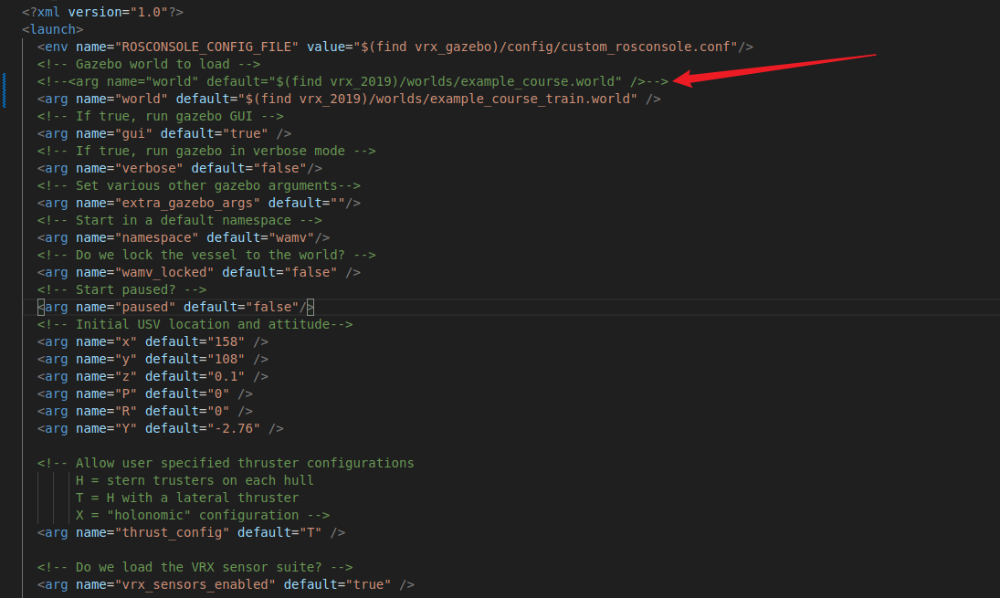
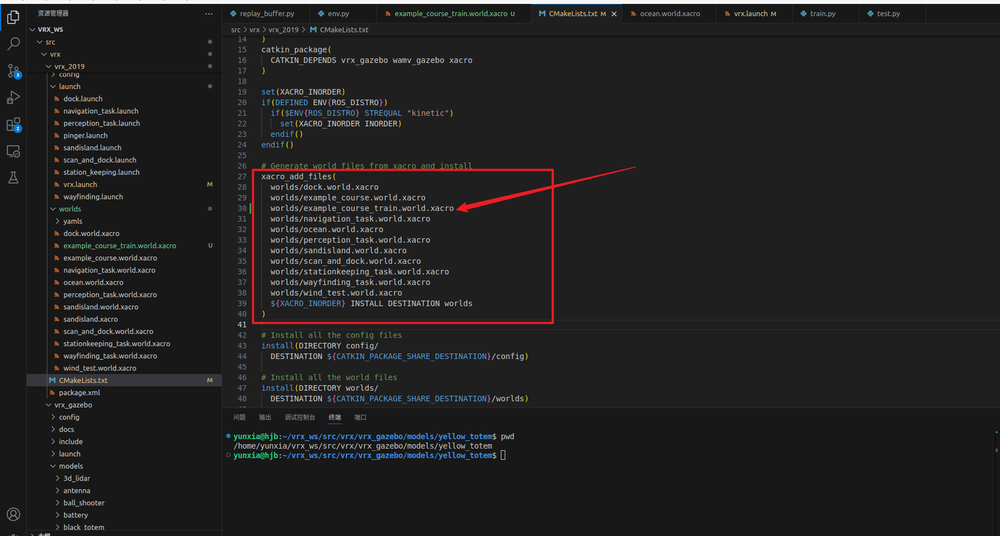

## conda环境使用基本命令
1. `conda update -n base conda`update最新版本的conda
2. `conda create -n xxxx python=3.5`创建python3.5的xxxx虚拟环境
3. `conda activate xxxx`开启xxxx环境
4. `conda deactivate`关闭环境
5. `conda env list`显示所有的虚拟环境
6. `conda info --envs`显示所有的虚拟环境
7. `conda list`查看该环境中原装的所有的包
8. `conda remove --name myenv --all`删除指定的环境（如 myenv
## 关于vrx中自定义世界的保存
+ 今天是2025年3月31日，实际上我接触强化学习已经有一段时间了，一直想利用vrx世界环境来简历方便可靠的强化学习环境，但是奈何在和赵虚左老师学创建仿真机器人世界的时候没有认真听，当时也是就觉得自己有实物，仿真部分可以不认真看，所以结果很明显，偷懒遭到反噬了。我大概摸索了一下，其实很简单
1. 首先我启动的是`roslaunch vrx_2019 vrx.launch`这个`launch`文件，如图：，箭头所指是源文件的写法
2. 现在我要创建一个有浮标的世界，但是又不想打乱原有的世界，所以我把`/home/yunxia/vrx_ws/src/vrx/vrx_2019/worlds/example_course.world.xacro`路径下的`worlds/example_course.world.xacro`文件复制了一份，名为`example_course_train.world.xacro`在里面加上了浮标，并定义了位置，保存好。
3. 但是后来运行发现打开的是一个空世界，问题出在`.xacro`文件需要编译生成`.world`文件才能正常加载
4. 这里我采用的语句是`rosrun xacro xacro --inorder /home/yunxia/vrx_ws/src/vrx/vrx_2019/worlds/example_course_train.world.xacro > /home/yunxia/vrx_ws/src/vrx/vrx_2019/worlds/example_course_train.world`编译显示：`yunxia@hjb:~/vrx_ws$ rosrun xacro xacro --inorder /home/yunxia/vrx_ws/src/vrx/vrx_2019/worlds/example_course_train.world.xacro > /home/yunxia/vrx_ws/src/vrx/vrx_2019/worlds/example_course_train.world xacro: in-order processing became default in ROS Melodic. You can drop the option.`这不是报错，只是告诉你在ROS Melodic及更新版本中，xacro的"in-order"处理已经成为默认行为，所以--inorder选项不再需要。这不是错误，只是一个信息性提示。
5. 以上是手动编译，正确且规范的方法是在对应的功能包下的`CMakeLists.txt`文件中添加，如图：
6. 然后再正常编译`catkin_make`，这样一来，运行`roslaunch vrx_2019 vrx.launch`就可以正常启动修改过后的世界了。
