## 层次分析法
### 一、层次分析法原理
1. 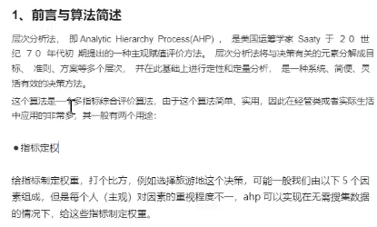
2. 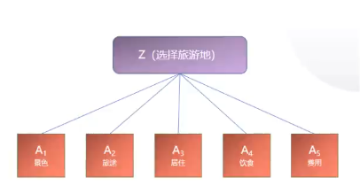
3. 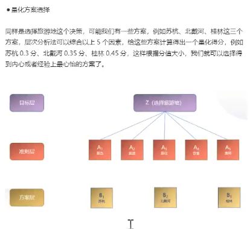
4. 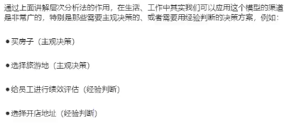
### 二、层次分析法过程
1. 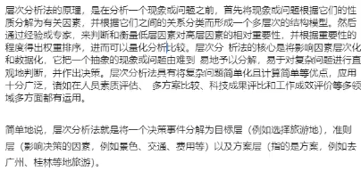
2. 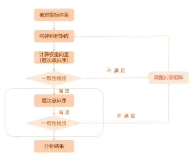
3. 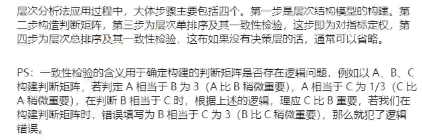
#### 2.1构建层次评价模型
1. 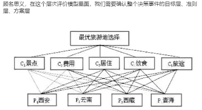
2. 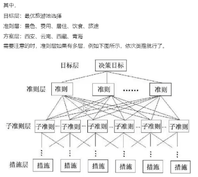
#### 2.2构建判断矩阵
1. 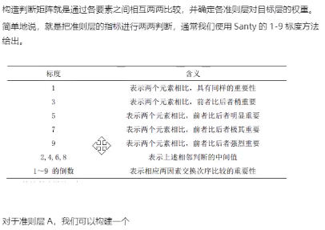
2. 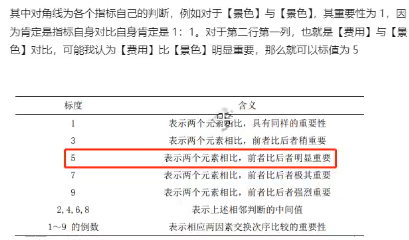
3. 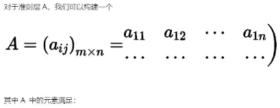
4. 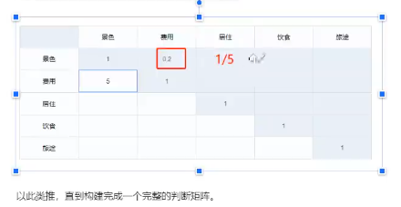
5. 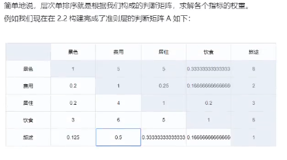
#### 2.3层次单排序与一致性检验
##### 层次单排序
1. 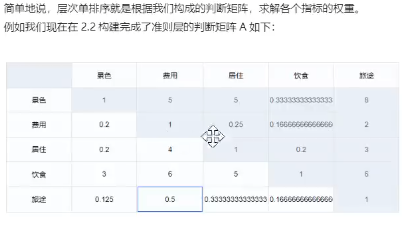
2. 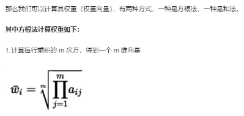
3. 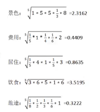
4. 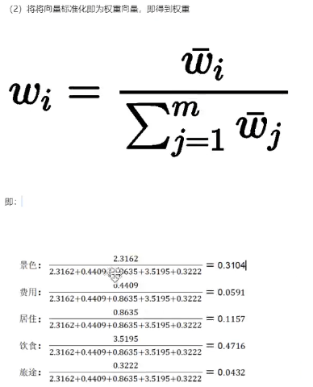
5. 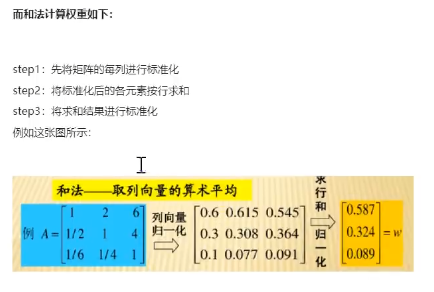
##### 求解最大特征根与CI值
1. 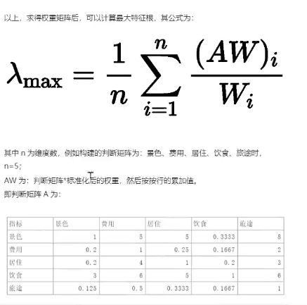
2. 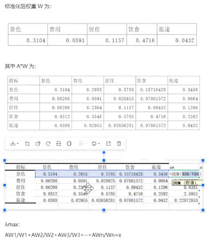
3. 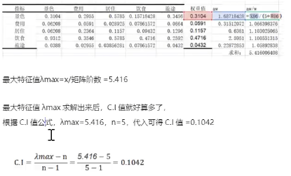
##### 根据CI、RI值求解CR值，判断其一致性是否通过
1. 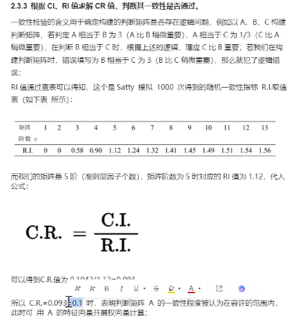
2. 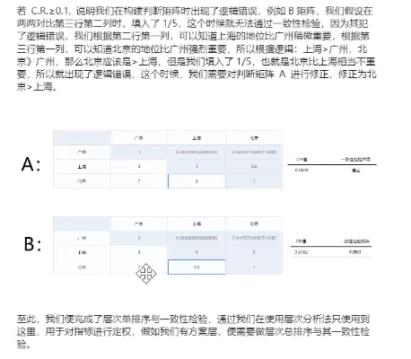
#### 2.4层次总排序与一致性检验
1. 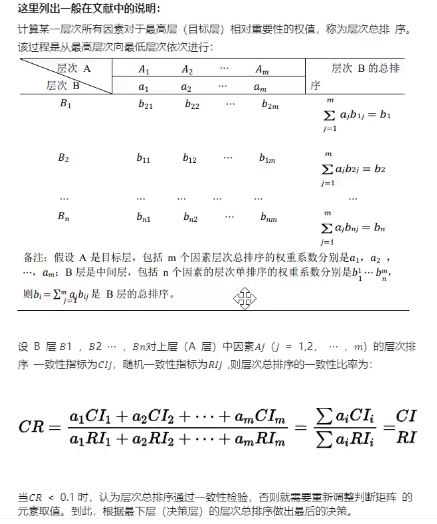
2. 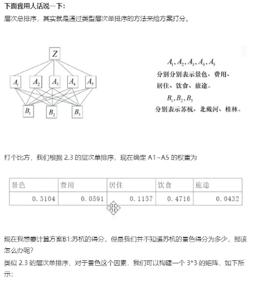
3. 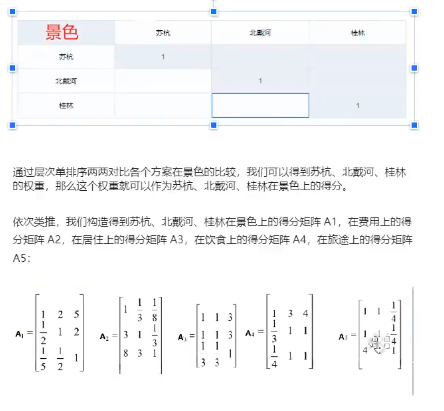
4. 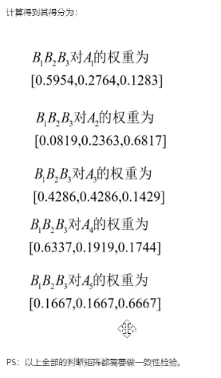
5. 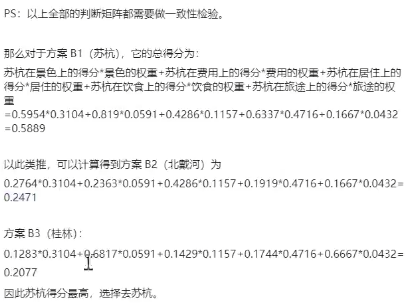
### 三、AHP三种实现方法
#### 3.1层次单排序——赋权
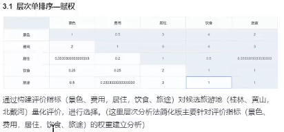
#### 3.2层次总排序——综合得分量化
1. 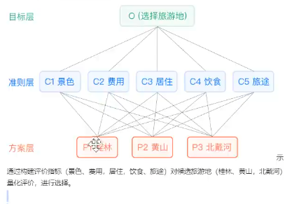
#### 3.3多专家层次分析法

## 假设检验之方差分析
### 一、什么是差异性分析？
#### 1.1 差异性分析和相关性分析
1. 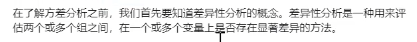
#### 1.2 常见的差异性分析方法
1. 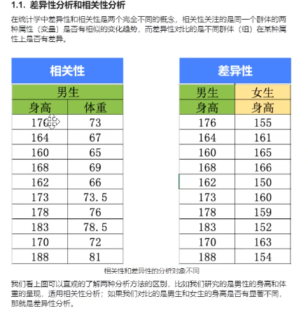
2. 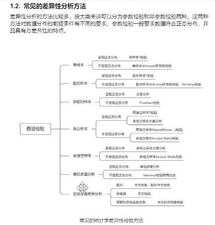
#### 1.3 参数检验
1. 什么是参数检验？
        + 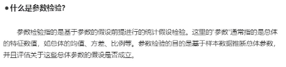
        + 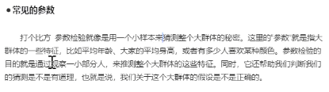
        + 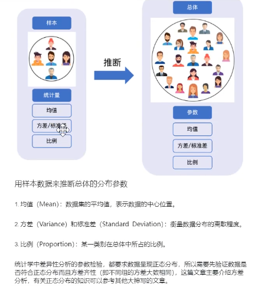
### 二、方差分析
1. 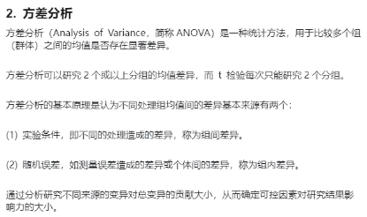
2. 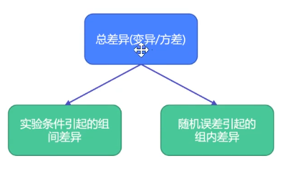
#### 2.1 基本分析步骤
1. 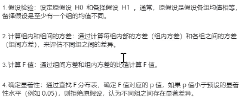
#### 2.2 不同类型的方差分析
1. 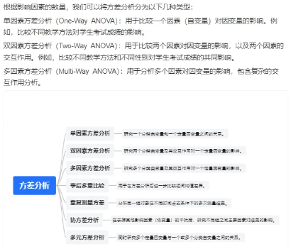
2. 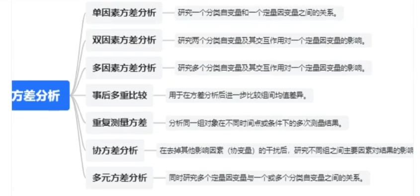
### 三、单因素方差分析
1. 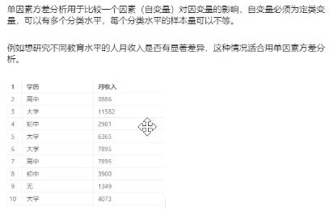
2. 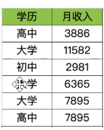
#### 3.1计算方法
1. 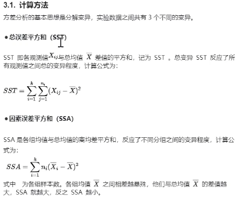
2. 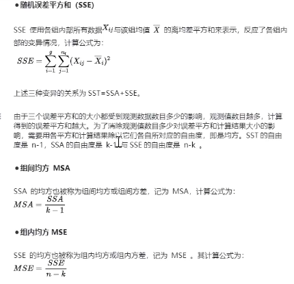
3. 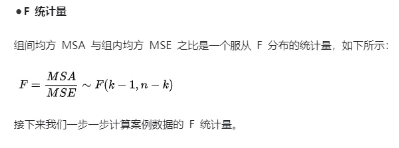
## 相关分析之皮尔逊&斯皮尔曼
### 一、什么是相关性分析？
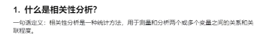
#### 1.1 相关关系和函数关系
1. 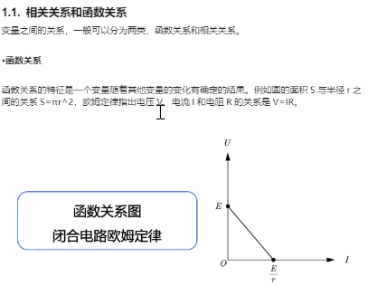
2. 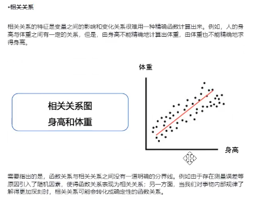
#### 1.2常见的相关关系
1. 
2. 
3. 
#### 1.3 相关性和因果关系
1. 
### 二、Pearson相关系数
1. 
#### 2.1计算方法
1. 
2. 
3. 
#### 2.2数据计算
1. 
2. 
3. 
### 三、Spearman相关系数
#### 3.1计算方法
1. 
2. 
#### 3.2数据计算

## 无监督模型之聚类分析
### 一、什么是聚类分析？
#### 1.1聚类分析介绍
1. 
2. 
#### 1.2K-means介绍
1. 
2. 
### 二、聚类分析原理与手推
#### 2.1 计算方法
1. 
2. 

# 数学建模2025
## 层次分析法-1
1. 
2. 
3. 
4. 
5. 
6. 
7. 
8. 
9. 
10. 
11. 创建执行节:ctrl+alt+enter
12. Matlab中注释的快捷键是ctrl+r,取消注释的快捷键是ctrl+t
13. 矩阵的形式是用`;`来区别行的
14. `size`获取行和列，`eig`用来计算矩阵的特征向量和特征值的
15. `./`是矩阵的对应元素相除
16. `find`找非零元素的位置，从左上往下数，第几个，找到的就是第几个元素
## Topsis法
1. 
2. 
3. 
4. 
5. 
6. 
7. 
## 熵权法求权重
1. 
2. 
3. 
4. 
5. 
## 模糊评价
1. 
2. 
3. 
4. 
5. 
6. 
7. 
8. 
9. 
10. 
11. 
12. 
13. 
14. 
15. 
16. 
17. 
18. 
19. 
20. 
21. 
22. 
23. 
24. 
## 灰色关联分析模型
1. 
2. 
3. 
4. 
5. 
6. 
7. 
8. 
9. 
10. 
11. 
12. 
13. 
## 主成分分析
1. 
2. 
3. 
4. 
5. 
6. 
7. 
8. 
9. 
10. 
11. 
12. 
13. 
14.  
## 线性规划模型
1. 
2. 
3. 
4. 
5. 
6. 
7. 
8. 
9.  