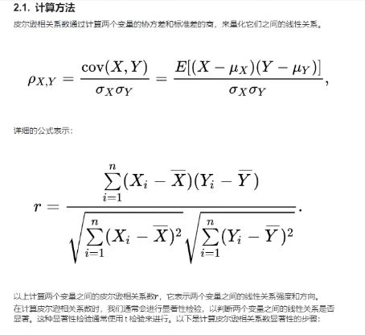

## 层次分析法
### 一、层次分析法原理
1. 
2. 
3. 
4. 
### 二、层次分析法过程
1. 
2. 
3. 
#### 2.1构建层次评价模型
1. 
2. 
#### 2.2构建判断矩阵
1. 
2. 
3. 
4. 
5. 
#### 2.3层次单排序与一致性检验
##### 层次单排序
1. 
2. 
3. 
4. 
5. 
##### 求解最大特征根与CI值
1. 
2. 
3. 
##### 根据CI、RI值求解CR值，判断其一致性是否通过
1. 
2. 
#### 2.4层次总排序与一致性检验
1. 
2. 
3. 
4. 
5. 
### 三、AHP三种实现方法
#### 3.1层次单排序——赋权

#### 3.2层次总排序——综合得分量化
1. 
#### 3.3多专家层次分析法

## 假设检验之方差分析
### 一、什么是差异性分析？
#### 1.1 差异性分析和相关性分析
1. 
#### 1.2 常见的差异性分析方法
1. 
2. 
#### 1.3 参数检验
1. 什么是参数检验？
        + 
        + 
        + 
### 二、方差分析
1. 
2. 
#### 2.1 基本分析步骤
1. 
#### 2.2 不同类型的方差分析
1. 
2. 
### 三、单因素方差分析
1. 
2. 
#### 3.1计算方法
1. 
2. 
3. 
## 相关分析之皮尔逊&斯皮尔曼
### 一、什么是相关性分析？

#### 1.1 相关关系和函数关系
1. 
2. 
#### 1.2常见的相关关系
1. 
2. 
3. 
#### 1.3 相关性和因果关系
1. 
### 二、Pearson相关系数
1. 
#### 2.1计算方法
1. 
2. 
3. 
#### 2.2数据计算
1. 
2. 
3. 
### 三、Spearman相关系数
#### 3.1计算方法
1. 
2. 
#### 3.2数据计算

## 无监督模型之聚类分析
### 一、什么是聚类分析？
#### 1.1聚类分析介绍
1. 
2. 
#### 1.2K-means介绍
1. 
2. 
### 二、聚类分析原理与手推
#### 2.1 计算方法
1. 
2. 