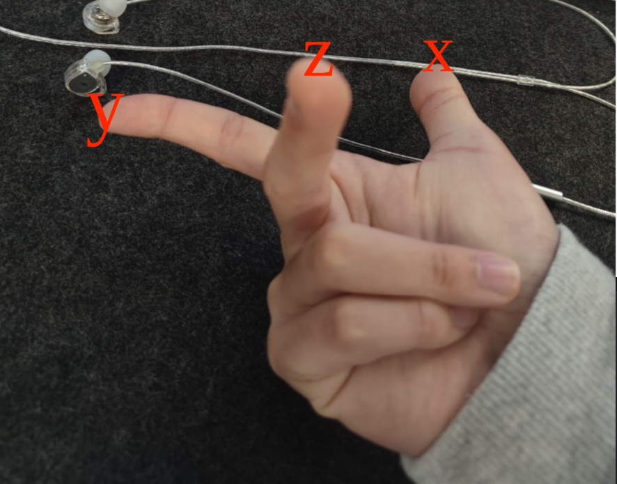

## 关于遥控器无法切换offboard模式
1. 在调无人艇的第二个订阅到角度代码的时候，发现遥控器没办法直接切换offboard模式，但是用代码就可以顺利切换offboard模式，卡在这里花了好几天找原因，发现其实这并不是问题，也许就是因为offboard要不断的接收到位置信号才能正常切换，但是我是直接切换，这可能是不对的。下次可是尝试在代码运行前。
2. 还有一个问题，在写代码的时候，一开始写的代码是以10hz的频率发布的，但是我在PX4的官网上看到要至少以20hz的频率才算有效信息，才会被正常接收，第一点的问题有可能就是因为我一开始只用了10hz的频率发布导致的无法正常切换到offboard模式，今天可以改一下代码试一下。【2024/10/28】
3. 最重要的一点，2024年11月3日晚，test1代码跑通的时候，用遥控器可以顺利切换offboard模式，这是因为代码中写了持续的驱动命令，我感觉不是要收到位置信息等等，而是要一直接收到驱动信息。
## 分布式问题
1. 太久没有上手小电脑的操作。要通过分布式来跑yolo.launch节点，但是会报IP错误的情况。其原因其实很简单，就是有的时候我有时候把网桥1接在248服务器上，网桥2给小电脑，这个时候的IP就应该设置成`192.168.1.31`，此时是连到248的IP。而当我把网桥1直接接到电脑上的时候，此时的分布式IP就应该设置成`192.168.1.2`，此时是网桥的有线IP。这是一个需要注意的点。
## 关于代码也无法顺利切换offboard模式
1. 这个问题困扰了我很久，大概有一两周左右。期间我最开始怀疑的就是电磁干扰的问题。但后来发现这是一个概率性问题，我确实有的时候把网桥和GPS放的很近也能跑通；并且这两周期间有一次调的时候有一瞬间，大概是三四秒，GPS和网桥就是放在一起的，几乎是零距离，也能跑通，电机也是动起来了。但是之后就再也没成功过。后来严重怀疑就是GPS和飞控的问题，以至于甚至换了新的GPS和飞控，等到新的GPS和飞控到了以后下楼调发现还是GPS信号很低，大概只有十颗星左右，也不进入`3Dlock`模式。到这一步几乎是绝望了，因为这个时候已经排除了GPS的问题，我就断定一定是网桥的电磁干扰的问题，我把两个网桥断开电源，发现GPS信号猛地增长到了24颗星，虽然没有进入`3Dlock`状态，但此时我已经百分之百的断定就是网桥的电磁干扰了。待我用USB串口进行通讯的时候确实是可以运行test1代码的。
2. 这个问题其实很简单，但是确实被现实误导了，也属于是运气不好。到时候看把这个网桥和GPS离得远一点，应该也是可以正常运作的。
## ros控制无人艇的转向问题
1. 今天尝试了把之前写的转向代码现场跑一下找一下问题，但是发现直接把角度信息传进PX4的PID中根本没有反应，角度信息确实一直在发布，黑窗口也一直在打印角度信息，但是没办法正常切换到offboard模式，目前推测可能是我们用的机架问题，选的这个UGV1的机架可能控制转向的方法不是像无人机那样，伸出右手用右手定则发现:
        
        y的负是右转
        y的正是直走
        x的正是右转
        x的负是左转
        这里y的方向是与飞控方向同向

2. 对于无法切换到offboard模式可能是我们选的这个机架的代码中压根就不是这个话题，很有可能PX4就没订阅到，所以没有没法切换到offboard模式。
## 切换offboard模式的硬性条件
1. Offboard模式通过设置位置、速度、加速、姿态、姿态角速率或力/扭矩设定值来控制飞行器的位置和姿态。
PX4 必须能够以2Hz的速率连续收到 MAVLink 设定值消息或 ROS 2 OffboardControlMode 消息以确保外部控制器正常运行。 该消息必须持续发送1秒以上PX4才能在Offboard模式下解锁或在飞行中切换至Offboard模式。 如果在外部控制器给出的指令速率低于2Hz，PX4将在超时(COM_OF_LOSS_T) 后退出Offboard模式，并尝试降落或执行其他一些失效保护行为。 失效保护行为取决于遥控器是否可用，它根据参数 COM_OBL_RC_ACT 设定。
当使用 MAVLink 时，设定值消息既传达了外部控制器"正常运行"的信号也传达了设定值本身。 Offboard模式下要保持位置，飞行器必须接收到一个包含当前位置设定值的消息指令。
当使用 ROS 2 时，通过监测 OffboardControlMode 消息流来确保外部控制器运行正常，实际设定值由uORB消息发布的任一设定值提供，例如 TrajectorySetpoint 为了在这种情况下保持当前位置，飞行器必须收到连续的 OffboardControlMode 消息，但只需要收到 TrajectorySetpoint 消息一次。
请注意，Offboard模式只支持比较有限的 MAVLink 指令和消息。 其他操作如起飞、降落、返航，最好使用适当的模式来处理。 图像上传、下载任务这样的操作可以在任何模式下执行。
2. 具体详情见`https://docs.px4.io/main/zh/flight_modes/offboard.html`
## 第一次角度调整成功记录
1. 今天下水初步的解决了无人艇在前进过程中角度调整的问题，发现我们用的这个Aion差速车辆机架好像不支持`Z轴`的转向，姿态调整好像只能通过左右电机的线速度差来调整。
2. 目前打算在上层写一个PID来调控转向的快、准、狠。
## yaw调整记录
1. 十一月初，我们已经能用线速度控制把入坞的成功率控制在一半左右了，但是还没有一个完整的入坞办法，暂时先用的是只调整目标航向的办法，没有目标位置的任何信息除了角度，所以当无人艇与船坞的角度超过一定角度时或者说过大的时候，无人艇很难正确的调整进坞仓，可以说我们现在的入坞都是运气，这个入坞方案是一个不完整的。
2. 十一月七号，我们写了一套用来控制姿态的代码，但是一直解锁失败，没有办法对无人艇进行姿态控制，后来发现原因是mavros中有一个姿态控制的选项，要在`roscdmavros/launch/px4_config.yaml`文件里面把姿态控制改成true。
3. 但是我们成功在姿态控制下解锁飞控并进入offboard模式以后，发现船的姿态控制并不是我们预期的那样，传入角度在某一个临界值会发生转向，也没有找到原因。
4. 第二天我发现传进去的角度可能是不正确的，我们传的是角度，但是在mavros中我们应该传弧度进去。
5. 但是发现好像还是不对，船一直朝一个方向转，要么朝北调整，要么朝东调整，要么朝西调整，非常奇怪，好像没有规律可言。
6. 后来翻看代码确定是坐标系的问题。这里我会出一个对坐标系的讲解，暂时还没有时间录，还有前面的从ros层到电机输出的过程我也会出一个视频，大概在这个周会抽时间录出来。
7. 确定是坐标系的问题以后发现还是没法朝着我们给定的角度调整姿态，在这个地方卡了将近一个星期，现在是十一月十七号，还是没有解决这个难题，还要继续翻看PX4代码。